## 8.7 活动组件库的Nupkg包的管理

1、在解决方案下新建一个.NET Framework 4.6.1的WPF应用程序InstallNupkgSample，此项目用来Nupkg包的管理，如图8.7-1所示。

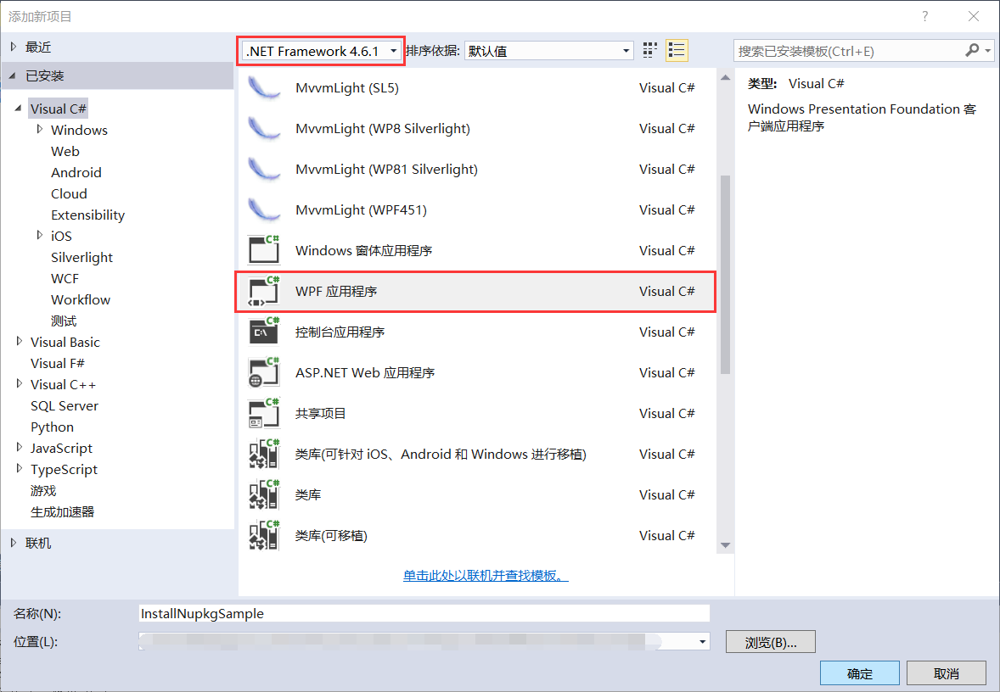

图8.7-1 新建项目

2、修改窗体的属性，更改Title为Nupkg包安装示例，设置窗体的初始位置在屏幕中央，并且设置属性SizeToContent让窗口的高度和宽度自动调整自身大小以适应其内容大小。添加StackPanel，与窗体间隔设为20。在水平方向添加一个TextBox和三个Button按钮，按钮分别为浏览、安装Nupkg包、浏览安装位置，并为其添加Click事件，如图8.7-2所示。

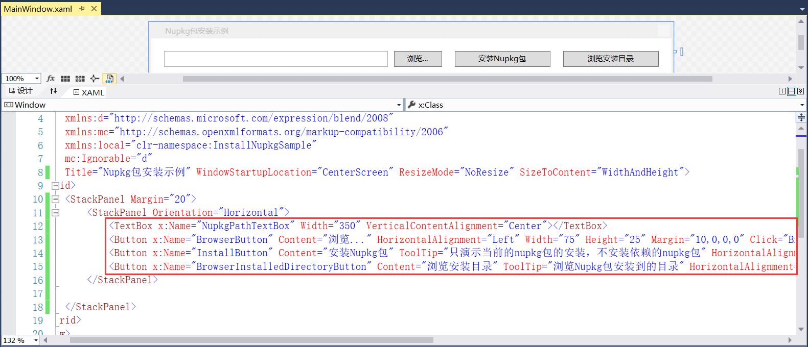

图8.7-2 添加按钮

3、接着添加窗体下方的获取Nupkg依赖项按钮和显示信息的TextBox，并为其添加Click事件，如图8.7-3所示。

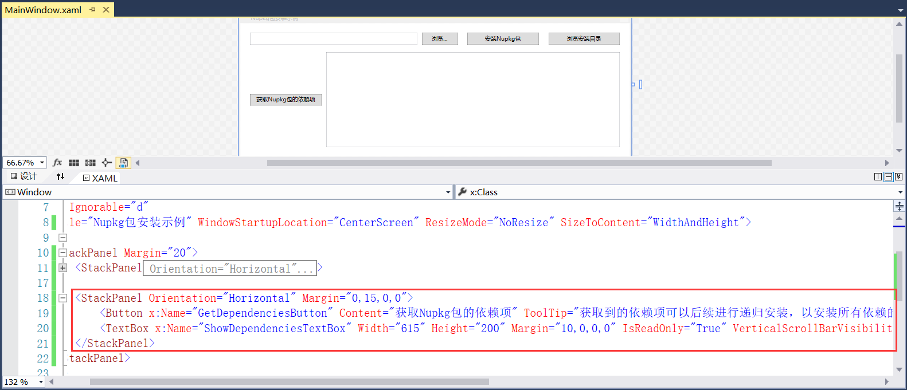

图8.7-3 添加获取依赖项按钮

4、编写浏览按钮的Click事件，首先添加对System.Windows.Forms的引用，如图8.7-4所示。

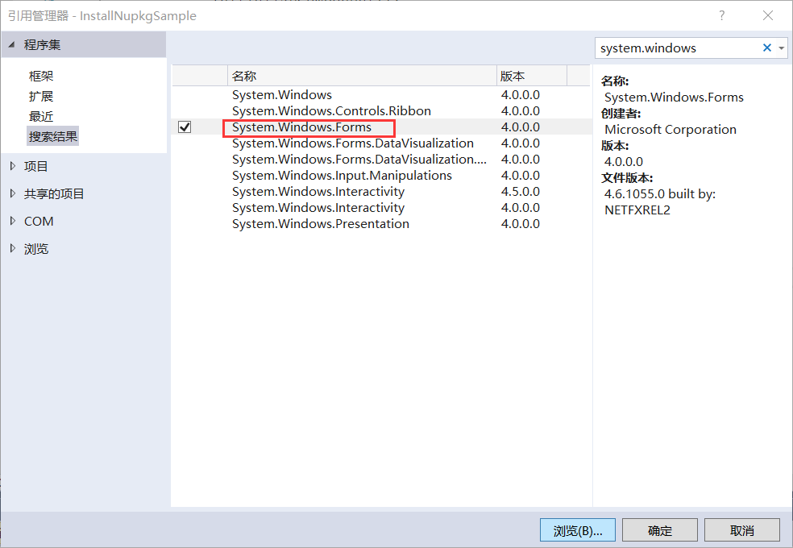

图8.7-4 添加引用

5、浏览按钮的Click事件如图8.7-5所示，在浏览文件时，筛选出*.nupkg格式的文件，选择后的文件路径显示在TextBox中，NupkgPathTextBox为TextBox的Name。

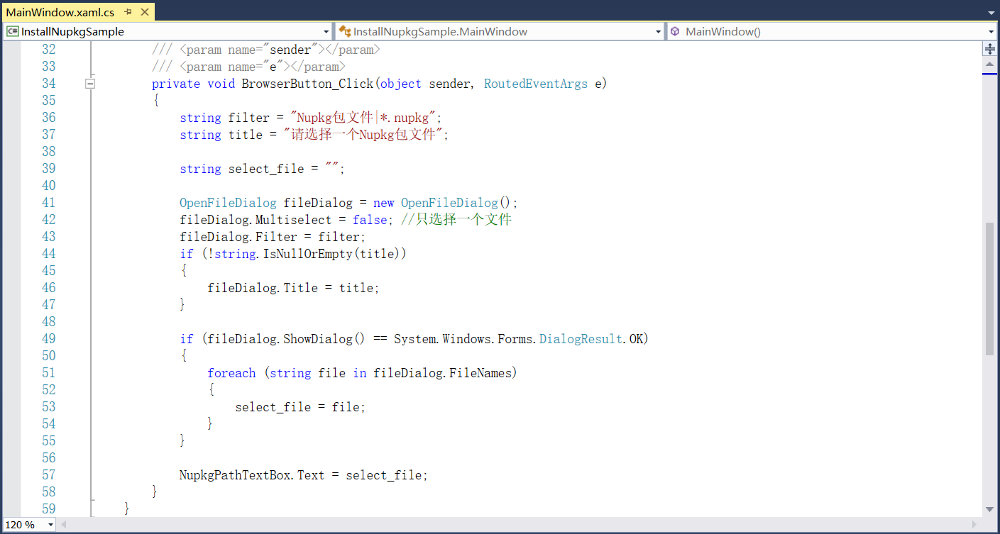

图8.7-5 浏览事件

6、接下来就是安装Nupkg包的实现，这里要安装NuGet.Core 2.14.0版本的包，如图8.7-6所示。

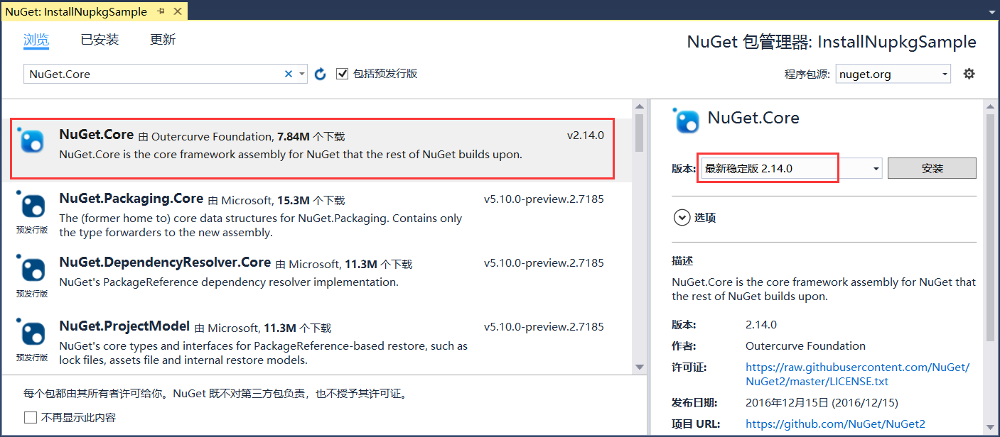

图8.7-6 安装NuGet.Core包

7、安装Nupkg包，通过将Nupkg包所在的目录当成包源，来执行安装操作。这种方式的安装和用Visual Studio的安装Nupkg包的目录结果并不一样，后续会介绍其它形式的安装。编写安装Nupkg包的实现如图8.7-7所示。其中里面进行路径的核验以及若安装过无需在安装的提示，安装成功后有成功的提示，安装成功的调用如图8.7-8所示。

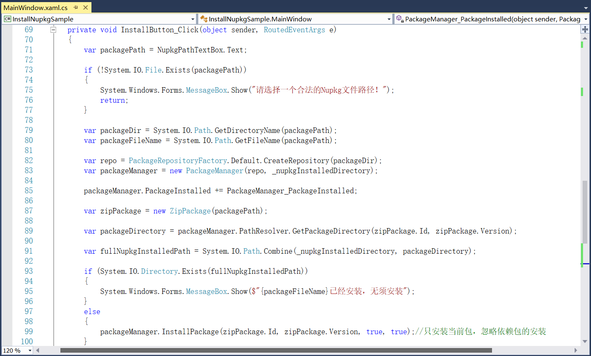

图8.7-7 安装Nupkg包

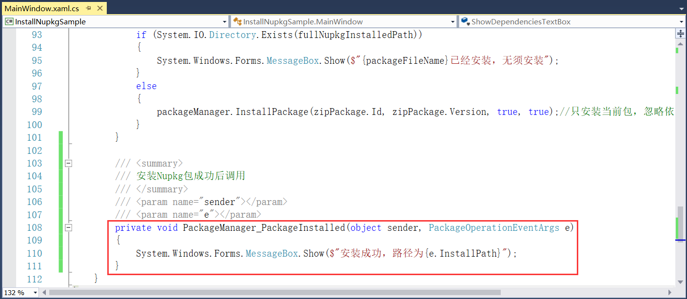

图8.7-8 安装成功

8、浏览安装目录代码实现如图8.7-9所示，通过查找资源管理器explorer来定位安装目录。

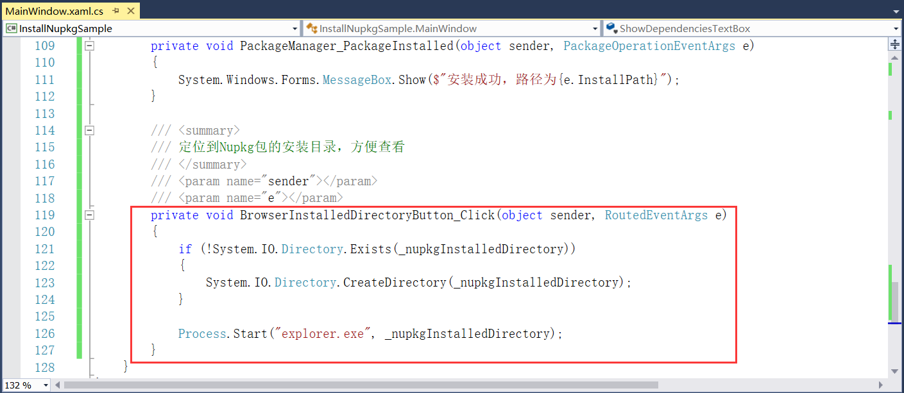

图8.7-9 浏览安装目录

9、获取Nupkg包的依赖项实现如图8.7-10所示，其中依赖项信息显示在右侧的TextBox中，显示信息换行，ShowDependenciesTextBox为TextBox的Name。

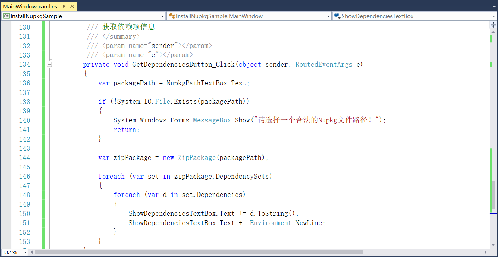

图8.7-10 获取依赖信息

10、将此项目设为启动项目，程序重新编译运行，界面如图8.7-11所示。

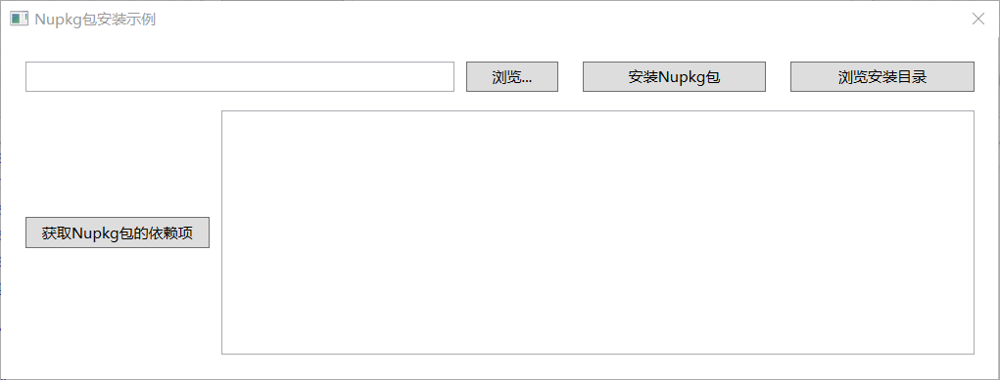

图8.7-11 界面

11、点击浏览，选择我们上述新建的组件活动库项目RPA.Sample.Activities.1.0.0.nupkg，点击安装Nupkg包，安装成功提示如图8.7-12所示。再次安装同一个Nupkg包时无须重复安装的提示如图8.7-13所示。

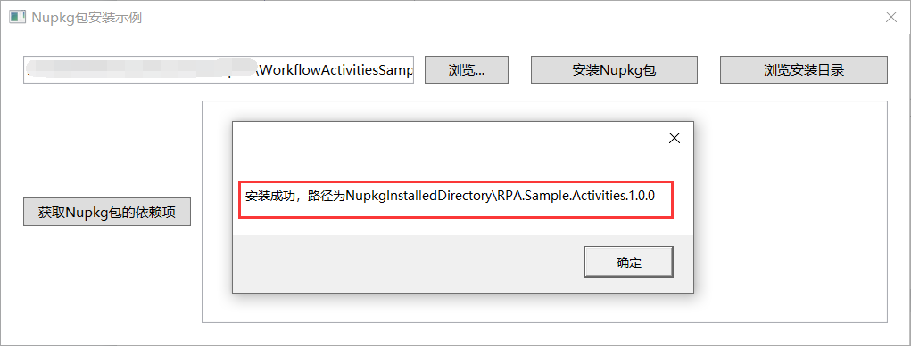

图8.7-12 安装成功

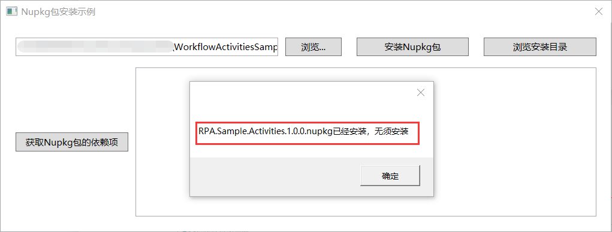

图8.7-13 无须重复安装

12、点击浏览安装目录，即可查看到安装的Nupkg包的位置，如图8.7-14所示。

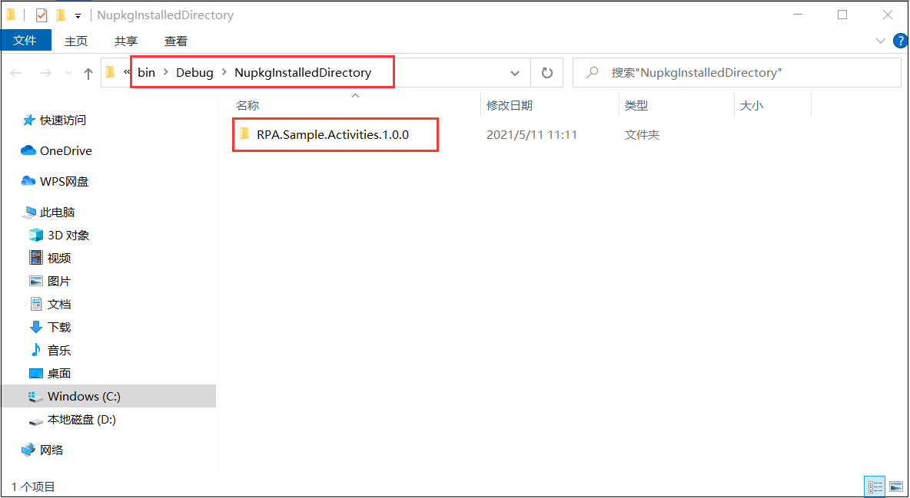

图8.7-14 浏览安装位置

13、因上述添加的RPA.Sample.Activities.1.0.0.nupkg没有其他依赖项，这里我们浏览上述安装的NuGet.Core 2.14.0版本，点击获取Nupkg包的依赖项，如图8.7-15所示。

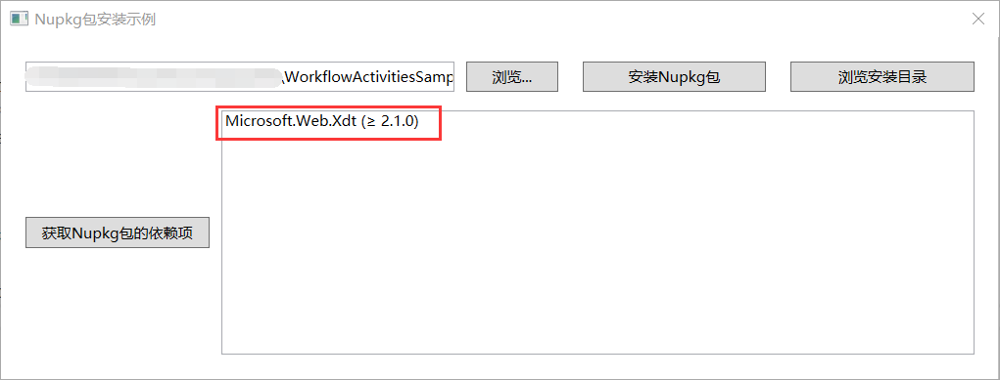

图8.7-15 获取Nupkg包的依赖项

14、因此可以通过上述方法来管理Nupkg包。

## links
   * [目录](<preface.md>)
   * 上一节: [活动组件库的Nupkg包的生成](<08.6.md>)
   * 下一节: [如何跟踪工作流的运行](<09.1.md>)