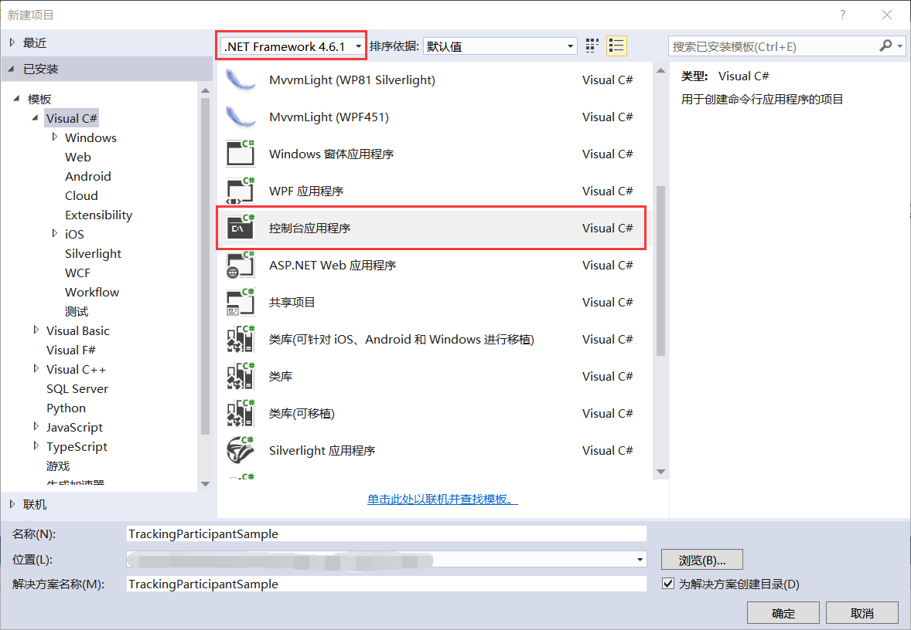

## 9.2 新建跟踪参与者示例项目

1、打开VS 2015新建项目，使用.NET Framework 4.6.1创建Visual C#下的控制台应用程序TrackingParticipantSample，如图9.2-1所示。注：该示例演示了跟踪参与者如何使用，在工作流调试运行时会用到该技术点。

图9.2-1 新建项目

2、创建控制台跟踪参与者类ConsoleTrackingParticipant，如图9.2-2所示。

图9.2-2 创建控制台跟踪参与者类

3、添加对程序集System.Activities的引用，如图9.2-3所示。

图9.2-3 添加引用

## links
   * [目录](<preface.md>)
   * 上一节: [如何跟踪工作流的运行](<09.1.md>)
   * 下一节: [跟踪参与者示例项目的代码解析](<09.3.md>)