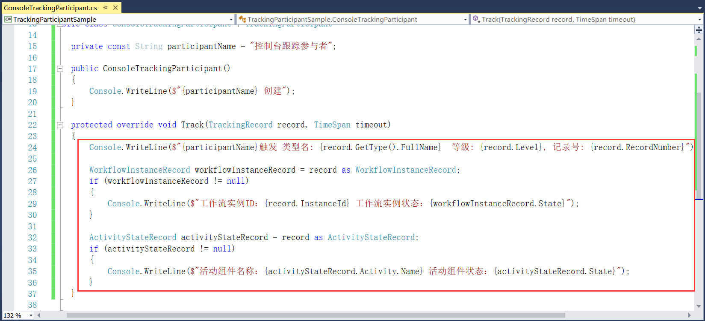
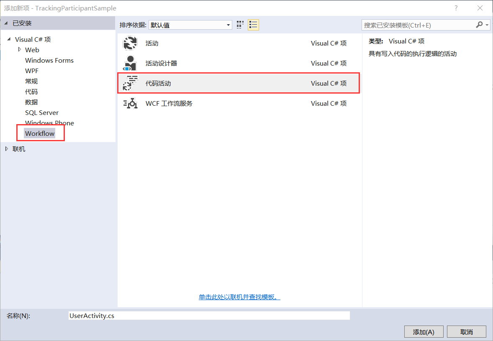
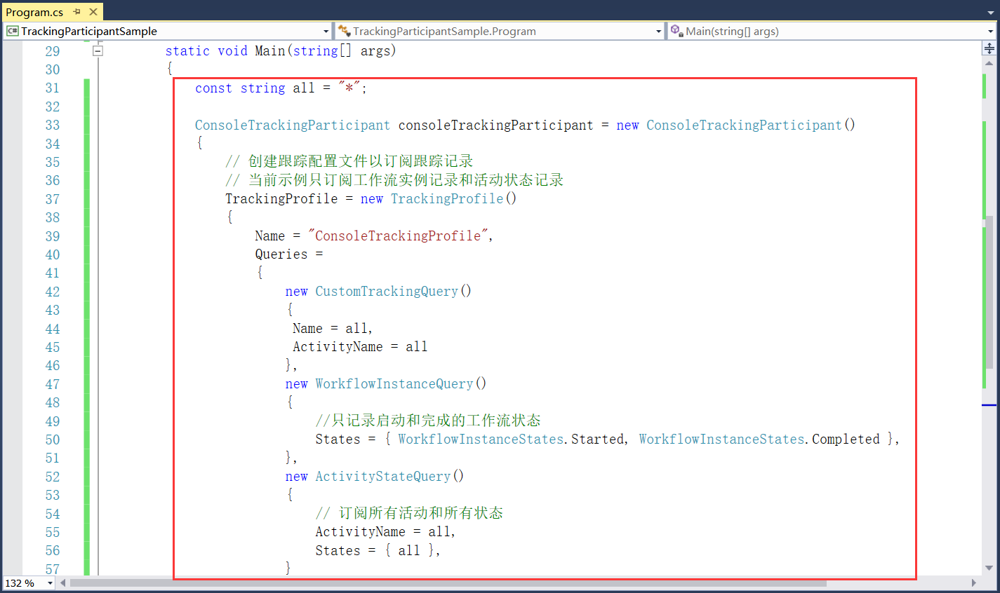

## 9.3 跟踪参与者示例项目的代码解析

1、在ConsoleTrackingParticipant类中继承TrackingParticipant，并实现抽象类Track。添加控制台跟踪参与者开始创建的信息，如图9.3-1所示。

图9.3-1 添加创建信息

2、添加开始触发时，记录跟踪参与者的命名空间、等级以及定义跟踪记录生成顺序的序列。如果在工作流实例更改状态时就记录发送给跟踪服务的工作流实例ID和工作流的当前状态，创建记录WorkflowInstanceRecord。同时创建在活动更改状态时的跟踪记录ActivityStateRecord，记录活动组件名称和当前运行状态。如图9.3-2所示。

图9.3-2 创建WorkflowInstanceRecord和ActivityStateRecord记录

3、除了上述添加的工作流和活动组件的跟踪记录，这里我们再添加一个自定义跟踪记录CustomTrackingRecord跟踪定义的用户数据，如图9.3-3所示。并且随后创建自定义一个用户活动。

图9.3-3 添加自定义跟踪记录

4、新建一个Workflow下的代码活动，用来自定义用户数据，如图9.3-4所示。

图9.3-4 新建代码活动

5、在代码活动中定义用户数据，定义姓名和年龄，然后进行Track将指定的自定义跟踪记录发送到已注册的任何跟踪提供程序，如图9.3-5所示。

图9.3-5 自定义用户活动

6、添加完自定义用户活动以后，接下来就是在项目的主程序中添加活动组件和自定义活动的实例，如图9.3-6所示。

图9.3-6 创建实例

7、创建跟踪配置文件以订阅跟踪记录，创建TrackingProfile的实例，并且订阅工作流实例记录（只记录启动和完成的工作流状态）和活动状态记录（订阅所有活动和所有状态），如图9.3-7所示。

图9.3-7 订阅跟踪记录

8、使用WorkflowInvoker进行调用工作流，并且将控制台跟踪参与者类添加到期扩展，并且通过Invoke进行调用，最后按任意键退出，如图9.3-8所示。

图9.3-8 调用工作流

9、程序重新编译运行，如图9.3-9和图9.3-10所示。

图9.3-9 运行效果

图9.3-10 运行效果

## links
   * [目录](<preface.md>)
   * 上一节: [新建跟踪参与者示例项目](<09.2.md>)
   * 下一节: [进程间通信的介绍](<10.1.md>)