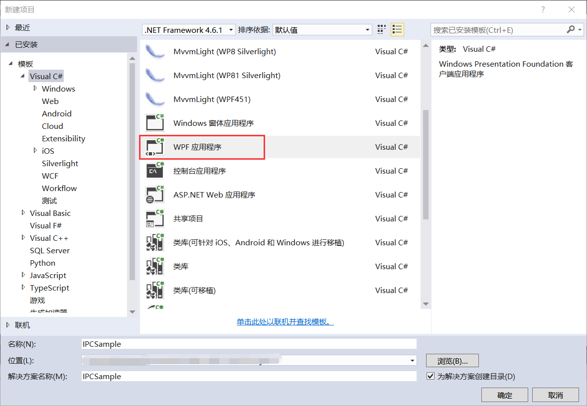
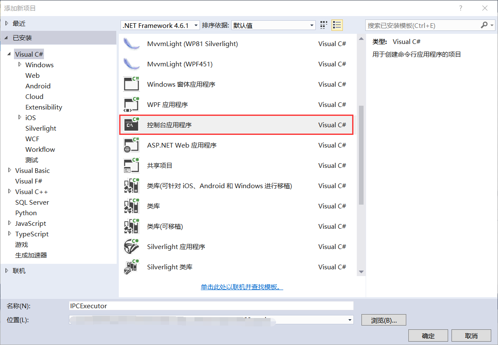
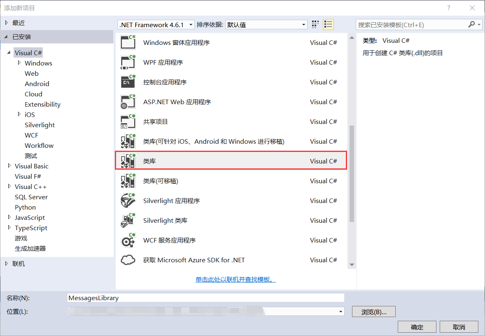
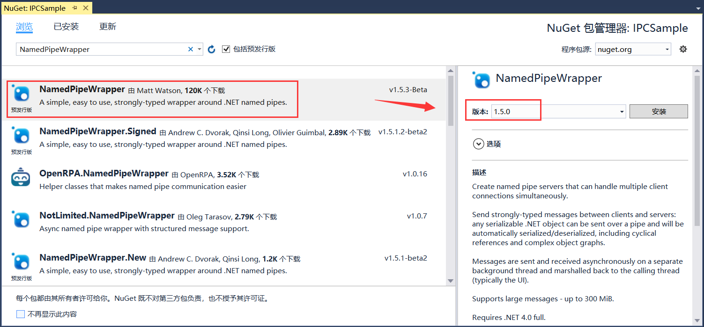

## 10.2 新建进程间通信示例项目

1、打开VS 2015新建项目，使用.NET Framework 4.6.1创建Visual C#下的WPF应用程序IPCSample作为服务器端，如图10.2-1所示

图10.2-1 新建项目IPCSample

2、在同一个解决方案下新建.NET Framework 4.6.1的Visual C#下的控制台应用程序IPCExecutor作为客户端，与上述所建的服务器端进行通信，如图10.2-2所示。

图10.2-2 新建项目IPCExecutor

3、再新建一个Visual C#下的类库MessagesLibrary，用来设置一些命令消息等，如图10.2-3所示。

图10.2-3 新建项目MessagesLibrary

4、因要使用IPC进行进程间的通信，因此这里需要添加NamedPipeWrapper 1.5.0版本的Nuget包，在项目IPCSample和IPCExecutor中都要添加此包，如图10.2-4所示。

图10.2-4 添加NuGet包

## links
   * [目录](<preface.md>)
   * 上一节: [进程间通信的介绍](<10.1.md>)
   * 下一节: [进程间通信示例项目的代码解析](<10.3.md>)