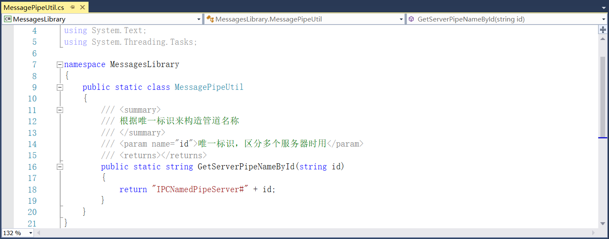
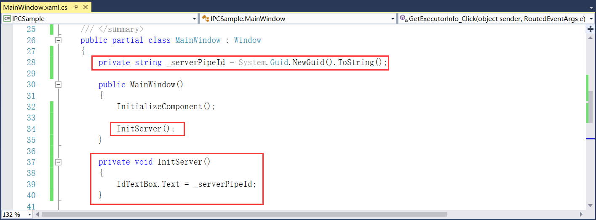

## 10.3 进程间通信示例项目的代码解析

1、先在IPCSample项目的MainWindow.xaml中设计进行进程间通信的界面，例如设计启动执行器开始通信的按钮等。修改窗体的Title属性、高度、宽度以及设置运行时初始位置为屏幕中央，如图10.3-1所示。

图10.3-1 修改窗体属性

2、在窗体的设计界面中会有多个Button按钮，因此我们可以统一设置下Button按钮的样式。使用Window.Resources来设置资源，并且设置样式的类型为Button，高度统一为30，边距值为5，如图10.3-2所示。

图10.3-2 设置Button按钮的样式

3、接下来就是将界面大体分成三行，第一行用来启动执行器，第二行用来获取执行器信息以及关闭执行器，第三行用来输出日志信息等。先添加第一行的当前服务器ID信息和启动执行器的Button按钮并为其添加Click事件，如图10.3-3所示。

图10.3-3 添加启动执行器按钮

4、在窗体的第二行使用GroupBox容器，标题设置为执行器控制。再添加执行器ID的ComboBox，接着添加获取执行器信息和关闭执行器的Button按钮，并为其添加Click事件，如图10.3-4所示。

图10.3-4 添加执行器控制界面

5、添加窗体的第三行界面，日志的GroupBox，容器里面添加清空日志的Button按钮和显示日志信息的TextBox，并为Button按钮添加Click事件，设置日志信息为只读，如图10.3-5所示。

图10.3-5 添加日志界面

6、界面设计好以后，接下来就是某些事件的代码实现，此项目示例我们是运用IPC的管道通信，并且当前系统的所有命名管道可通过各种方式来查看，有些需要在Win10操作系统上操作，如下：
（1）Powershell中可查看所有的命名管道列表：[System.IO.Directory]::GetFiles("\\.\\pipe\\") 或者 get-childitem \\.\pipe\

（2）cmd命令行中也可用来查看所有的命名管道列表： dir \\.\pipe\\ 

（3）微软Sysinternals Suite工具包中的管道查看命令行工具：PipeList

（4）Chrome浏览器中输入地址来查看：file://./pipe// 或者直接输入 \\.\pipe\\

7、首先需要在MessagesLibrary类库中新建一个接口ICommandMessage，新建方式为右键项目----》新建项----》接口，如图10.3-6所示。

图10.3-6 新建接口

8、接口ICommandMessage是服务端往客户端发送的命令消息，并添加命令标识，如图10.3-7所示。

图10.3-7 添加命令标识

9、接着在类库中新建一个类MessagePipeUtil，在类中添加通过唯一标识来构造管道名称的方法用来区分多个服务器时用，其中id在使用时用Guid生成即可，如图10.3-8所示。

图10.3-8 唯一标识

10、在MainWindow.xaml.cs文件中添加服务器ID的字段，并且与TextBox绑定，如图10.3-9所示。

图10.3-9 服务器ID

11、在IPCSample项目中添加对其他两个项目的引用，如图10.3-10所示。

图10.3-10 添加项目引用

12、定义一个字典用来存放执行器ID，定义NamedPipeServer<ICommandMessage>类型用来服务器与执行器进行通信，并添加日志信息的方法，且日志信息需要换行，如图10.3-11所示。

图10.3-11 日志信息

13、添加执行器断开连接的方法，并且断开后从ExecutorIdComboBox中将断开的执行器移除，并且默认选择为列表的最后一个，如图10.3-12所示。

图10.3-12 执行器断开连接方法

14、接下来添加执行器向服务器通信的方法，首先新建类C2SMessages设置注册时的执行器ID以及进行通信时的ID和信息，并且进行序列化，如图10.3-13所示。

图10.3-13 C2SMessages文件

15、接着就是添加两者之间进行通信的方法，且注册成功后执行器ID向ComboBox中添加，并且默认选项为刚刚添加的执行器，如图10.3-14所示。

图10.3-14 两者通信方法

16、在InitServer方法中绑定断开连接和进行通信的事件，如图10.3-15所示。

图10.3-15 绑定断开连接和两者通信的事件

17、接下来就是启动执行器，这里启动执行器我们运行IPCExecutor应用程序，因此我们需要在IPCExecutor的主程序中编写代码。首先添加执行器ID和服务器ID的字段以及NamedPipeClient<ICommandMessage>类型的客户端管道，并且设置当参数少于1个时，进程终止并退出，如图10.3-16所示。

图10.3-16 添加字段

18、接着就是添加客户端也就是执行器的断开连接和进行通信的方法，那么先来添加IPCExecutor启动和关闭的命令消息，新建类S2CMessages，里面添加命令消息并且同样进行序列化，如图10.3-17所示。

图10.3-17 新建类S2CMessages

19、现在添加执行器断开连接和进行通信时的方法，并且在断开连接和收到关闭指令时延时两秒在操作，便于观察，具体实现方法如图10.3-18所示。

图10.3-18 断开连接和通信

20、断开连接和与服务器通信的消息事件进行绑定，并进行Start，然后WaitForConnection等待进行连接，如图10.3-19所示。

图10.3-19 事件绑定

21、这些都完成以后，剩下来的就是对按钮的点击事件的实现。先来添加启动执行器的Click事件，使用IPCExecutor.exe进行启动，在进行这一部分测试的时候，千万不要忘记程序重新生成，这样才会有exe。其中参数传递的是服务器的ID，如图10.3-20所示。

图10.3-20 启动执行器

22、再来获取指定的执行器信息，并且ComboBox的选择为当前进行通信的执行器ID，具体实现如图10.3-21所示。

图10.3-21 获取指定的执行器信息

23、通过ComboBox的选择即ID来关闭指定的执行器，具体实现如图10.3-22所示。

图10.3-22 关闭指定的执行器

24、最后只剩下日志的清空，只需要对Text重新赋值为空即可，如图10.3-23所示。

图10.3-23 清空日志

25、代码写到此处，IPC的通信算是写好了，接下来就是对程序重新编译运行，一起来看下运行的结果。整体的布局如图10.3-24所示，并且显示服务器的ID。

图10.3-24 主界面

点击启动执行器，如图10.3-25所示，同时服务器的日志信息显示某ID的执行器注册成功，并且Combox中显示正在通信的执行器ID（可以同时启动多个执行器，Combox中就会有多个ID进行选择，选中哪个就代表与哪个执行器进行通信），如图10.3-26所示。

图10.3-25 启动执行器

图10.3-26 执行器注册成功

点击获取执行器信息，执行器收到信息请求，如图10.3-27所示，并且服务器日志信息显示执行器获取信息成功，如图10.3-28所示。（启动多个执行器时，可来回切换进行多个通信）

图10.3-27 执行器收到信息请求

图10.3-28 日志显示

点击关闭执行器，收到指令以后，延时两秒以后，执行器自动终止并退出，如图10.3-29所示，并且日志信息显示与执行器断开连接，Combox中也移除掉断开连接的执行器（启动多个执行器时，断开某一个执行器的连接时，Combox会默认选择列表中最后一个选项），如图10.3-30所示。

图10.3-29 执行器退出

图10.3-30 与执行器断开连接

点击清空日志，日志信息为空，如图10.3-31所示。

图10.3-31 清空日志

## links
   * [目录](<preface.md>)
   * 上一节: [新建进程间通信示例项目](<10.2.md>)
   * 下一节: [命令行参数的介绍](<11.1.md>)