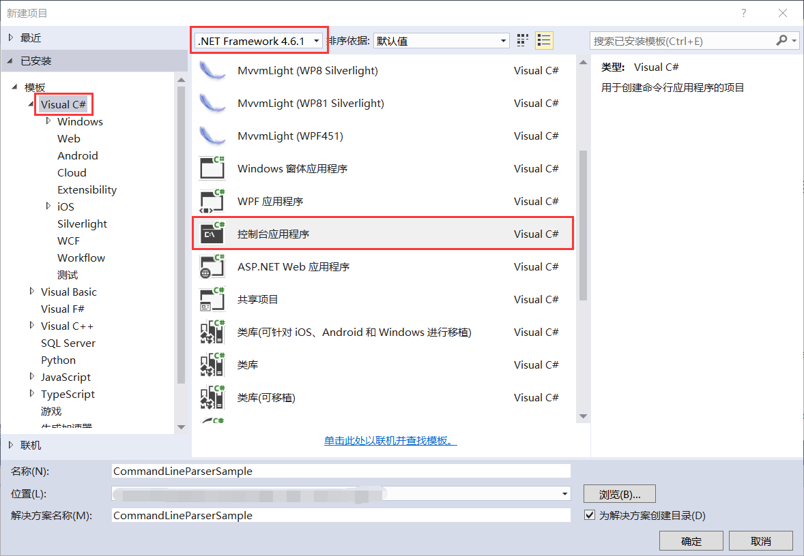
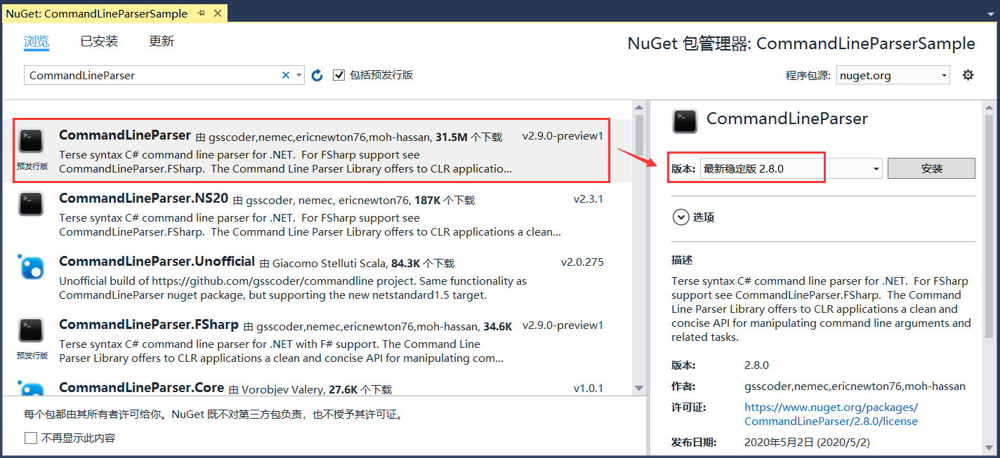

## 11.2 新建命令行参数解析项目

1、打开VS 2015新建项目，使用.NET Framework 4.6.1创建Visual C#下的控制台应用程序CommandLineParserSample，如图11.2-1所示。

图11.2-1 新建项目

2、系统在创建一个新进程时，会传一个命令行给它，也就是命令行字符串。程序需要对命令行字符串进行解析，并执行相应操作。在控制台程序中，Main函数中传入的args字符串数组，就是系统传入进程的命令行参数。在构建具有复杂命令行参数的控制台程序时，手动解析参数就变得非常麻烦，这里我们安装解析命令行参数的CommandLineParser 2.8.0版本的NuGet包，如图11.2-2所示。

图11.2-2 添加NuGet包

## links
   * [目录](<preface.md>)
   * 上一节: [命令行参数的介绍](<11.1.md>)
   * 下一节: [命令行参数解析项目的代码解析](<11.3.md>)