## 11.3 命令行参数解析项目的代码解析

1、首先我们先新建一个类Options，用来设置命令行的参数，这里我们添加三个参数，一个是累加的参数a，用来输出整数序列的和。一个是是否进行弹窗的参数m。最后一个为是否将结果写入到文件中l，定义参数如图11.3-1所示。

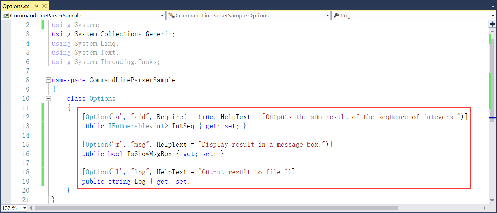

图11.3-1 定义参数

2、因为这里有参数涉及到弹窗，那么这里需要添加对System.Windows.Forms的引用，如图11.3-2所示。

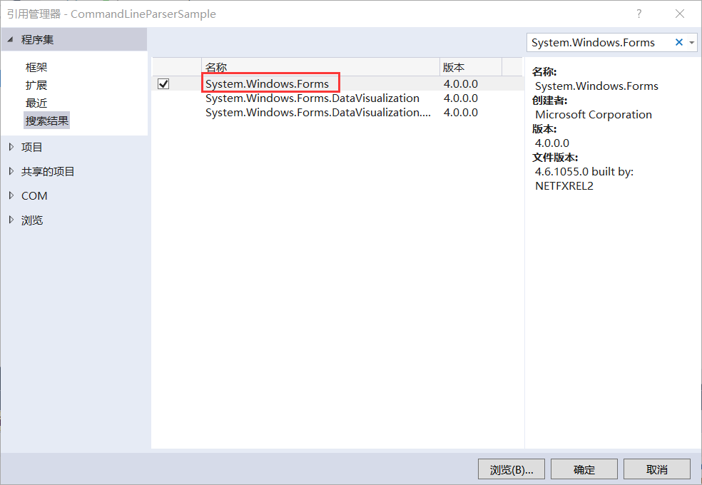

图11.3-2 添加引用

3、接着添加调用这三个参数的具体实现方法，如图11.3-3所示。

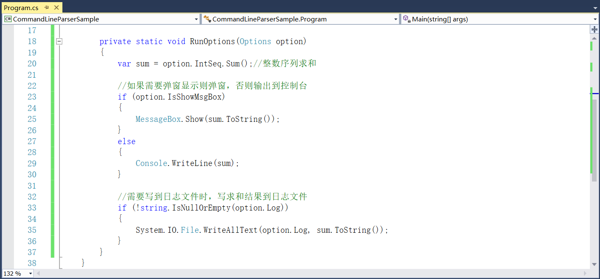

图11.3-3 具体实现

4、在Main中添加解析命令行参数，如图11.3-4所示。

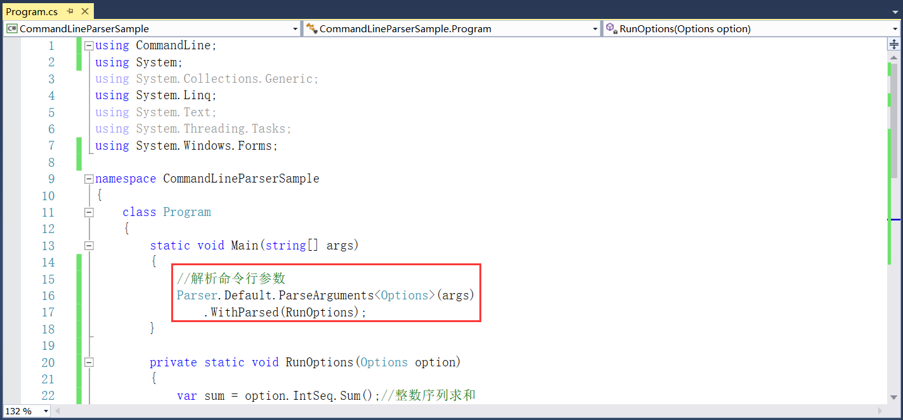

图11.3-4 解析命令行参数

5、到这里定义命令行的参数就完成了，现在只需要对程序重新编译，让其生成CommandLineParserSample.exe程序。然后在cmd中将路径切换到exe所在的目录下，执行CommandLineParserSample.exe --help，结果如图11.3-5所示，当然也可以直接使用其他参数，但是我们为了使用起来更加方便，这里写一个批处理文件。

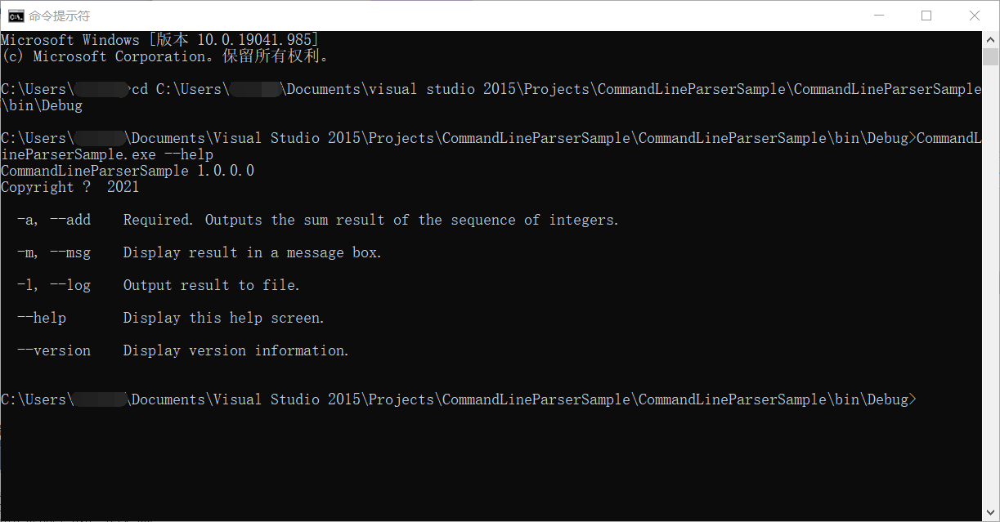

图11.3-5 执行命令

6、新建一个bat格式的批处理文件，文件内容如图11.3-6所示。其中::代表注释，第二行代表对5、6、7进行求和并且结果显示在弹窗中，第三行代表对3、7、11求和但是结果不显示在弹窗中，第四行代表对9、99、999进行求和并且把结果写入到文件sum中（文件不存在就新建文件，文件事先存在就覆盖掉，文件位置是与exe在同一目录下）。并且最后进行pause，按任意键即可退出。

这个批处理文件添加到项目中，需要注意的是需要将文件属性复制到输出目录改为“如果较新则复制”，如图11.3-7所示。

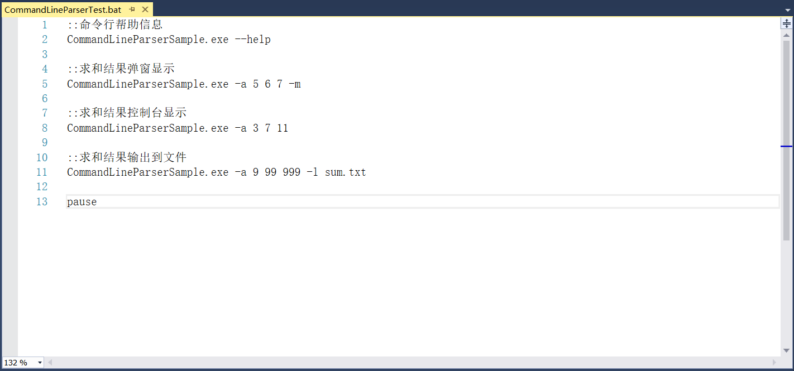

图11.3-6 批处理文件内容

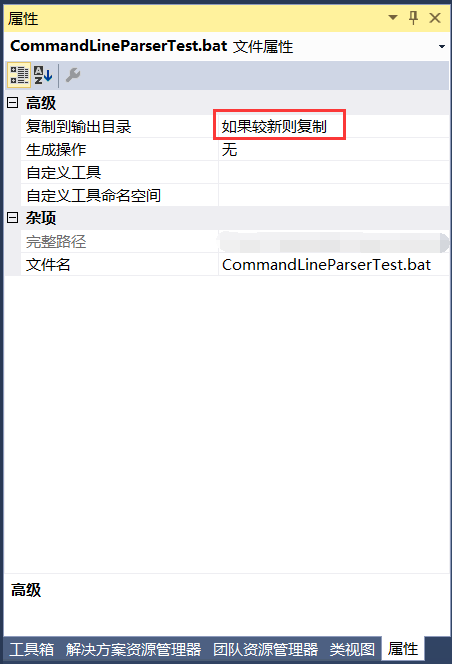

图11.3-7 文件属性

7、对程序重新编译，在项目目录的bin\Debug下找到上述的批处理文件，如图11.3-8所示。

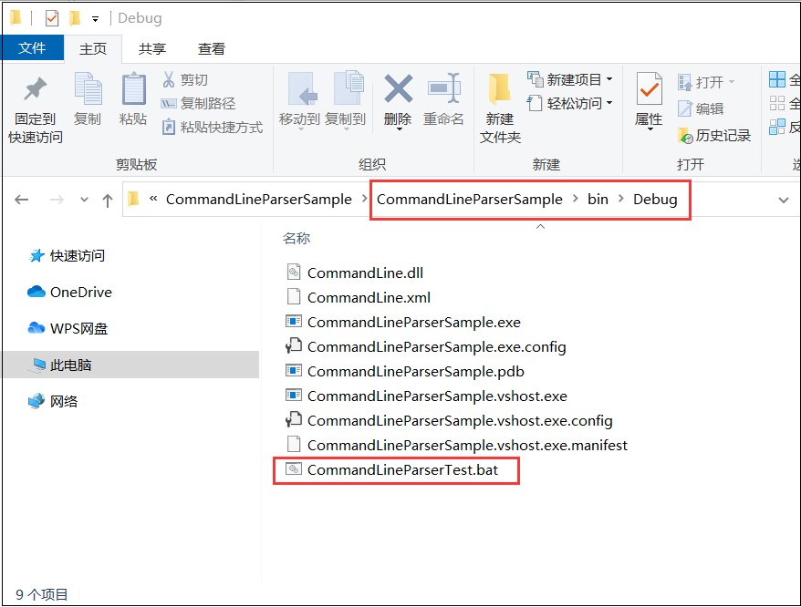

图11.3-8 批处理文件

8、双击CommandLineParserTest.bat文件，5、6、7累计和计算，结果显示在弹窗中，如图11.3-9所示。点击确定，计算3、7、11，结果显示在窗口中，计算9、99、999结果写入到文件sum.txt中，如图11.3-10所示，sum.txt文件如图11.3-11所示。最后按任意键可退出。

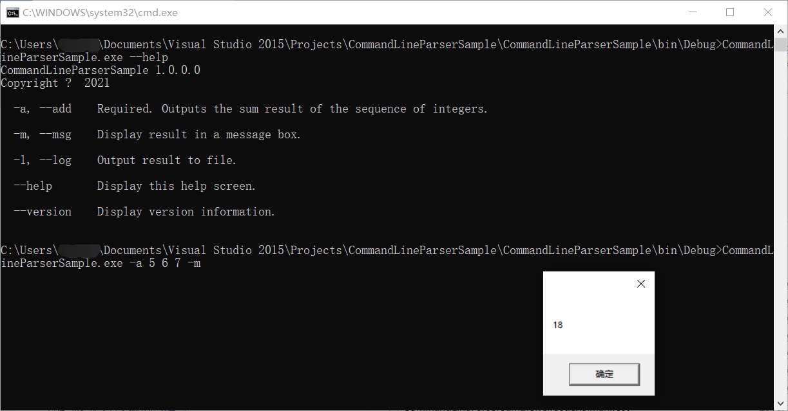

图11.3-9 结果显示在弹窗中

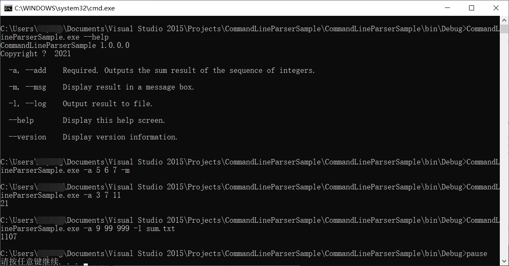

图11.3-10 计算累加和

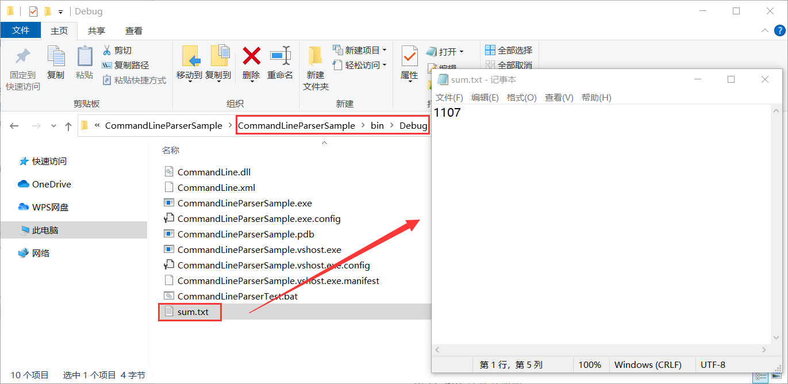

图11.3-11 结果写入到sum.txt文件中

## links
   * [目录](<preface.md>)
   * 上一节: [新建命令行参数解析项目](<11.2.md>)
   * 下一节: [程序日志记录的重要性介绍](<12.1.md>)