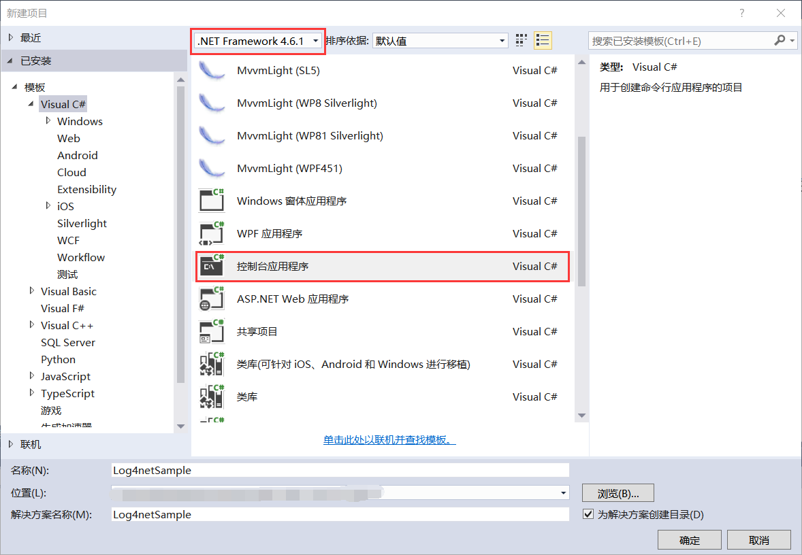
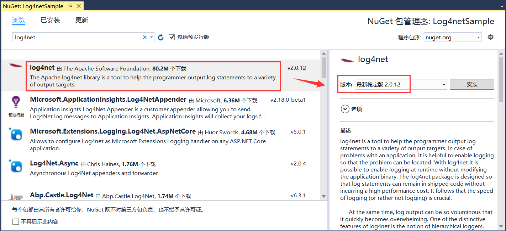

## 12.2 新建Log4net项目

1、我们这里演示Log4net和NLog的日志记录的项目示例，首先打开VS 2015，然后点击新建项目，使用.NET Framework 4.6.1创建Visual C#下的控制台应用程序Log4netSample，如图12.2-1所示。

图12.2-1 新建项目Log4netSample

2、在Log4netSample示例中添加使用到的log4net 2.0.12版本，如图12.2-2所示。

图12.2-2 安装log4net的NuGet包

## links
   * [目录](<preface.md>)
   * 上一节: [程序日志记录的重要性介绍](<12.1.md>)
   * 下一节: [Log4net项目代码解析](<12.3.md>)