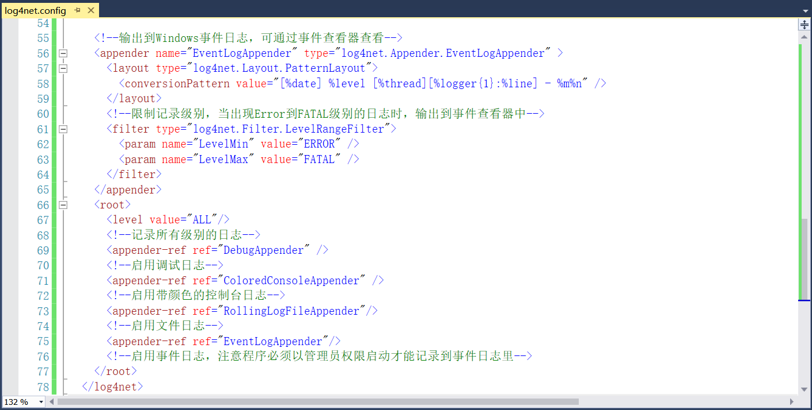

## 12.3 Log4net项目代码解析

1、打开Log4netSample项目的主程序Program.cs文件，先定义一个ILog类型的只读字段，然后在Main中添加日志信息，包括Debug、Error、Info、Warn、Fatal，如图12.3-1所示。

图12.3-1 日志信息

2、接着再用try catch来捕获一个整数除以0引发的异常，并且日志若要记录详细的错误信息需要将PDB文件放到程序目录，如图12.3-2所示。

图12.3-2 捕获异常

3、最后再添加程序结束的日志信息，并按任意键可退出，如图12.3-3所示。

图12.3-3 添加程序结束的日志信息

4、接下来通过配置文件的方式，将日志信息通过颜色来区分消息类型以及输出到控制台或文件中，首先新建一个应用程序配置文件，如图12.3-4所示。

图12.3-4 新建应用程序配置文件

5、并且设置配置文件的属性复制到输出目录为如果较新则复制，如图12.3-5所示。

图12.3-5 设置文件属性

6、在AssemblyInfo.cs文件中添加对配置文件的启用并且设置监视配置文件，如图12.3-6所示。

图12.3-6 启用配置文件

7、打开配置文件log4net，添加日志信息在调试运行时输出到VS的输出窗口，具体实现如图12.3-7所示。

图12.3-7 输出到VS的输出窗口

8、这里为了区分输出的日志信息类型，为不同的类型添加不同的颜色，如图12.3-8所示。

图12.3-8 为日志信息添加颜色

9、为了方便查看并且快速定位问题，我们一般都是将日志信息写入到文件，如图12.3-9所示。其中这里的日志文件存放在当前exe所在目录下的Logs文件夹中，文件命名方式为项目名称和年月日，并且当单个文件超过5MB时就会自动进行拆分，拆分后的文件后缀名保持不变。

图12.3-9 输出到文件

10、不仅如此，日志信息还可以输出到Windows的事件日志中，并且可以通过事件查看器进行查看，如图12.3-10所示。在事件日志中记录中所有级别的日志，但是启用事件日志，程序必须以管理员权限启动才可以记录到事件日志中。

图12.3-10 输出到Windows事件日志

11、程序以管理员权限启动的方法如下：右键Log4netSample项目----》属性----》安全性，勾选启用ClickOne安全设置，然后再取消勾选，如图12.3-11所示。

图12.3-11 启用ClickOne安全设置

12、这时项目中会多了一个文件app.manifest，如图12.3-12所示。

图12.3-12 app.manifest文件

13、打开app.manifest文件，将用户账户控制级别更改为requireAdministrator，使用管理员权限启动，如图12.3-13所示。其中Windows用户账户控制设置可以在电脑上搜索UAC即可打开，并且可以设置用户账户控制，如图12.3-14所示。

图12.3-13 修改为管理员权限

图12.3-14 UAC设置

14、全都设置好以后，对程序重新编译运行，这时会提示需要用管理员权限打开VS 2015，点击使用其他凭据重新启动即可，如图12.3-15所示。然后在点击运行，如图12.3-16所示。

图12.3-15 管理员启动提示

图12.3-16 日志消息

输出到VS控制台的日志消息如图12.3-17所示。

图12.3-17 输出到VS控制台日志消息

将日志写入到文件，如图12.3-18所示。

图12.3-18 日志消息写入到文件

上述我们设置了写入到Windows的事件日志中，打开Win+R输入eventvwr或直接搜索事件查看器，打开Windows日志下的应用程序，即可看到写入的日志信息，如图12.3-19所示。

图12.3-19 写入到Windows的事件日志

## links
   * [目录](<preface.md>)
   * 上一节: [新建Log4net项目](<12.2.md>)
   * 下一节: [新建NLog项目](<12.4.md>)