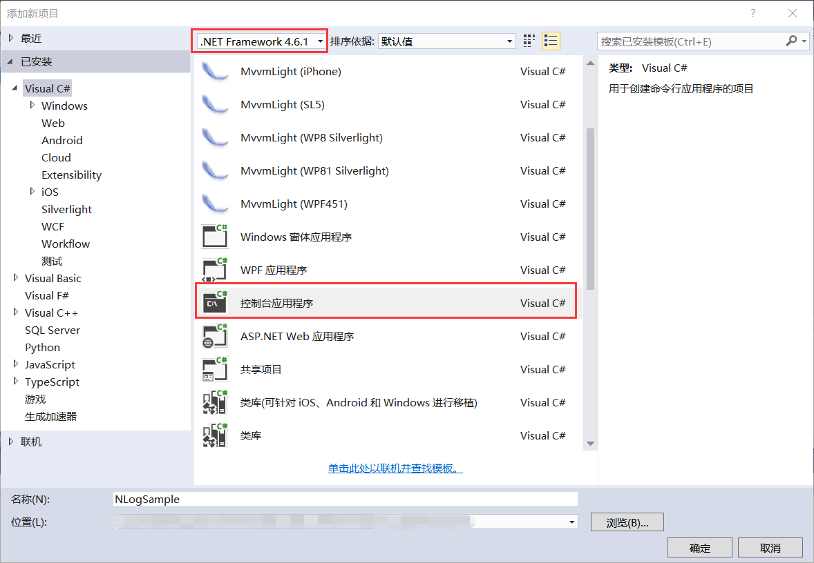
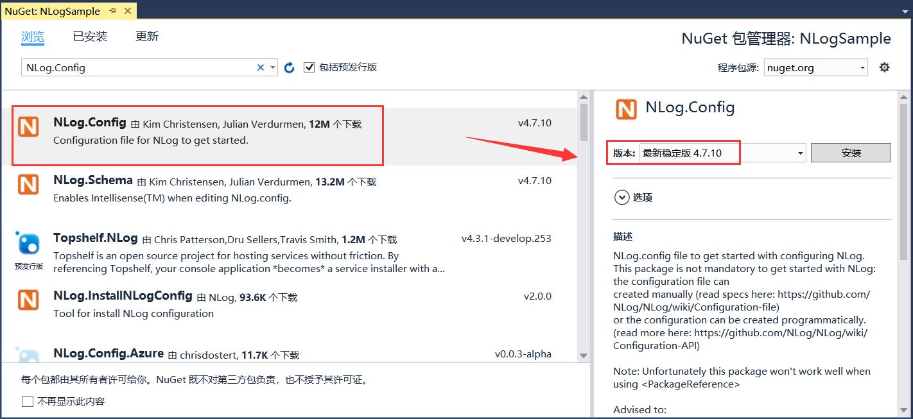
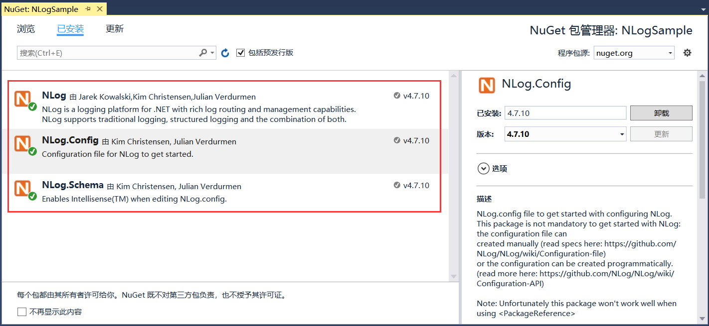

## 12.4 新建NLog项目

1、在同一个解决方案下以同样方式再新建一个项目NLogSample，如图12.4-1所示。

图12.4-1 新建项目NLogSample

2、安装完log4net的NuGet包，接着安装NLogSample项目使用到的NLog.Config 4.7.10版本，如图12.4-2所示。安装完成以后，会自动安装NLog和NLog.Schema的NuGet包，如图12.4-3所示。

图12.4-2 安装NLog.Config的NuGet包

图12.4-3 自动安装的NLog和NLog.Schema的NuGet

## links
   * [目录](<preface.md>)
   * 上一节: [Log4net项目代码解析](<12.3.md>)
   * 下一节: [NLog项目代码解析](<12.5.md>)