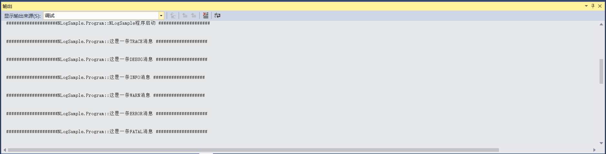

## 12.5 NLog项目代码解析

1、打开NLogSample项目的主程序Program文件，先定义一个Logger类型的只读字段，然后在Main中添加日志信息，包括Debug、Error、Info、Warn、Fatal，如图12.5-1所示。

图12.5-1 添加日志信息

2、接着再用try catch来捕获throw抛出的异常，并且日志若要记录详细的错误信息需要将PDB文件放到程序目录，最后通过Shutdown处理所有目标并关闭日志记录，然后在按任意键退出，如图12.5-2所示。

图12.5-2 捕获异常

3、这时我们不需要再新建一个配置文件，在项目中有一个NLog.config配置文件，更改此文件即可。在根节点（nlog）配置 internalLogLevel和internalLogFile，可以查看NLog输出日志时的内部信息，比如在配置文件有错误时很有帮助，如图12.5-3所示。并且可以设置变量为特定的目录名称在后面使用，如用${NLogSampleLogsDirectory}来使用特定的目录。

图12.5-3 设置内部日志文件

4、添加调试器日志，如图12.5-4所示。

图12.5-4 调试器日志

5、再为输出的日志信息按照类别进行添加颜色，如图12.5-5所示。

图12.5-5 日志信息添加颜色

6、将日志信息输出到Windows的事件日志中，可用事件查看器查看，如图12.5-6所示。

图12.5-6 输出到Windows事件日志

7、当日志文件过大时，需要进行拆分，这里是以5MB为界限，超过5MB会自动进行拆分。需要注意的是，拆分文件时是以字节作为单位。拆分的文件在当前exe程序目录下的Logs\Archives文件夹中，拆分的文件是以项目名称、年月日以及加上索引组成的，索引从0开始，如图12.5-7所示。

图12.5-7 拆分文件设置

8、在rules节点，指定了两个target输出日志的级别，可以设置 minlevel最小级别，如图12.5-8所示。并且当出现Error及以上级别日志时，输出到事件查看器中，注意程序必须以管理员权限启动才能记录到事件日志里。

图12.5-8 设置输出日志级别

9、关于如何设置程序以管理员权限启动，请参考上述Log4netSample项目中的讲解，方法一致。设置好以后，将NLogSample项目设为启动项目，程序重新编译运行，日志输出如图12.5-9所示。

图12.5-9 日志输出

在VS的输出窗口中的日志信息如图12.5-10所示。

图12.5-10 VS中日志信息输出

写入到文件的日志信息如图12.5-11所示。这里为了演示拆分的日志文件，将界限修改为1024字节，拆分后的文件在Archives文件夹下，如图12.5-12所示。

图12.5-11 日志信息写入到文件

图12.5-12 日志文件拆分

写入到Windows事件日志中，打开Win+R输入eventvwr或直接搜索事件查看器，打开Windows日志下的应用程序，即可看到写入的日志信息，如图12.5-13所示。

图12.5-13 Windows事件日志

## links
   * [目录](<preface.md>)
   * 上一节: [新建NLog项目](<12.4.md>)
   * 下一节: [设计思路](<13.1.md>)