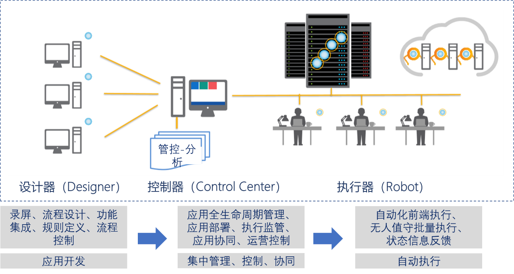

## 13.1 设计思路

通过上述讲解的项目示例，相信大家都对RPA有了一定的了解，并且也大概知道开发RPA所需要用到的一些技术点，那么接下来我们就开始正式开发RPA。其实换句话来说正式开发的RPA就是将上述我们讲解的项目示例集成到一个项目中，并且在此基础上对代码和功能做进一步的完善和扩展。

RPA核心包括：RPA设计器、RPA执行器和RPA控制器（可自行搭建，一般采用Web端，在设计器中调用其接口即可，这里暂不实现），如图13.1-1所示。

图13.1-1 核心组件及功能

其中RPA设计器的组件可以通过定义各种活动组件来实现自动完成完整业务流程每一步骤所需的模块化功能，并实现业务系统之间功能数据交互的松耦合，最大弹性限度内提高系统的集成性。

核心组件的系统技术架构和应用架构应足够灵活，可以将各种新技术和实现方式有机融合到平台中，从而实现各种新技术和创新应用的整合，快速响应企业的各种自动化流程建设需求。核心组件平台无论是在数据层还是功能层都应结构清晰，保证复杂RPA应用搭建的有序性和层次化，便于维护，便于分工协作。

RPA设计器里包括录屏工具，插件/扩展等模块化应用组件。“录屏”工具用以配置软件机器人，通过记录用户界面（UI）里发生的每一次鼠标动作和键盘输入，自动转换为相应的工作流视图。为了让配置运行软件机器人变得简单，RPA设计器应提供核心组件库的封装，例如邮件操作、办公软件操作等。在本系统设计中，我们通过类似包管理器的机制对各种插件和扩展进行管理，按需使用。同时RPA设计器还包括可视化流程图操作，例如流程视图、可视化视图、源码视图、属性视图等，分别针对不同用户的需求。

除此之外，RPA设计器需要支持一定的研发项目管理机制，例如支持工作流模块化，便于复杂长流程的管理，和方便其他项目复用。当项目开发完成后，设计器需要将项目通过远程或者本地的方式发布到控制器，以便将开发好的机器人快速部署到目标计算机。

核心组件之一的RPA执行器为RPA流程执行者。执行器通过消息方式与RPA控制器进行沟通对话，比如：接收运行、停止指令，将运行结果反馈给控制器，日志提交和分析等。同时可以将控制器分配好的流程任务自动下载并运行。

RPA执行器按照是否需要人工配合分为有人值守和无人值守两类。前者可同人类员工一起工作。后者在虚拟环境中自动执行多个进程，负责远程执行监控、调度和为工作队列提供支持。人类管理员可对机器人运行时的状态、动作采用录制屏幕或者日志记录等方式进行控制监管。

RPA控制器为RPA设计器、RPA执行器的管理控制与协调机构，主要用于软件机器人的部署和运行管理，包括启动、停止机器人的运行，为机器人制作日程表，维护和发布代码，重新部署机器人的不同任务，管理许可证和凭证等。当需要在多台PC上运行软件机器人的时候，也可以用控制器对这些机器人进行集中控制，比如统一分发流程，统一设定启动条件等。

RPA设计器与RPA执行器为客户端程序，用户交互频繁，主要涉及工作流的定义和执行，因此需要采用成熟、稳定、简洁、以用的UI开发套件和工作流框架。同时，RPA设计器和执行器与控制器之间存在密切的交互，因此可靠的数据通信框架也是必需。

正式开发的此RPA项目采用.Net编程语言，工作流开发采用微软Windows Workflow Foundation工作流框架，界面UI开发采用微软用户界面框架WPF（Windows Presentation Foundation），客户端与服务器端交互采用IPC进程间通信，技术架构如图13.1-2所示。。

图13.1-2 技术架构

## links
   * [目录](<preface.md>)
   * 上一节: [NLog项目代码解析](<12.5.md>)
   * 下一节: [解决方案项目分类](<13.2.md>)