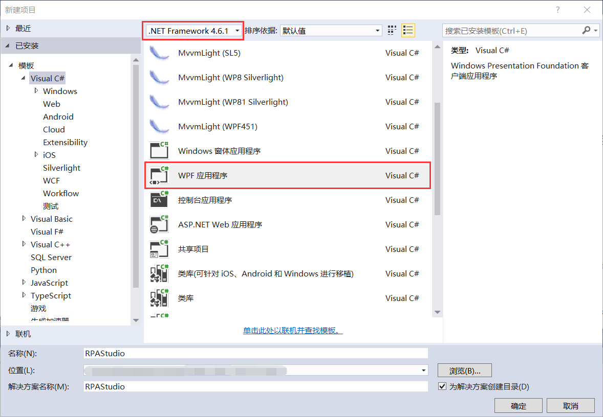
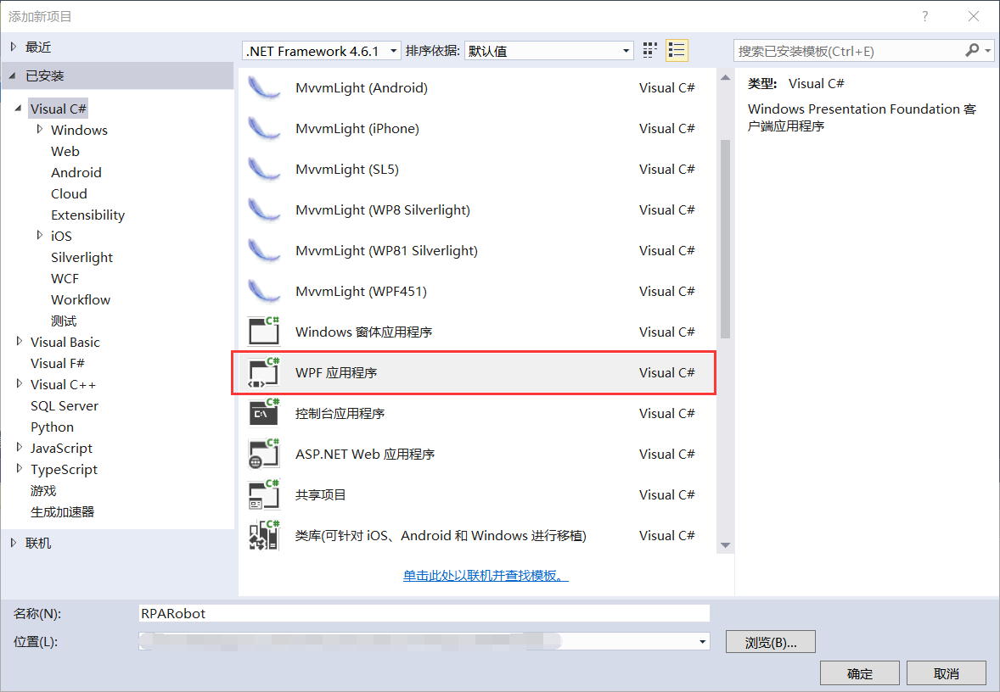
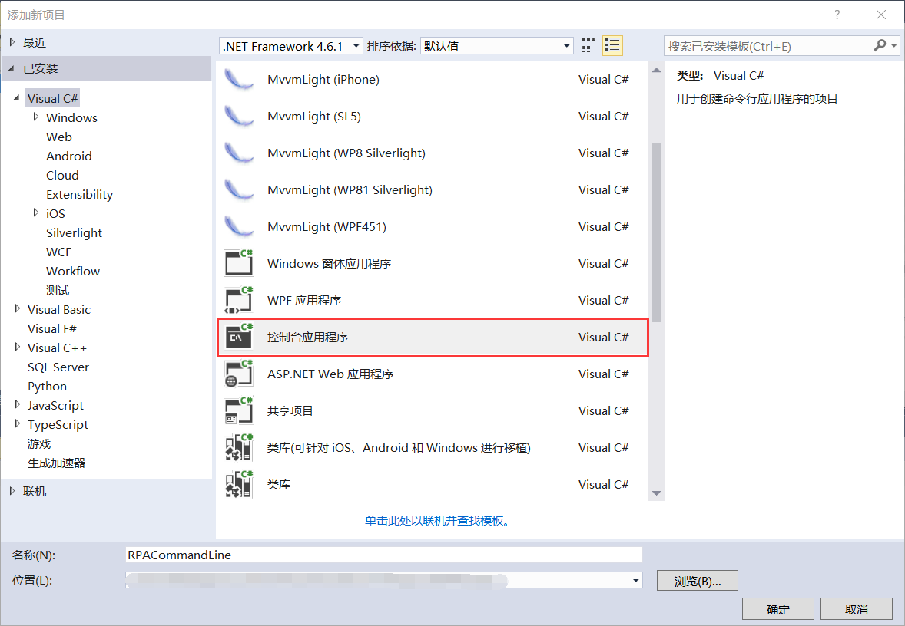
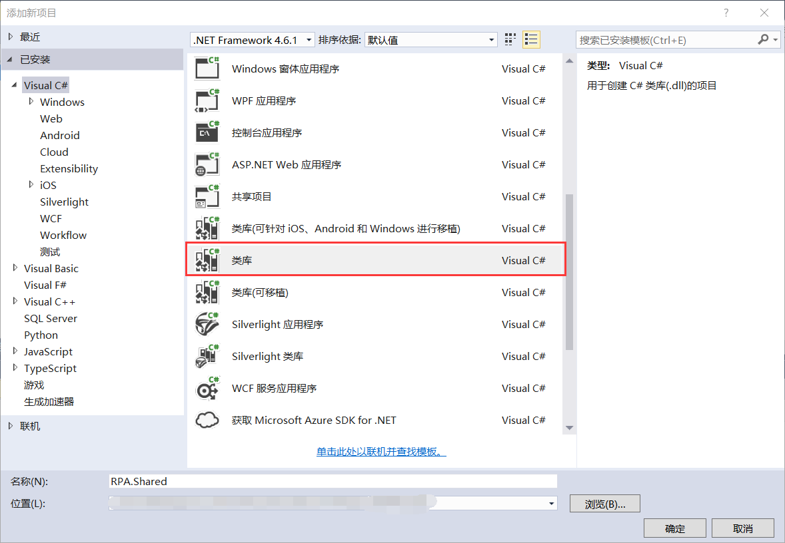
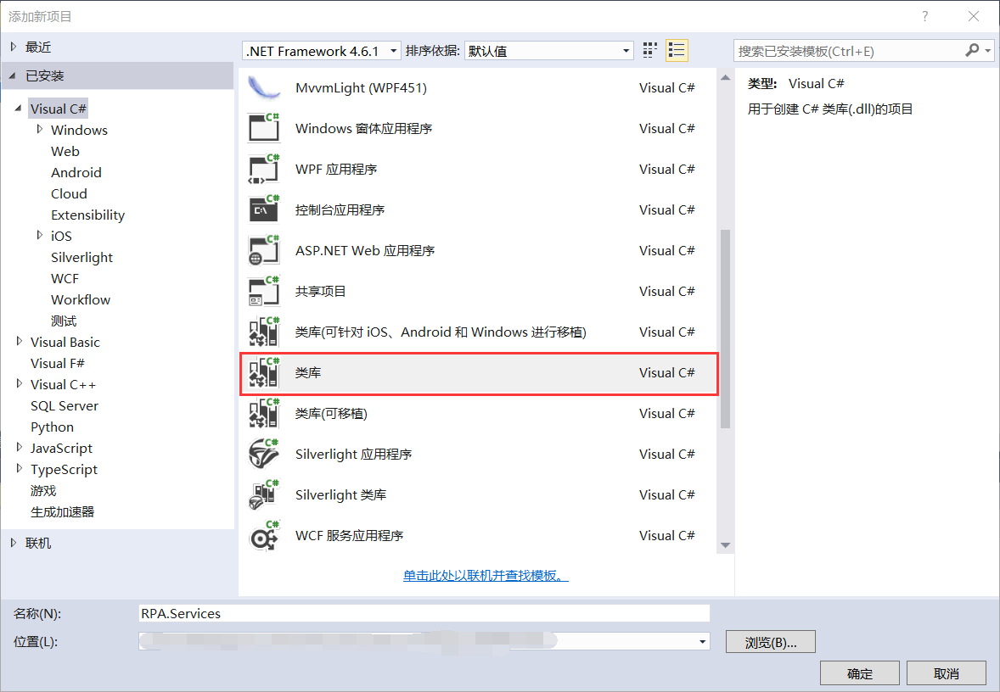
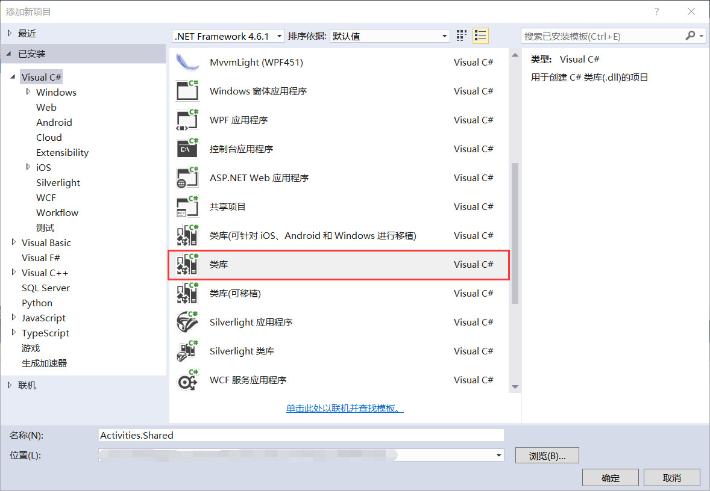
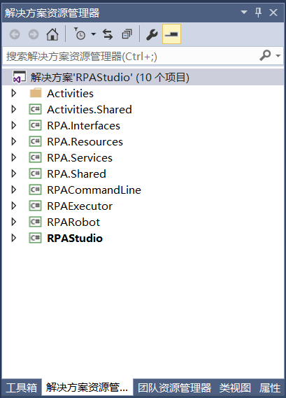

## 13.3 新建解决方案和项目

1、打开VS 2015，然后点击新建项目，使用.NET Framework 4.6.1创建Visual C#下的控制台应用程序RPAStudio，如图13.3-1所示。

图13.3-1 新建应用程序RPAStudio

2、新建执行器RPARobot项目，在同一解决方案下新建WPF应用程序RPARobot，用来设置执行器的界面Views和ViewMode以及使用到的资源文件Image等，如图13.3-2所示。

图13.3-2 新建RPARobot项目

3、添加命令行的控制台应用程序RPACommandLine，如图13.3-3所示。

图13.3-3 新建命令行RPACommandLine项目

4、添加共享类库RPA.Shared，用来设置一些样式以及参数类型转换等，如图13.3-4所示。

图13.3-4 新建共享类库RPA.Shared

5、新建服务类RPA.Services类库，如图13.3-5所示。

图13.3-5 新建服务类RPA.Services

6、新建资源类库RPA.Resources，用来放置设计器使用到的资源文件、图片、样式以及设置颜色等，如图13.3-6所示。

图13.3-6 新建资源类库RPA.Resources

7、新建接口类库RPA.Interfaces，用来放置一些使用到的接口，如图13.3-7所示。

图13.3-7 新建接口类库RPA.Interfaces

8、新建活动组件中使用到的共享类库Activities.Shared，如图13.3-8所示。

图13.3-8 新建活动组件共享类库Activities.Shared

9、新建文件夹Activities，文件夹下新建活动组件类库RPA.Learn.Activities，如图13.3-9所示。

图13.3-9 新建活动组件类库RPA.Learn.Activities

10、添加WPF应用程序RPAExecutor，用来停止工作流的运行，如图13.3-10所示。

图13.3-10 RPAExecutor

11、新建好的项目以RPAStudio作为启动项目，如图13.3-11所示。

图13.3-11 新建好的项目

## links
   * [目录](<preface.md>)
   * 上一节: [解决方案项目分类](<13.2.md>)
   * 下一节: [RPAStudio启动添加Autofac解耦](<13.4.1.md>)