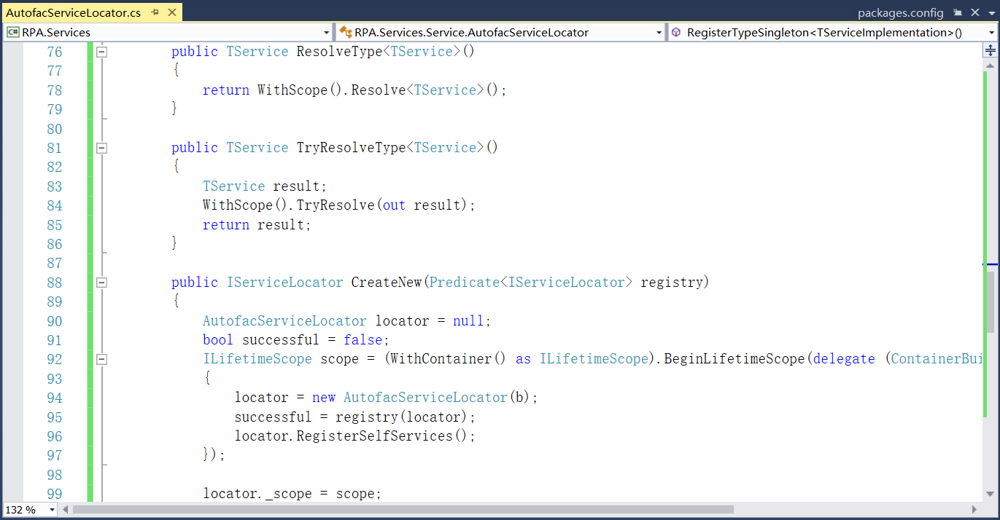

## 13.4.1 RPAStudio启动添加Autofac解耦

1、在RPA.Interfaces项目下新建文件夹App，在文件夹中添加接口IApplication，内容如图13.4.1-1所示，并删除Class1.cs文件。

图13.4.1-1 定义接口IApplication

2、在RPA.Interfaces项目下新建文件夹Service，在文件夹中添加接口IServiceLocator，并继承IDisposable，接口内容如图13.4.1-2所示。

图13.4.1-2 定义接口

3、RPAStudio启动添加Autofac解耦，在RPA.Services项目中添加Autofac 4.9.4版本的NuGet包，安装后如图13.4.1-3所示。

图13.4.1-3 Autofac的NuGet包

4、在RPA.Shared项目下新建Utils文件夹，在此文件夹下添加Common类，并删除Class1.cs文件。在类中添加为调用进程分配的新的控制台的AllocConsole函数以及从控制台分离调用进程的FreeConsole函数，如图13.4.1-4所示。

图13.4.1-4 添加函数

5、在RPA.Services项目中新建文件夹App，并删除类文件Class1.cs。在文件夹中添加类StudioApplication，继承接口IApplication，添加PresentationFramework、PresentationCore以及项目RPA.Shared的引用，StudioApplication中代码如图13.4.1-5和图13.4.1-6所示。

图13.4.1-5 StudioApplication类

图13.4.1-6 StudioApplication类

5、在RPA.Services项目中新建文件夹Service，在文件夹下添加类文件AutofacServiceLocator，并继承IServiceLocator。添加一些相对应的服务实现，代码如图13.4.1-7、图13.4.1-8、图13.4.1-9、图13.4.1-10和图13.4.1-11所示。

图13.4.1-7 AutofacServiceLocator类

图13.4.1-8 AutofacServiceLocator类

图13.4.1-9 AutofacServiceLocator类

图13.4.1-10 AutofacServiceLocator类

图13.4.1-11 AutofacServiceLocator类

6、程序日志使用NLog，在RPAStudio项目中安装NLog.Config 4.7.10版本的NuGet包，安装好以后如图13.4.1-12所示。

图13.4.1-12 NLog的NuGet包

7、在RPAStudio项目中新建App文件夹，在文件夹中新建类RPAStudioApplication，并继承StudioApplication，如图13.4.1-13所示。

图13.4.1-13 RPAStudioApplication类

8、在RPAStudio项目中新建Service文件夹，在文件夹中新建类AppServiceRegistry，类中代码如图13.4.1-14所示和图13.4.1-15所示。

图13.4.1-14 AppServiceRegistry类

图13.4.1-15 AppServiceRegistry类

9、在Service文件夹中继续添加RPAStudioServiceRegistry类，并继承AppServiceRegistry

，实现抽象类，如图13.4.1-16所示。

图13.4.1-16 RPAStudioServiceRegistry类

10、在RPAStudio项目中新建Boot文件夹，在文件夹中新建类AppBoot，删除App.xaml文件。因将App.xaml文件删除，因此类中的Main作为程序的入口，如图13.4.1-17所示。

图13.4.1-17 AppBoot类

11、在RPAStudio项目中添加文件夹Views，用来存放界面设计。将MainWindow.xaml文件移至到Views文件夹中，命名空间修改为RPAStudio.Views.MainWindow以及更改MainWindow.xaml.cs文件的命名空间，如图13.4.1-18所示。

图13.4.1-18 修改命名空间

## links
   * [目录](<preface.md>)
   * 上一节: [新建解决方案和项目](<13.3.md>)
   * 下一节: [程序的启动结束及日志添加](<13.4.2.md>)