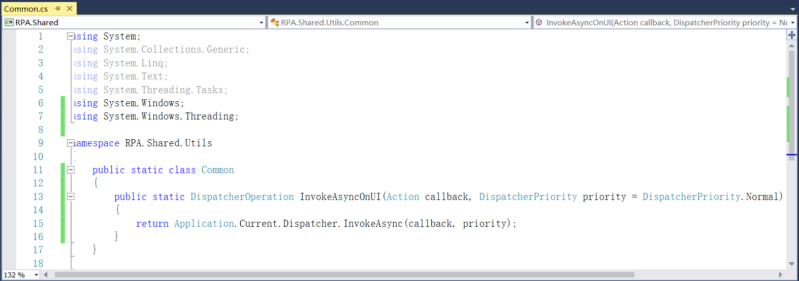

## 13.4.2 程序的启动结束及日志添加

1、在RPA.Services项目中App下的StudioApplication类中添加程序启动和结束的方法，如图13.4.2-1和图13.4.2-2所示。

图13.4.2-1 启动和结束

图13.4.2-2 添加启动和结束方法

2、在RPAStudio项目App文件夹下的RPAStudioApplication类中添加程序启动和结束的日志，如图13.4.2-3所示。

图13.4.2-3 添加程序启动和结束日志

3、在RPA.Interfaces项目App文件夹下的IApplication接口中添加程序异常的方法，如图13.4.2-4所示。

图13.4.2-4 接口添加异常方法

4、在RPA.Services项目App文件下的StudioApplication中实现接口，如图13.4.2-5所示。

图13.4.2-5 实现接口

5、在RPAStuodio项目中定义IServiceLocator字段，并实现抽象类，如图13.4.2-6所示。

图13.4.2-6 实现抽象类

7、此类库作为整个解决方案的共享库，添加PresentationFramework的引用，并且在Common类中添加InvokeAsyncOnUI，如图13.4.2-7所示。

图13.4.2-7 InvokeAsyncOnUI

8、在RPAStudio项目Boot文件夹下AppBoot类中添加程序异常的方法，如图13.4.2-8所示。

图13.4.2-8 程序异常日志

## links
   * [目录](<preface.md>)
   * 上一节: [RPAStudio启动添加Autofac解耦](<13.4.1.md>)
   * 下一节: [NLog颜色调整](<13.4.3.md>)