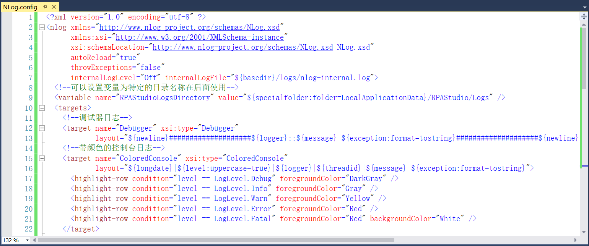
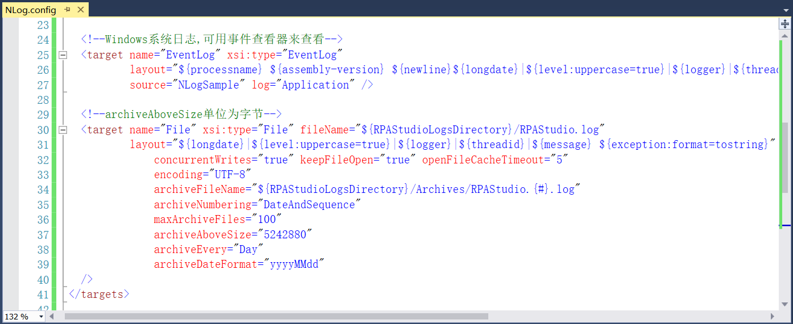
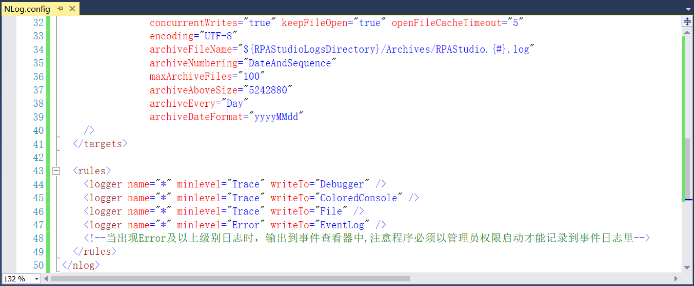
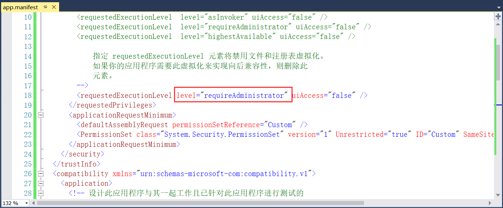

## 13.4.3 NLog颜色调整

1、将日志调整为带颜色的控制台日志，如图13.4.3-1所示，详细介绍请见第12章。

图13.4.3-1 日志颜色调整

2、Windows的系统日志，可以用事件查看器来查看，如图13.4.3-2所示。

图13.4.3-2 输出到事件查看器

3、当出现Error及以上级别日志时，输出到事件查看器中，程序必须以管理员权限启动才能记录到事件日志里，如图13.4.3-3所示。

图13.4.3-3 事件查看器

4、设置程序管理员启动的办法：右键RPAStudio项目----》属性----》安全性，勾选“启用ClickOnce安全设置”，勾选以后在去掉勾选，点击保存即可。这时在RPAStudio项目Properties下会生成一个app.manifest文件，打开此文件将level改为requireAdministrator保存即可，如图13.4.3-4所示。

图13.4.3-4 管理员启动

## links
   * [目录](<preface.md>)
   * 上一节: [程序的启动结束及日志添加](<13.4.2.md>)
   * 下一节: [MVVM初步添加](<13.5.01.md>)