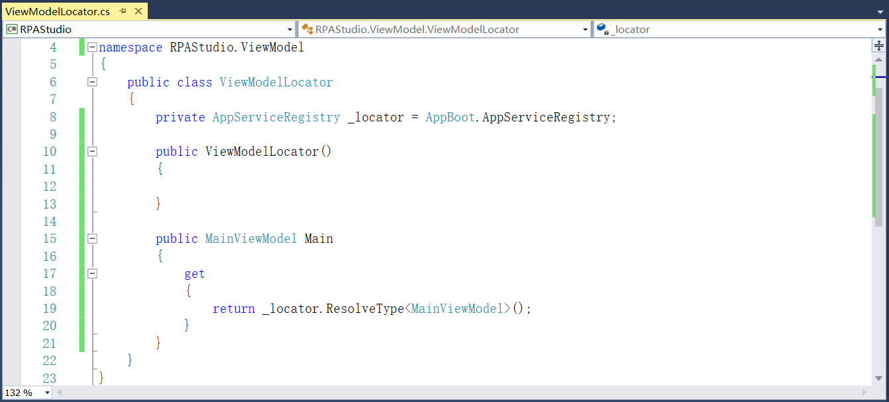

## 13.5.1 MVVM初步添加

1、界面设计我们这里采用商业界面库Actipro Software，详细介绍请见第7章。下载并安装Actipro Software，可在应用程序中找到Actipro WPF Controls Sample Browser。如果是默认  安装的话，位置在“C:\Program Files (x86)\Actipro Software\WPF-Controls\v19.1.0685”，在Assemblies文件夹下可以引用它的一些dll文件，如图13.5.1-1所示。

图13.5.1-1 dll文件

2、在RPAStudio项目中添加所用到的界面库Actipro Software的dll，如ActiproSoftware.DataGrid.Contrib.Wpf、ActiproSoftware.Docking.Wpf、ActiproSoftware.Editors.Wpf等，添加好的引用如图13.5.1-2所示。

图13.5.1-2 添加Actipro Software的引用

3、同时还需要在RPAStudio项目中引入轻量级的MVVM的开发框架，详细介绍请见第4章。安装轻量级MVVM的NuGet包，在NuGet安装界面搜索MVVM，找到MvvmLight，安装5.4.1.1版本，如图13.5.1-3所示。

图13.5.1-3 安装MVVM的NuGet包

4、安装好以后如图13.5.1-4所示。

图13.5.1-4 已安装的NuGet包

5、在RPAStudio项目Service文件夹下RPAStudioServiceRegistry类中添加主窗体的服务注册，如图13.5.1-5所示。

图13.5.1-5 主窗体服务注册

6、在RPAStudio项目ViewModel文件夹下ViewModelLocator中添加Main方法进行数据绑定，如图13.5.1-6所示。

图13.5.1-6 数据绑定

## links
   * [目录](<preface.md>)
   * 上一节: [NLog颜色调整](<13.4.3.md>)
   * 下一节: [设计主窗体](<13.5.02.md>)