## 13.5.2 设计主窗体

1、在RPA.Services项目中App文件夹下StudioApplication类中设置添加资源，如图13.5.2-1所示。

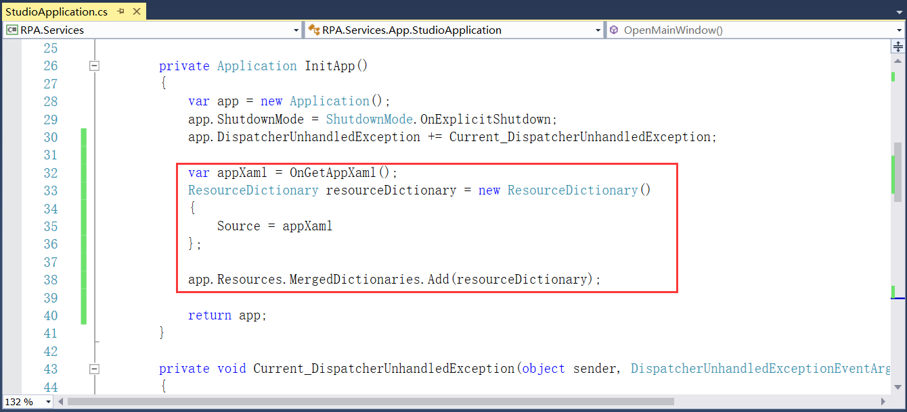

图13.5.2-1 StudioApplication类

2、在RPAStudio项目中添加Gu.Wpf.Adorners 2.1.1版本的NuGet包，并在RPA.Resources

添加PresentationCore、PresentationFramework和WindowsBase等引用。新建文件夹Colors，文件夹下添加GlobalColors.xaml文件，设置相关样式等，并删除Class1.cs文件，如图13.5.2-2所示，文件属性设置如图13.5.2-3所示。

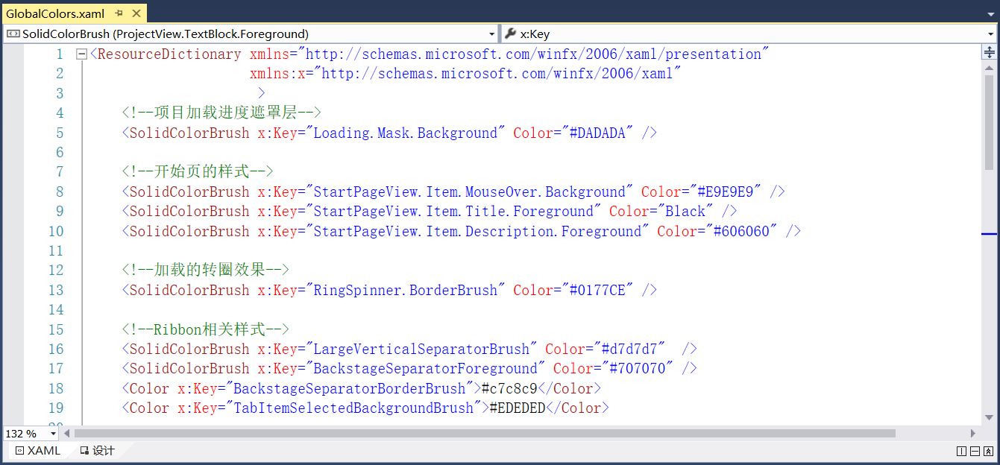

图13.5.2-2 设置样式

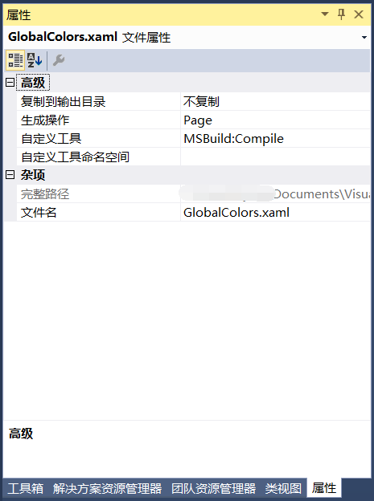

图13.5.2-3 文件属性设置

3、在RPA.Resources项目中新建文件夹Image用来存放项目中使用到的一些图标，并且图片属性中的生成操作为Resource，如图13.5.2-4所示。

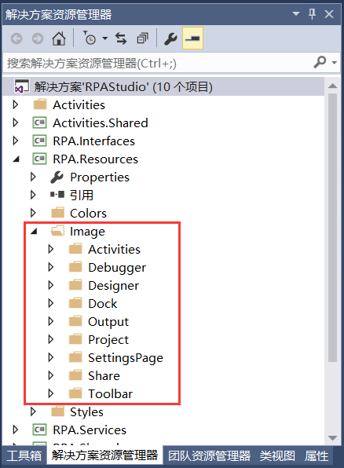

图13.5.2-4 添加的图片资源

4、在RPA.Shared项目中新建文件夹Converters，用来添加转换器。添加当值为true时是可见，false为折叠的BooleanToCollapsedVisibilityConverter转换器，并继承IValueConverter，如图13.5.2-5所示。接着添加当为true时为折叠，false为可见的OppositeBooleanToCollapsedVisibilityConverter转换器，继承IValueConverter，如图13.5.2-6所示。添加当为true时隐藏，false时显示的OppositeBooleanToVisibilityConverter转换器，继承IValueConverter，如图13.5.2-7所示。

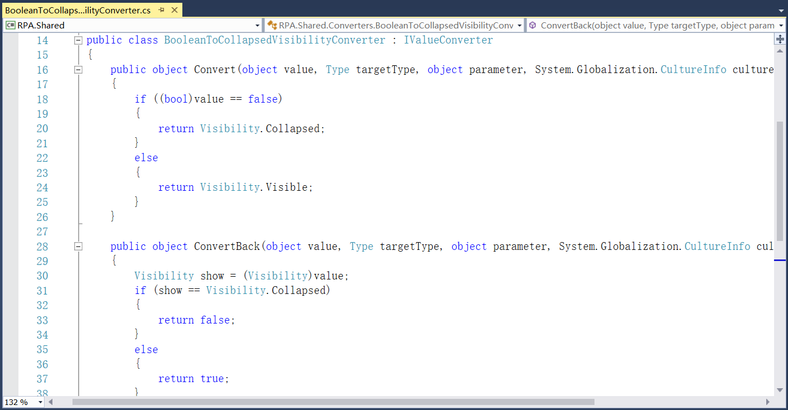

图13.5.2-5 BooleanToCollapsedVisibilityConverter转换器

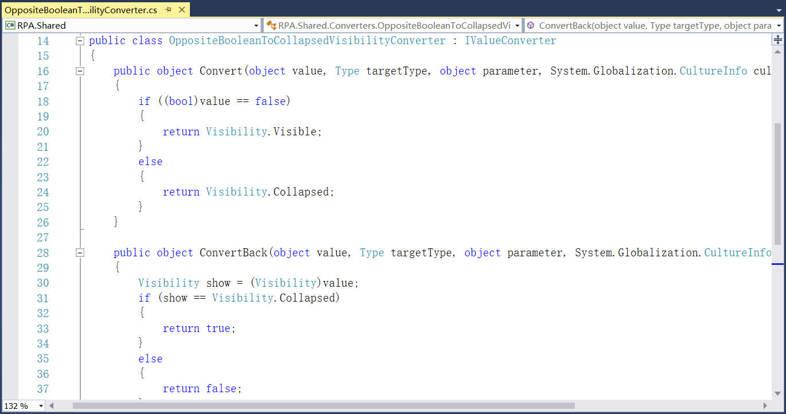

图13.5.2-6 OppositeBooleanToCollapsedVisibilityConverter转换器

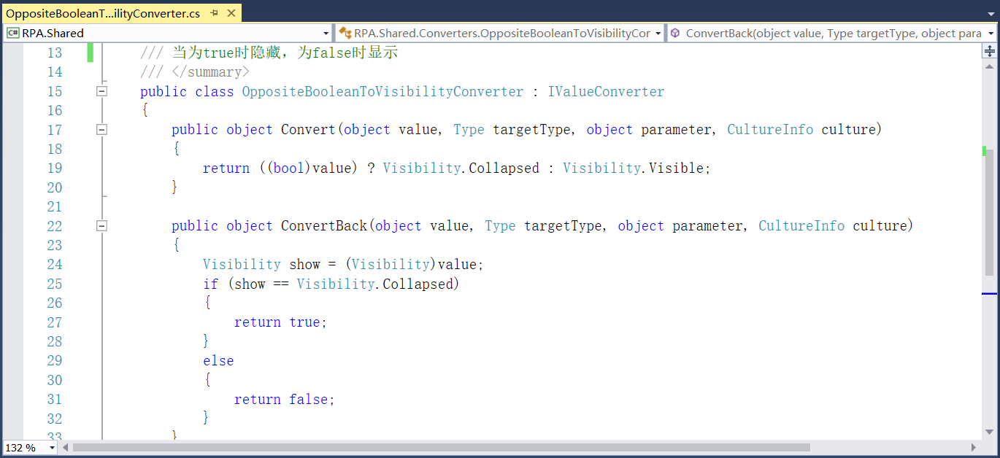

图13.5.2-7 OppositeBooleanToVisibilityConverter转换器

5、在RPA.Shared项目的文件夹Converters下添加Converters.xaml文件，汇总转换器的资源，如图13.5.2-8所示。

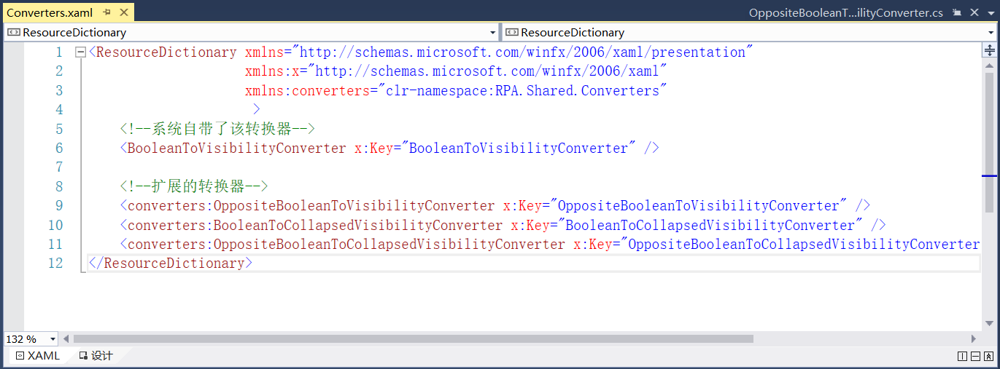

图13.5.2-8 转换器资源

6、在RPA.Shared项目下新建文件夹References，添加使用到的dll文件，如ActiproSoftware.DataGrid.Contrib.Wpf、ActiproSoftware.Docking.Wpf等。并将RPACommandLine项目、RPARobot等其他项目都设置为管理员启动。在RPAStudio项目中新建Resources文件夹用来存放一些资源文件，在文件夹下添加App.Resources.xaml文件，如图13.5.2-9所示。并在Resources文件夹下新建ICON文件件，存放RPAStudio的图标。

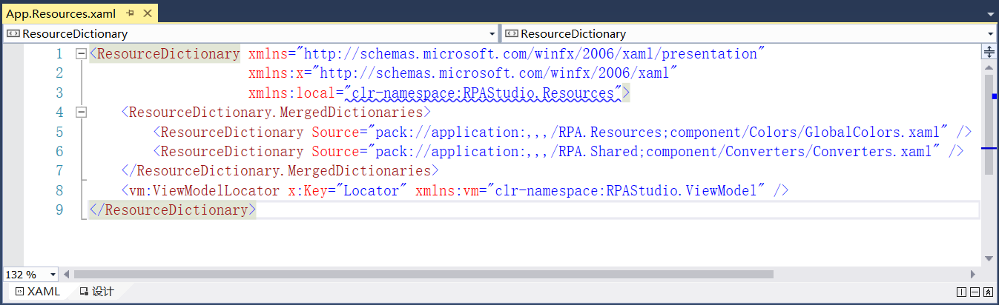

图13.5.2-9 App.Resources.xaml文件

7、在RPAStudio项目APP文件夹下RPAStudioApplication类中初始化Uri的实例，如图13.5.2-10所示。

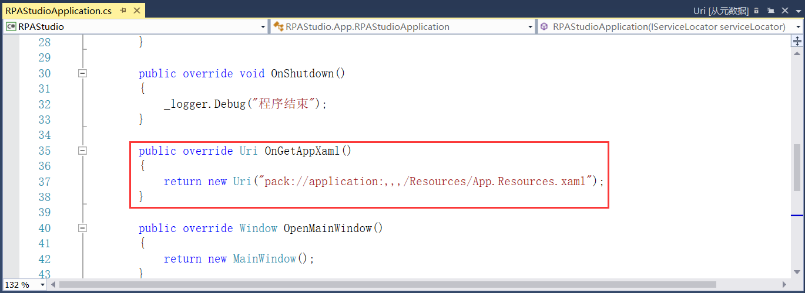

图13.5.2-10 初始化Uri实例

8、打开RPAStudio项目Views文件夹下MainWindow.xaml文件，开始设计项目的主界面，添加主页、设计和调试选项页以及最底部的状态栏，部分代码如图13.5.2-11和图13.5.2-12所示，详细设计步骤请见第7章。

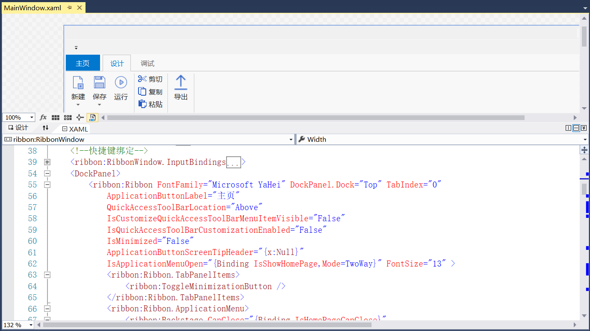

图13.5.2-11 主窗体

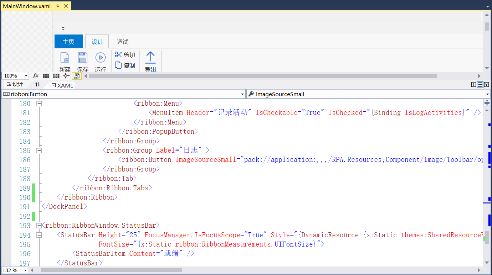

图13.5.2-12 状态栏

## links
   * [目录](<preface.md>)
   * 上一节: [MVVM初步添加](<13.5.01.md>)
   * 下一节: [各视图的初步创建](<13.5.03.md>)