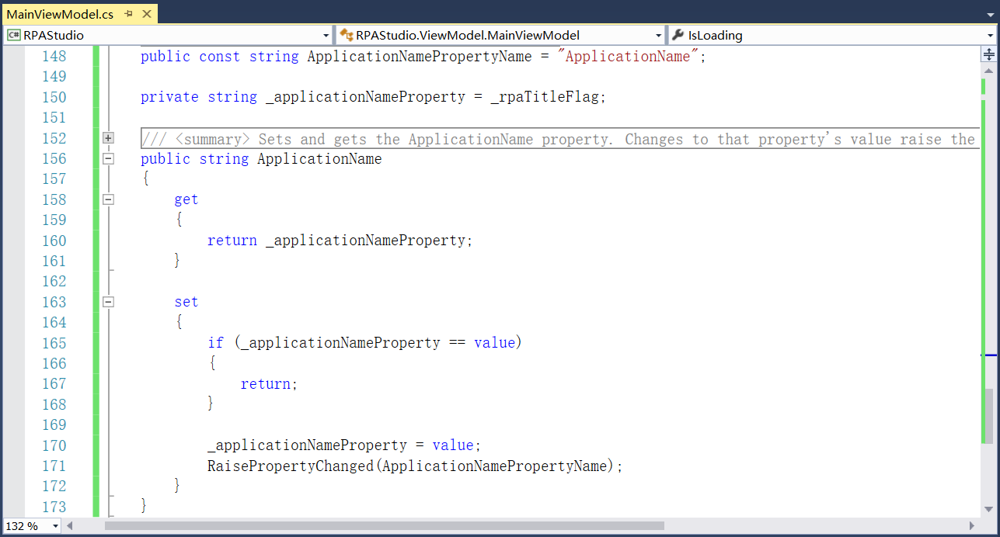

## 13.5.3 各视图的初步创建

1、在RPAStudio项目Views文件夹下添加用户控件(WPF)组件视图ActivitiesView.xaml文件、调试视图DebugView.xaml文件、DocksView.xaml文件、输出行视图OutlineView.xaml文件、输出窗口OutputView.xaml文件、搜索视图ProjectView.xaml文件、PropertyView.xaml文件、开始页中的设置页SettingsPageView.xaml文件、SettingsPageView.xaml文件、开始页StartPageView.xaml文件、工具视图ToolsPageView.xaml文件等，如图13.5.3-1所示。

图13.5.3-1 添加视图

2、在ViewModel文件夹下新建MvvmViewModel(WPF)项DocksViewModel.cs，定义属性如图13.5.3-2所示。

图13.5.3-2 DocksViewModel

3、接着在ViewModel文件夹下添加DesignerDocumentViewModel文件。在Service文件夹下的RPAStudioServiceRegistry文件中添加DocksViewModel文件的服务注册，并在ViewModel文件夹下的ViewModelLocator文件中添加Docks方法实现数据绑定，如图13.5.3-3所示。

图13.5.3-3 Docks数据绑定

4、在MainViewModel文件中定义程序标题等属性，具体定义方法可使用快捷命令创建，详细介绍请见第4章，如图13.5.3-4所示。

图13.5.3-4 定义标题等

5、添加窗体加载完成后调用命令，启动后显示主页，并且主页的回退按钮隐藏，ESC也无法关闭主页，如图13.5.3-5所示。

图13.5.3-5 窗体加载完成后调用命令

6、定义是否显示开始页的属性，如图13.5.3-6所示。

图13.5.3-6 定义是否显示主页属性

7、添加是否加载的属性，如图13.5.3-7所示。

图13.5.3-7 是否加载属性

8、添加应用程序的名称属性，如图13.5.3-8所示。

图13.5.3-8 应用程序的名称

9、在MainWindow.xaml中可以直接引用开始视图、工具视图等，如图13.5.3-9所示。

图13.5.3-9 引用用户控件

10、程序重新编译运行，界面如图13.5.3-10所示。

图13.5.3-10 开始页面

11、在RPA.Shared.Localization中添加ActiproLocalization类，对Actipro进行界面汉化，如图13.5.3-11所示。

图13.5.3-11 Actipro界面汉化

## links
   * [目录](<preface.md>)
   * 上一节: [设计主窗体](<13.5.02.md>)
   * 下一节: [组件打包及描述信息完善](<13.5.04.md>)