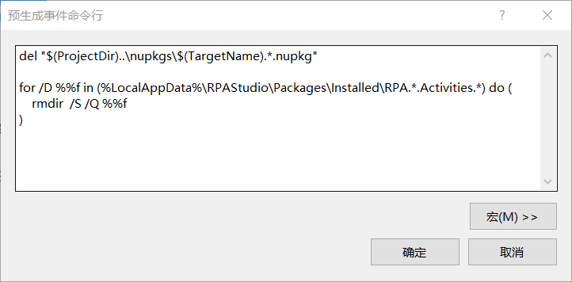
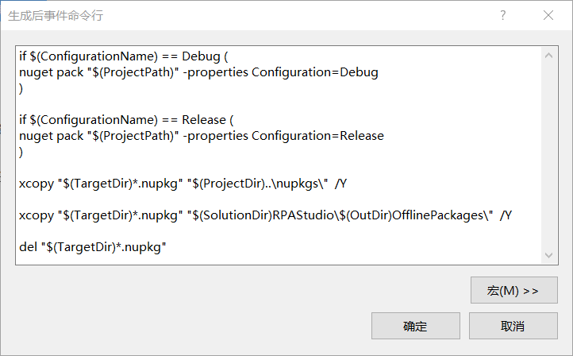
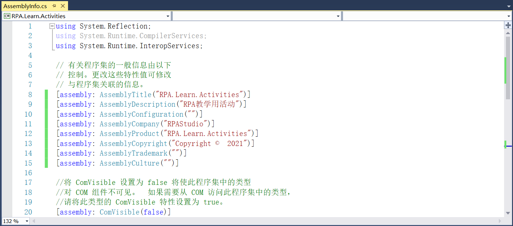
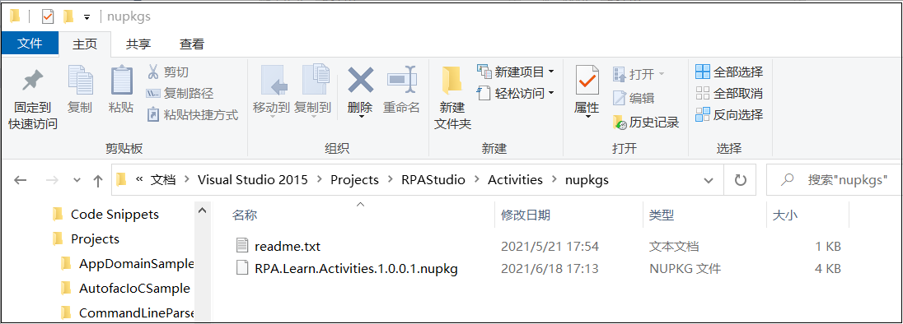

## 13.5.4 组件打包及描述信息完善

1、将Activities文件夹下RPA.Learn.Activities类库中的Class.cs文件删除，将类库的生成事件的预先生成事件命令写为如图13.5.4-1所示。删除%LocalAppData%\RPAStudio\Packages\Installed下组件库的包。

图13.5.4-1 预生成事件命令行

2、生成后事件命令行如图13.5.4-2所示，在Activities文件夹下新建nupkgs文件夹，根据生成后事件命令编译后会将nupkg包放至项目路径下的nupkgs文件夹中。

图13.5.4-2 生成后事件命令行

3、在程序集信息文件AssemblyInfo中将信息修改为如图13.5.4-3所示，版本号修改为1.0.0.1。并将RPACommandLine、RPARobot等其他项目的版本号都修改为1.0.0.1。

图13.5.4-3 修改描述信息

4、打开nupkgs文件夹，并在其中添加一个readme.txt文件，内容为说明项目的nupkg存放在此路径下。并将程序重新编译，打开nupkgs文件，可以看到生成的nupkg包，如图13.5.4-4所示。

图13.5.4-4 生成的nupkg包

## links
   * [目录](<preface.md>)
   * 上一节: [各视图的初步创建](<13.5.03.md>)
   * 下一节: [样式添加](<13.5.05.md>)