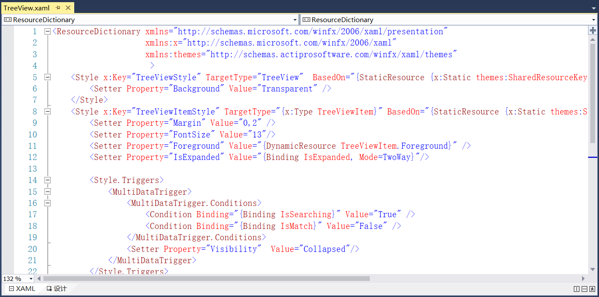

## 13.5.5 样式添加

1、在RPA.Shared项目中新建UI文件夹，在文件夹中添加三态按钮扩展类ButtonThreeState，并继承Button，类中添加默认图片、鼠标悬浮图片、默认前景色等，如图13.5.5-1所示。

图13.5.5-1 三态按钮扩展类

2、接着在UI文件夹中继续添加带颜色的三态按钮控件扩展类ColorButtonThreeState，类中定义默认图像、默认颜色、默认前景色等，如图13.5.5-2所示。

图13.5.5-2 带颜色的三态按钮控件扩展类

3、在RPA.Resources项目中添加Styles文件夹，并添加RPA.Shared项目和System.Activities.Presentation为引用。在文件夹中添加样式，如图13.5.5-3为Button按钮的样式。

图13.5.5-3 Button样式

4、继续添加ComboBox的样式，如图13.5.5-4所示。

图13.5.5-4 ComboBox样式

5、添加GroupBox样式，如图13.5.5-5所示。

图13.5.5-5 GroupBox样式

6、添加System.Xaml为引用，添加滚动条样式，如图13.5.5-6所示。

图13.5.5- 6 ScrollBar样式

7、先在RPA.Shared项目的Converters文件夹中添加转换器并继承IValueConverter，如图13.5.5-7所示，同时在Converters.xaml文件中添加该扩展的转换器。接着添加分割线的样式，如图13.5.5-8所示。

图13.5.5-7 转换器

图13.5.5-8 Separator样式

8、添加选项卡控件的样式，如图13.5.5-9所示。

图13.5.5-9 TabControl样式

​9、添加任务选项卡控件的样式，如图13.5.5-10所示。

图13.5.5-10 TaskTabControl样式

10、添加文本框的样式，如图13.5.5-11所示。

图13.5.5-11 TextBox样式

11、添加树视图的样式，如图13.5.5-12所示。

图13.5.5-12 TreeView样式

12、添加Index.xaml文件，定义Actipro库的控件样式，如图13.5.5-13所示。

图13.5.5-13 Actipro库的控件样式

13、在RPAStudio项目Resources文件夹中的App.Resources.xaml文件中添加Index.xaml文件的资源，如图13.5.5-14所示。

图13.5.5-14 App.Resources文件

## links
   * [目录](<preface.md>)
   * 上一节: [组件打包及描述信息完善](<13.5.04.md>)
   * 下一节: [开始页及相关菜单栏功能实现](<13.5.06.md>)