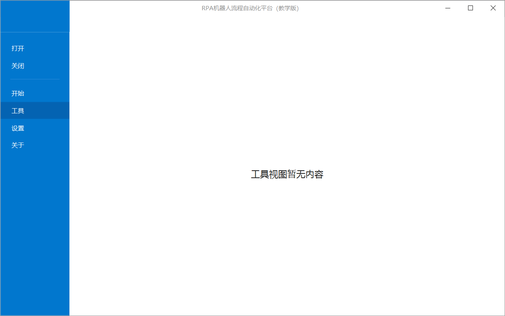
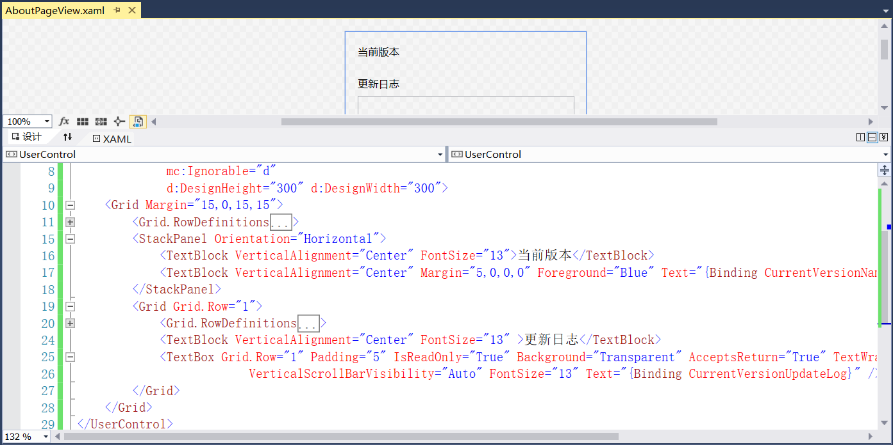
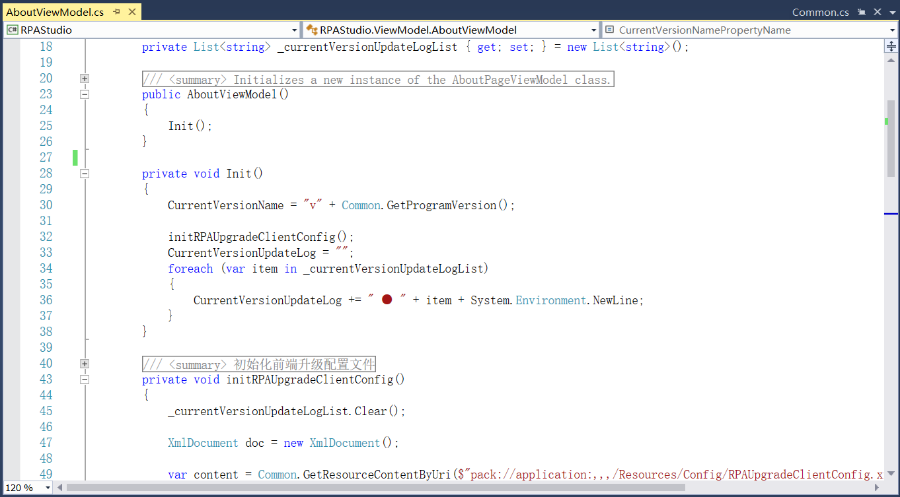
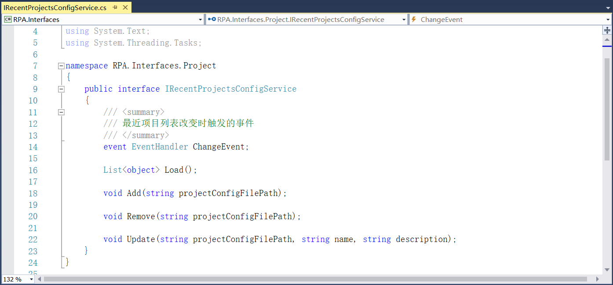
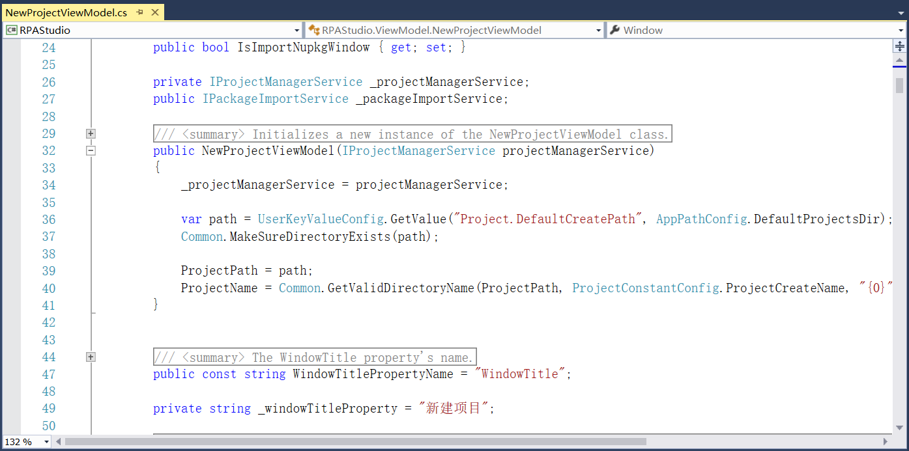

## 13.5.6 开始页及相关菜单栏功能实现

1、在RPAStudio项目中安装Extended.Wpf.Toolkit 3.8.2版本的NuGet包，在Views文件夹中的SettingsPageView文件中添加开始页的设置视图，如图13.5.6-1所示。

图13.5.6-1 设置视图

2、设置视图界面如图13.5.6-2和图13.5.6-3所示。

图13.5.6-2 常规项

图13.5.6-3 组件项

3、在StartPageView文件中添加开始视图，如图13.5.6-4所示。

图13.5.6-4 开始视图

4、开始视图界面如图13.5.6-5所示。

图13.5.6-5 开始视图

5、在ToolsPageView文件中设计工具视图，暂时先不添加内容，如有需要可自行添加，如图13.5.6-6所示。

图13.5.6-6 工具视图

6、工具视图界面如图13.5.6-7所示。

图13.5.6-7 工具视图

7、在Views文件夹中添加用户控件AboutPageView.xaml文件，用来设计关于视图，视图中用来显示设计器的版本号信息以及更新的日志信息等，如图13.5.6-8所示。

图13.5.6-8 关于视图

8、在RPA.Shared项目Utils文件夹下的Common文件中添加获取版本号和获取资源文件内容的方法，如图13.5.6-9所示。并在项目中安装NLog 4.7.10版本的NuGet包。在RPAStudio项目Resources文件夹下添加Config文件夹，添加RPAUpgradeClientConfig.xml文件作为更新日志文件，如图13.5.6-10所示。

图13.5.6-9 获取版本号及升级日志

图13.5.6-10 升级日志文件

9、在ViewModel文件夹中新建AboutViewModel类，初始化升级的配置文件等，如图13.5.6-11所示。版本号前加上v，并且升级日志前添加符号，同时日志内容换行。

图13.5.6-11 AboutViewModel类

10、关于视图界面如图13.5.6-12所示。

图13.5.6-12 关于视图

11、接着创建其他几个视图相对应的ViewModel类，在ViewModelLocator文件中定义SettingsPage等方法实现数据绑定，如图13.5.6-13所示。并在Service文件夹的RPAStudioServiceRegistry文件中添加服务注册，如图13.5.6-14所示。

图13.5.6-13 数据绑定

图13.5.6-14 服务注册

12、接下来添加开始页的新建项目窗口，在Views文件夹中添加NewProjectWindow文件，设计的界面如图13.5.6-15所示。并且在设置的名称和位置上添加了校验，不允许设置特殊字符。

图13.5.6-15 新建项目窗口设计

13、接下来添加新建项目窗口的相关功能实现，定义界面数据的绑定。首先在RPA.Shared项目中安装Newtonsoft.Json 13.0.1版本的NuGet包，创建Project文件夹，在文件夹中添加project.rpa的JSON文件格式的ProjectJsonConfig类，如图13.5.6-16所示。包括项目类型、项目版本、名称和描述等。

图13.5.6-16 project.rpa的JSON文件格式

14、在RPA.Interfaces项目中创建Project文件夹，在文件夹中添加IProjectManagerService接口，用来定义创建项目打开后的转圈效果、当前项目的配置等，如图13.5.6-17所示。

图13.5.6-17 定义接口

15、在RPA.Interfaces项目中新建文件夹Nupkg，在文件夹下添加接口IPackageImportService，定义Nupkg包的id、版本号以及描述等信息的属性，在打开Nupkg类型的项目时会使用到，如图13.5.6-18所示。

图13.5.6-18 Nupkg包的属性接口

16、在RPA.Shared项目中创建Configs文件夹，在文件夹中添加AppPathConfig类文件，用来设置应用程序中使用到路径，比如设计器的日志路径、Package包路径等，如图13.5.6-19所示。

图13.5.6-19 路径配置等

17、在Configs文件夹中添加UserKeyValueConfig类文件，包含修改值和获取值的方法，如图13.5.6-20和图13.5.6-21所示。

图13.5.6-20 获取值

图13.5.6-21 修改值

18、在RPA.Shared项目Utils文件夹下的Common类中添加如目录不存在就创建的方法，以及添加获取项目名称的方法，如图13.5.6-22所示。

图13.5.6-22 创建目录及获取项目名称

19、在Configs文件夹中添加ProjectConstantConfig文件，定义一些使用到的项目常量配置等，包括项目文件的名称、扩展名以及最近显示的项目总数等，如图13.5.6-23所示。

图13.5.6-23 项目常量配置

20、安装NuGet.Versioning 4.5.3版本、NuGet.Core 2.14.0版本的NuGet包，在Utils文件夹中添加CommonNuget文件，进行项目包id的检验，如图13.5.6-24所示。

图13.5.6-24 CommonNuget文件

21、在Utils文件夹中添加CommonDialog类文件，添加在新建项目时保存目录的选择，如图13.5.6-25所示。

图13.5.6-25 保存目录的选择

22、将新建项目所使用到的接口和属性定义好以后，在ViewModel文件夹中新建NewProjectViewModel文件。文件中添加新建好项目并打开加载项目的转圈效果，并且获取项目路径等，如图13.5.6-26所示。

图13.5.6-26 新建项目

23、并且在新建项目时进行项目名称和路径的合法性核验，如图13.5.6-27所示。并且当项目名称和路径修改时也要进行核验。

图13.5.6-27 项目名称和路径的合法性核验

24、还有定义项目的描述信息属性，创建项目的命令如图13.5.6-28和图13.5.6-29所示。

图13.5.6-28 创建项目

图13.5.6-29 创建项目

25、在ViewModelLocator中定义NewProject方法以及在Service文件夹的RPAStudioServiceRegistry中添加NewProjectViewModel的注册进而实现数据绑定，如图13.5.6-30所示。

图13.5.6-30 数据绑定

26、接着就是在开始页面添加新建项目窗口的命令即可完成，首先在RPA.Shared项目的Utils文件夹下新建CommonWindow类，添加打开窗口的Show和ShowDialog方法，如图13.5.6-31所示。

图13.5.6-31 Show和ShowDialog方法

27、最后在开始页面的StartPageViewModel中添加新建项目窗口的命令，如图13.5.6-32所示。

图13.5.6-32 新建窗口命令

28、新建项目窗口如图13.5.6-33所示。

图13.5.6-33 新建项目窗口

29、在项目中新建可以选择序列图、流程图和状态机，在RPA.Resources项目中新建Configs文件夹，在文件夹中添加RPAStudio.System.xml文件，其文件属性的生成操作为Resource，内容如图13.5.6-34所示。

图13.5.6-34 新建类型

30、接着在文件夹中添加RPAStudio.User.xml文件，并且文件的生成操作也为Resource，内容如图13.5.6-35所示。

图13.5.6-35 用户配置

31、在RPA.Shared项目Configs文件夹下添加SystemKeyValueConfig类，用来获取配置文件，如图13.5.6-36所示。

图13.5.6-36 获取配置文件

32、在Utils文件夹下的Common类中添加写入文件的方法，可用于日志的填写，如图13.5.6-37所示。

图13.5.6-37 写入文件

33、在Configs文件夹中AppPathConfig类中添加用户配置文件输出，如图13.5.6-38所示。

图13.5.6-38 配置文件

34、在Utils文件夹中的CommonWindow类中添加窗口最大化、最小化等的方法，如图13.5.6-39所示。

图13.5.6-39 窗口最大化、最小化

35、在RPA.Interfaces项目中新建AppDomains文件夹，添加MarshalByRefServiceBase文件，代码如图13.5.6-40所示。

图13.5.6-40 MarshalByRefServiceBase类

36、在文件夹中添加接口IAppDomainServiceHost定义服务，如图13.5.6-41所示。

图13.5.6-41 定义接口

37、添加程序集解析服务接口，如图13.5.6-42所示。

图13.5.6-42 程序集解析服务

38、添加事件处理跨域服务，如图13.5.6-43和图13.5.6-44所示。

图13.5.6-43 跨域服务

图13.5.6-44 跨域服务

39、在RPA.Shared.Utils下的Common类中添加在关联的线程上同步执行，如图13.5.6-45所示。

图13.5.6-45 在关联线程上执行

40、在AppDomains文件中添加跨域相关服务，如图13.5.6-46和图13.5.6-47所示。

图13.5.6-46 跨域服务

图13.5.6-47 跨域服务

41、在RPA.Services项目中新建文件夹AppDomains，添加域卸载，如图13.5.6-48所示。

图13.5.6-48 卸载域

42、在项目中添加NLog.Config 4.7.10版本的NuGet包，在RPA.Interfaces项目中添加Share文件夹，定义获取项目路径、EXE所在路径、日志输出类型等，如图13.5.6-49所示。

图13.5.6-49 定义SharedObject

43、添加加载程序集的方法，如图13.5.6-50所示。

图13.5.6-50 加载程序集

44、在RPA.Shared项目Utils中添加CommonMessageBox的提示、警告和错误的定义，如图13.5.6-51所示。

图13.5.6-51 定义CommonMessageBox

45、在AppDomains中添加跨域服务，如图13.5.6-52所示。

图13.5.6-52 跨域服务

46、在RPA.Interfaces项目Project文件夹中添加最近项目列表改变时触发的事件，如图13.5.6-53所示。

图13.5.6-53 最近项目列表改变时触发事件

47、实现上述接口最近项目列表的服务，如图13.5.6-54所示。

图13.5.6-54 服务实现

48、并在资源项目中添加NuGet.Default.Config和NuGet.User.Config文件以及nuget.exe，如图13.5.6-55所示。

图13.5.6-55 包源配置文件

49、添加最近列表的显示功能，在RPAStudio项目的ViewModel文件夹中添加RecentUsedProjectItemViewModel文件，如图13.5.6-56所示。

图13.5.6-56 最近列表

50、在StartPageViewModel文件中添加最近项目列表更新，如图13.5.6-57所示。

图13.5.6-57 最近项目列表更新

51、在RPA.Shared.Converters中添加单文本转换类，如图13.5.6-58所示。

图13.5.6-58 单文本转换

52、添加打开关闭项目的日志，并添加其功能的实现，如图13.5.6-59和13.5.6-60所示，新建项目功能如图13.5.6-61所示。

图13.5.6-59 打开项目

图13.5.6-60 关闭项目

图13.5.6-61 新建项目

53、定义包的版本信息接口等以及实现包导入功能，如图13.5.6-62和图13.5.6-63所示。

图13.5.6-62 定义包相关信息

图13.5.6-63 包导入

54、在RPA.Shared.Utils下的Common中添加在当前目录文件夹中遍历、获取有效的文件名以及删除文件方法等，如图13.5.6-64所示。

图13.5.6-64 遍历文件夹等方法

55、程序重新编译，新建项目如图13.5.6-65所示。

图13.5.6-65 新建项目

## links
   * [目录](<preface.md>)
   * 上一节: [样式添加](<13.5.05.md>)
   * 下一节: [文档视图](<13.5.07.md>)