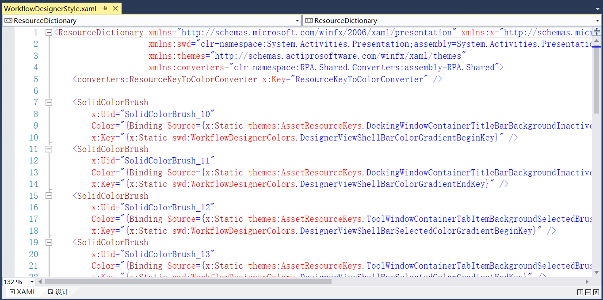
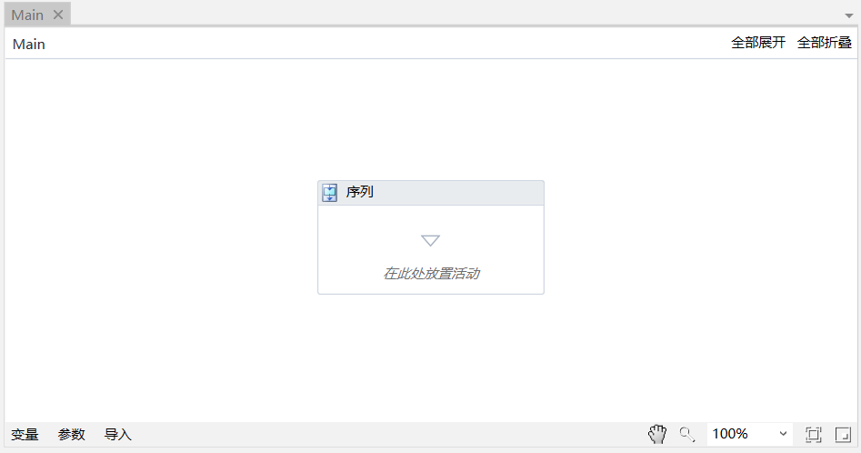

## 13.5.7 文档视图

1、在RPAStudio.ViewModel中添加文档视图的DocumentViewModel，如图13.5.7-1所示。

图13.5.7-1 DocumentViewModel

2、在DesignerDocumentViewModel修改继承为DocumentViewModel，并添加相关事件调试运行及结束等，如图13.5.7-2所示。

图13.5.7-2 添加事件

3、在DocksViewModel中添加窗体关闭命令事件以及设置工作流在运行或调试时新打开的xaml文件为只读，如图13.5.7-3所示。

图13.5.7-3 窗体关闭

4、并在MainViewModel中添加工作流运行、结束和保存等命令事件，如图13.5.7-4所示。

图13.5.7-4 工作流运行

5、在RPA.Shared.Extensions中的StringExtensions为字符串的扩展，如图13.5.7-5所示。

图13.5.7-5 字符串的扩展

6、在RPA.Shared.Utils中添加DirOrFileItem文件，定义路径以及名称等，如图13.5.7-6所示。

图13.5.7-6 定义文件路径、名称等

7、RPA.Resources.WorkflowDesigner中添加设计器样式设置，如图13.5.7-7所示。

图13.5.7-7 设计器样式

8、流程设计面板如图13.5.7-8所示。

图13.5.7-8 流程设计面板

## links
   * [目录](<preface.md>)
   * 上一节: [开始页及相关菜单栏功能实现](<13.5.06.md>)
   * 下一节: [项目视图](<13.5.08.md>)