## 13.5.8 项目视图

1、在ProjectView中添加项目视图的设计，如图13.5.8-1所示。

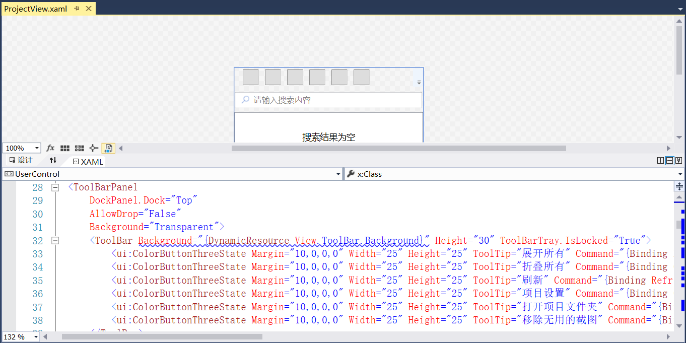

图13.5.8-1 项目视图显示

2、在ProjectViewModel中添加展开列表、依赖包的展示以及搜索等，如图13.5.8-2所示。

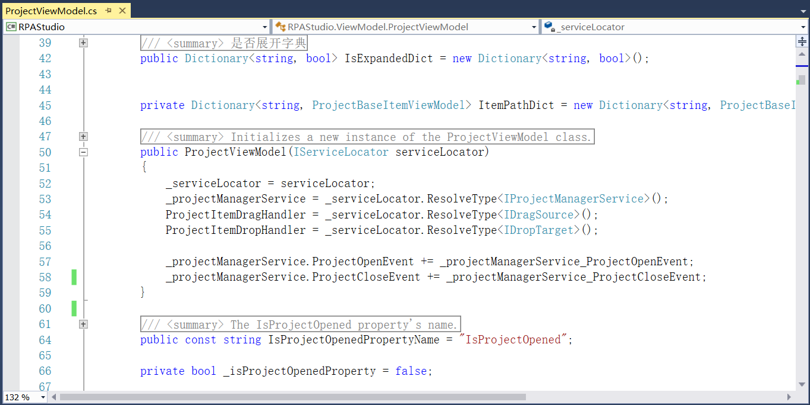

图13.5.8-2 项目视图

3、在项目视图中添加新建文件夹功能，Views文件夹中添加NewFolderWindow.xaml文件为新建文件夹视图，如图13.5.8-3所示。

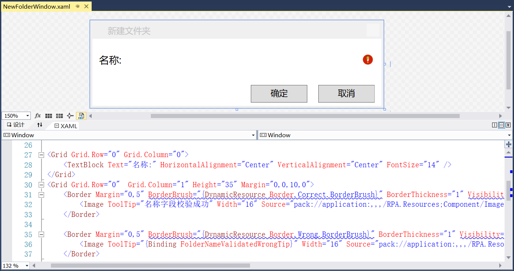

图13.5.8-3 新建文件夹视图

4、在ViewModel文件夹中添加对应的功能实现，如图13.5.8-4所示。

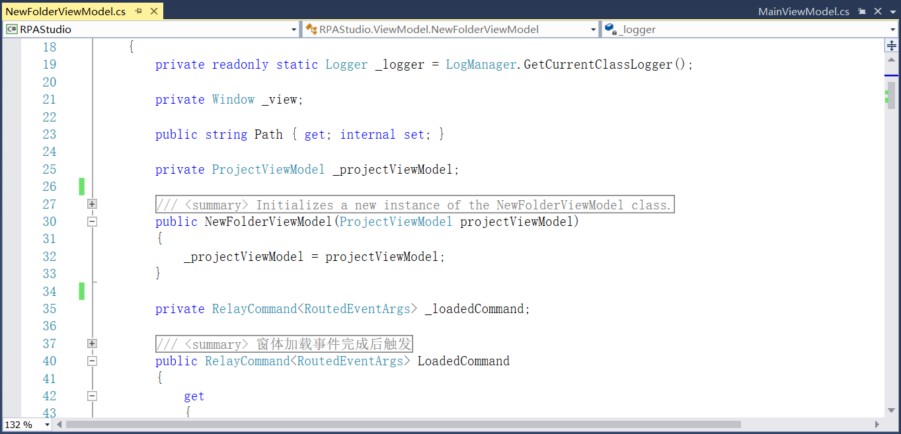

图13.5.8-4 新建文件夹

5、继续添加新建流程文件的视图，如图13.5.8-5所示。

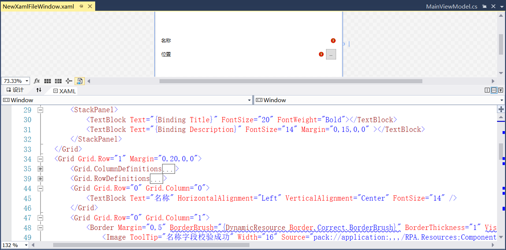

图13.5.8-5 新建流程文件视图

6、新建流程文件的功能实现，可以新建序列图、流程图和状态机三种，如图13.5.8-6所示。

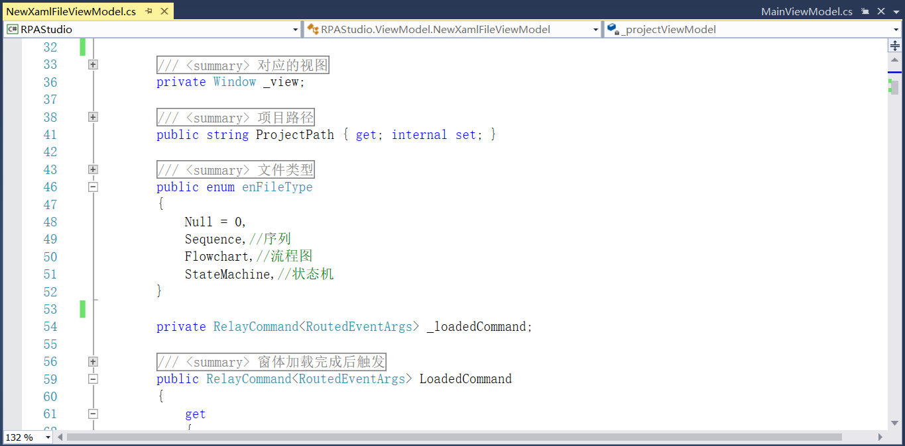

图13.5.8-6 新建流程文件

7、添加重命名的视图，如图13.5.8-7所示。

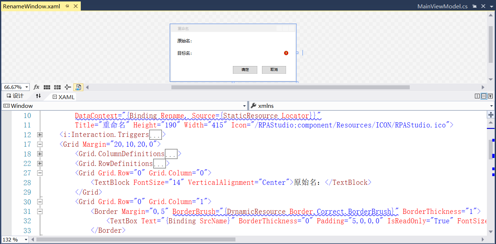

图13.5.8-7 重命名视图

8、相对应的添加重命名功能实现，将文件进行重命名，如图13.5.8-8所示。

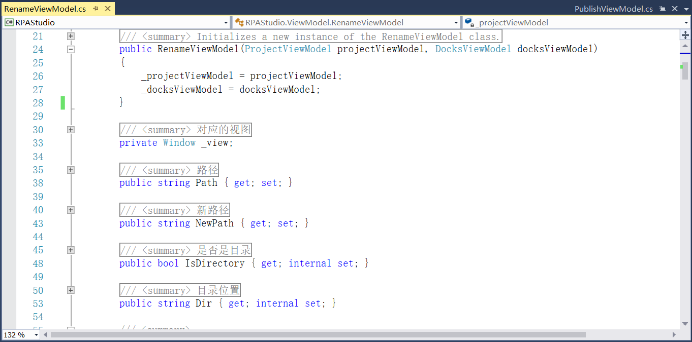

图13.5.8-8 文件重命名

9、在RPA.Shared.Utils中的Common文件中添加Brush转BitmapSource的方法，如图13.5.8-9所示。

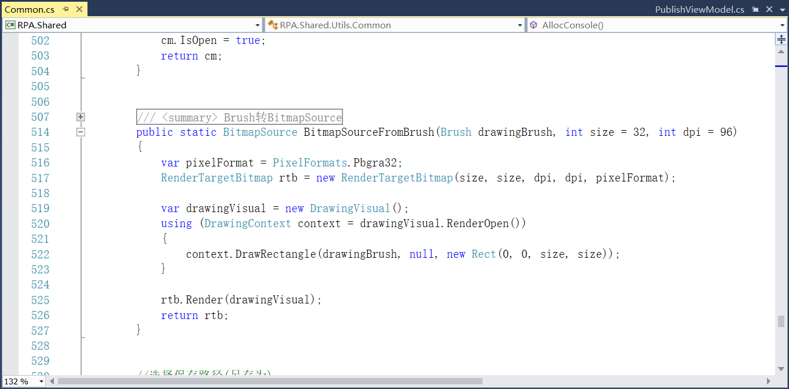

图13.5.8-9 Brush转BitmapSource

10、在RPA.Shared.UserControls中添加自定义搜索框用户控件，如图13.5.8-10所示。

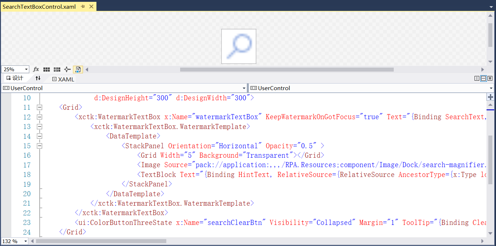

图13.5.8-10 自定义搜索框

11、搜索框中文本内容及其他字段定义，并且添加清除搜索内容，如图13.5.8-11所示，并在项目视图ProjectView中引用此用户控件。

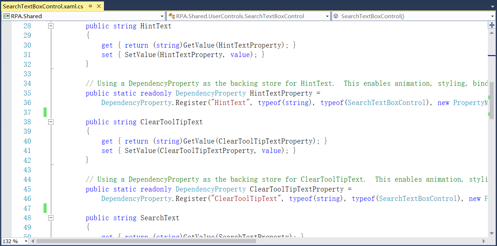

图13.5.8-11 定义属性

12、项目面板如图13.5.8-12所示。

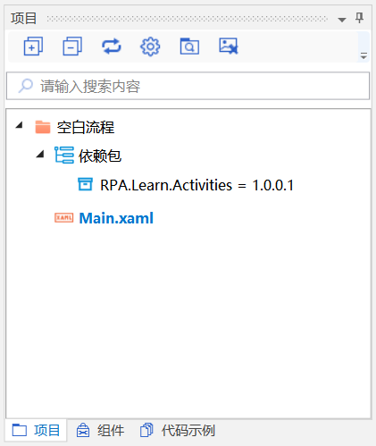

图13.5.8-12 项目面板

## links
   * [目录](<preface.md>)
   * 上一节: [文档视图](<13.5.07.md>)
   * 下一节: [组件视图](<13.5.09.md>)