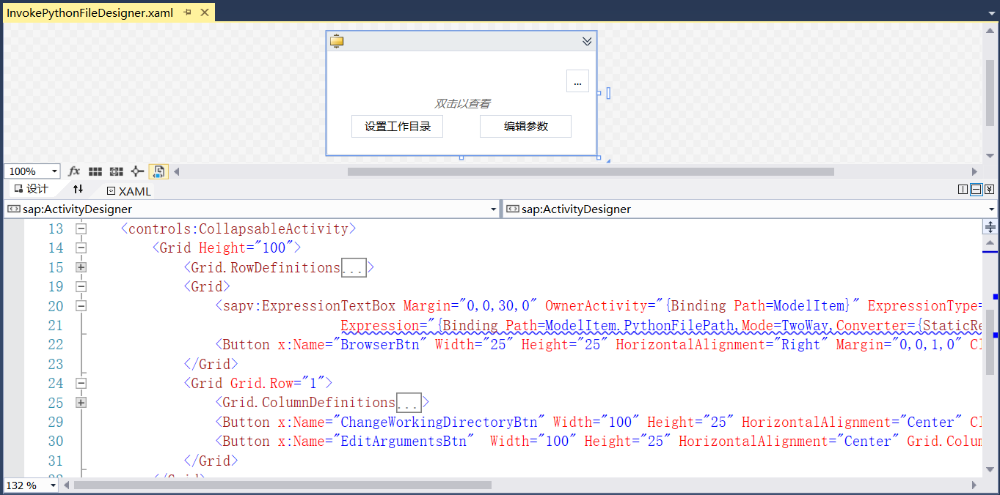

## 13.5.9 组件视图

1、在RPAStudio.Views中添加组件视图ActivitiesView，如图13.5.9-1所示。

图13.5.9-1 组件视图显示

2、在 ViewModel文件夹中添加活动组件在搜索中的顺序以及是否匹配等，如图13.5.9-2所示。

图13.5.9-2 搜索顺序等

3、在ActivityGroupItemViewModel文件中定义活动组件的图标属性等，如图13.5.9-3所示。

图13.5.9-3 活动组件图标等

4、在RPA.Resources.Configs中添加收藏活动组件和最近使用活动组件的xml文件，如图13.5.9-4所示。

图13.5.9-4 收藏活动组件xml

5、并在RPA.Interfaces.Activities中定义收藏以及最近使用过的活动组件接口，如图13.5.9-5所示。

图13.5.9-5 定义收藏组件接口

6、添加活动组件的图标接口，如图13.5.9-6所示。

图13.5.9-6 活动组件图标接口

7、接下来就是具体实现上述接口，收藏活动组件列表的添加以及移除功能实现，如图13.5.9-7所示。

图13.5.9-7 添加或移除收藏组件

8、定义活动组件最近列表最多纪录条数，如图13.5.9-8所示。

图13.5.9-8 活动组件最近列表

9、并且修改系统图标为自定义图标，如图13.5.9-9所示。

图13.5.9-9 修改系统图标为自定义图标

10、活动组件拖动时设置在数据对象中存储指定的数据，如图13.5.9-10所示。

图13.5.9-10 存储指定数据

11、项目在拖动时的设置，如图13.5.9-11所示。

图13.5.9-11 项目拖拽设置

12、在ViewModel中的ActivitiesViewModel添加活动组件的相关功能，初始化活动组件列表、按名称排序以及添加到最近列表等，如图13.5.9-12所示。

图13.5.9-12 活动组件

13、接下来开始添加使用到的活动组件，添加执行Python文件和执行工作流文件组件。在RPA.Learn.Activities中添加Image文件夹，用来放置活动组件所使用图标，并且添加Python和Workflow文件夹。在Python文件夹中添加InvokePythonFileActivity类和InvokePythonFileDesigner活动设计器，类中代码如图13.5.9-13所示。

在RPA.Shared中安装pythonnet_py37_win_x86 2.5.2版本的NuGet包，并且在代码的Tools中带有Python 3.7.2的安装程序。

如果需要pip安装第三库，需要在cmd中切换到当前python.exe所在目录，然后调用命令：python -m pip install <第三方组件库名>。

图13.5.9-13 执行Python文件

14、并且添加Python的print的重定向，在Python文件夹中添加PythonPrintRedirectObject文件，如图13.5.9-14所示。

图13.5.9-14 Python的print重定向

15、Python的活动设计器如图13.5.9-15所示。

图13.5.9-15 Python的活动设计器

16、接下来在Workflow文件夹中添加类InvokeWorkflowFileActivity和活动设计器InvokeWorkflowFileDesigner。活动组件类如图13.5.9-16所示。

图13.5.9-16 执行工作流文件

17、执行工作流文件活动设计器如图13.5.9-17所示。

图13.5.9-17 执行工作流文件活动设计器

18、并在活动组件项目下添加配置文件Activities.xml，如图13.5.9-18所示。

图13.5.9-18 活动组件配置

19、在Activities.Shared.ActivityTemplateFactory中添加InvokePythonFileFactory文件，创建Activity的实例，如图13.5.9-19所示。

图13.5.9-19 InvokePythonFileFactory

20、继续添加InvokeWorkflowFileFactory文件，如图13.5.9-20所示。

图13.5.9-20 InvokeWorkflowFileFactory

21、在RPA.Services项目中添加Activities文件夹，在RPA.Interfaces.Activities中添加接口IActivitiesService，定义活动组件服务接口，如图13.5.9-21所示。

图13.5.9-21 活动组件接口

22、根据上述接口对应的实现服务，在RPA.Services.Activities中添加ActivitiesService活动组件服务，如图13.5.9-22所示。

图13.5.9-22 活动组件服务实现

23、添加接口IActivitiesServiceProxy活动组件服务代理，如图13.5.9-23所示。

图13.5.9-23 IActivitiesServiceProxy

24、然后添加服务实现，如图13.5.9-24所示。

图13.5.9-24 服务实现

25、添加活动组件服务，服务注册以及默认属性的汉化等，如图13.5.9-25所示。

图13.5.9-25 默认属性的汉化

26、在RPA.Interfaces.AppDomains中定义获取程序集接口，如图13.5.9-26所示。

图13.5.9-26 程序集接口

27、在RPA.Services.AppDomains中实现上述相关服务，进行类型获取，避免可能返回null的情况，如图13.5.9-27所示。

图13.5.9-27 获取类型

28、在RPA.Shared.Converters中添加空图像转换类，如图13.5.9-28所示。

图13.5.9-28 空图像转换类

29、在Activities.Shared.Attached中添加活动组件获取或设置图标等，如图13.5.9-29所示。

图13.5.9-29 设置图标等

30、添加活动组件可折叠，如图13.5.9-30所示。

图13.5.9-30 组件可折叠

31、在Activities.Shared.Converters中添加相对路径与绝对路径的转换，以便显示，如图13.5.9-31所示。

图13.5.9-31 相对路径转换

32、在Editors中添加编辑模板，如图13.5.9-32所示。

图13.5.9-32 编辑模板

33、添加参数集合编辑器，如图13.5.9-33所示。

图13.5.9-33 参数集合编辑器

34、继续添加字典参数编辑器，如图13.5.9-34所示。

图13.5.9-34 字典参数编辑器

35、并在Styles文件夹中添加Button按钮、ComboBox及TextBox等样式，如图13.5.9-35所示。

图13.5.9-35 Button按钮样式

36、最后在RPA.Resources.Configs中添加系统组件，如图13.5.9-36所示。

图13.5.9-36 系统组件

37、在RPA.Learn.Activities的AssemblyInfo文件中添加命名空间映射，方便后期组件位置移动，如图13.5.9-37所示。

图13.5.9-37 命名空间映射

38、组件面板如图13.5.9-38所示。

图13.5.9-38 组件面板

## links
   * [目录](<preface.md>)
   * 上一节: [项目视图](<13.5.08.md>)
   * 下一节: [代码片段](<13.5.10.md>)