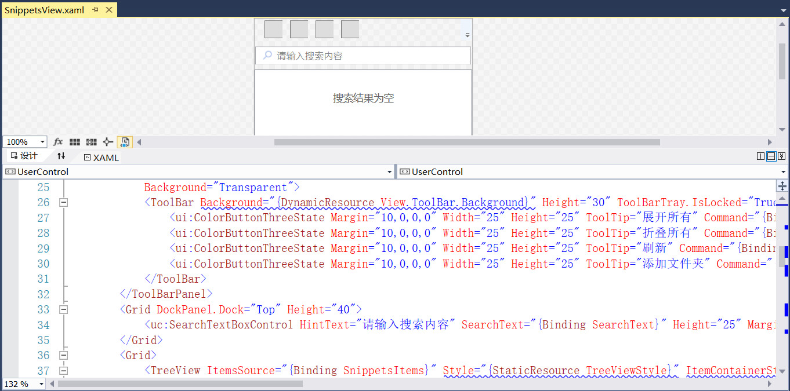
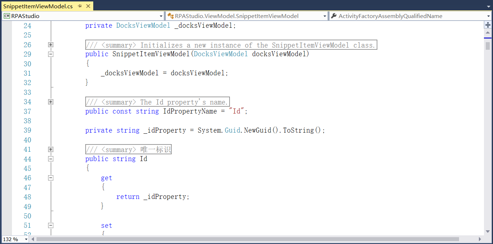
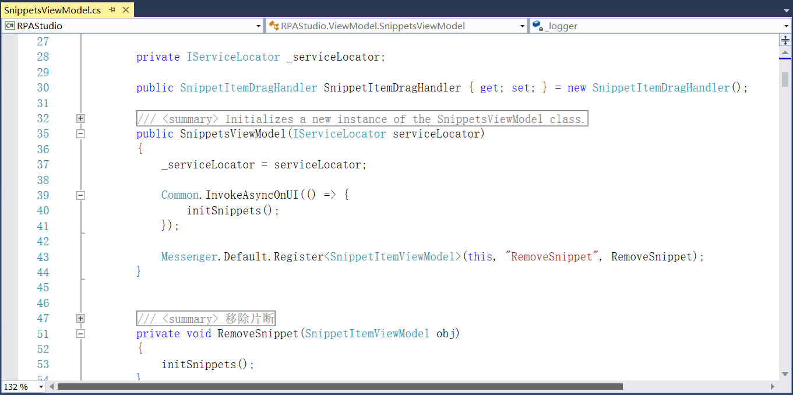
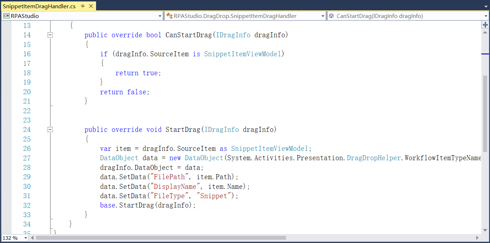
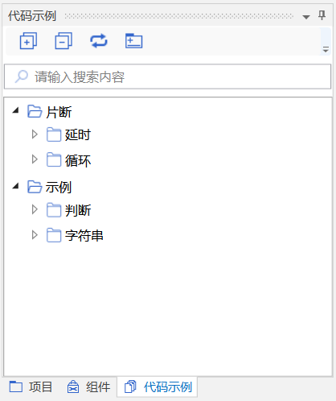

## 13.5.10 代码片段

1、在RPAStudio.Views中添加代码片段的视图，如图13.5.10-1所示。

图13.5.10-1 代码片段视图

2、在ViewModel文件夹中添加代码片段项，设置唯一标识等，如图13.5.10-2所示。

图13.5.10-2 设置唯一标识等

3、同时添加代码片段的功能实现，包括移除片段等，如图13.5.10-3所示。

图13.5.10-3 代码片段

4、在RPAStudio.DragDrop中添加代码片段拖拽的设置，如图13.5.10-4所示。

图13.5.10-4 代码片段拖拽

5、代码示例面板如图13.5.10-5所示。

图13.5.10-5 代码示例

## links
   * [目录](<preface.md>)
   * 上一节: [组件视图](<13.5.09.md>)
   * 下一节: [属性视图](<13.5.11.md>)