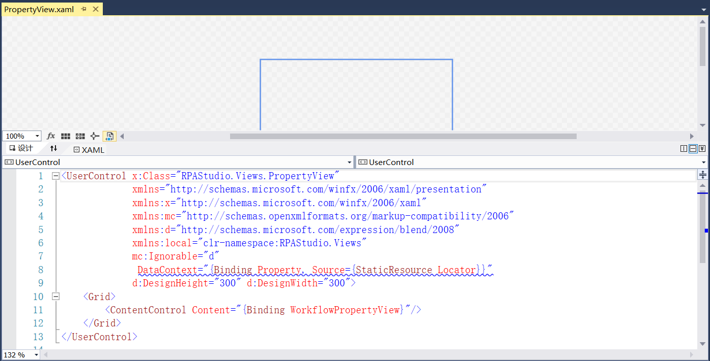
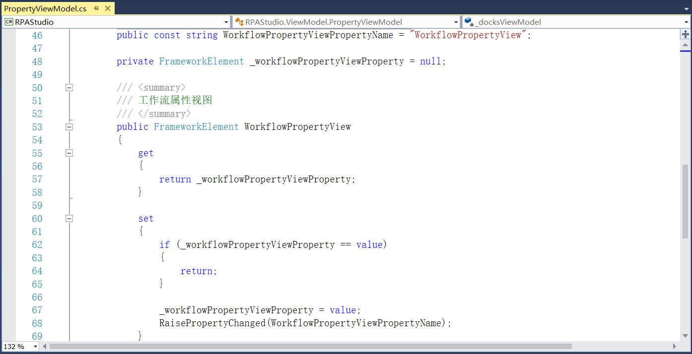
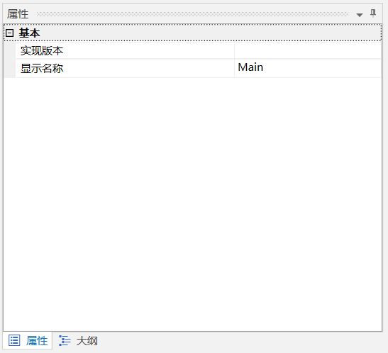

## 13.5.11 属性视图

1、在RPAStudio.Views中添加属性视图，如图13.5.11-1所示。

图13.5.11-1 属性视图

2、在ViewModel文件夹中定义属性视图的相关事件，如图13.5.11-2所示。

图13.5.11-2 属性视图相关实现

3、属性面板如图13.5.11-3所示。

图13.5.11-3 属性面板

## links
   * [目录](<preface.md>)
   * 上一节: [代码片段](<13.5.10.md>)
   * 下一节: [大纲视图](<13.5.12.md>)