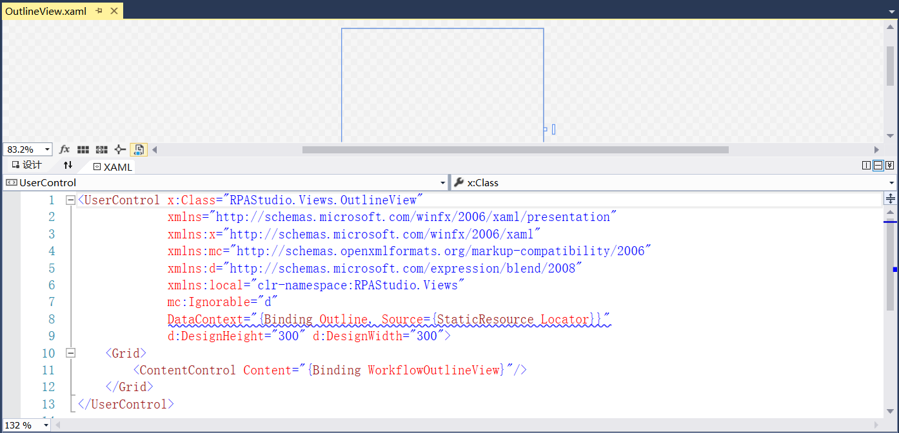
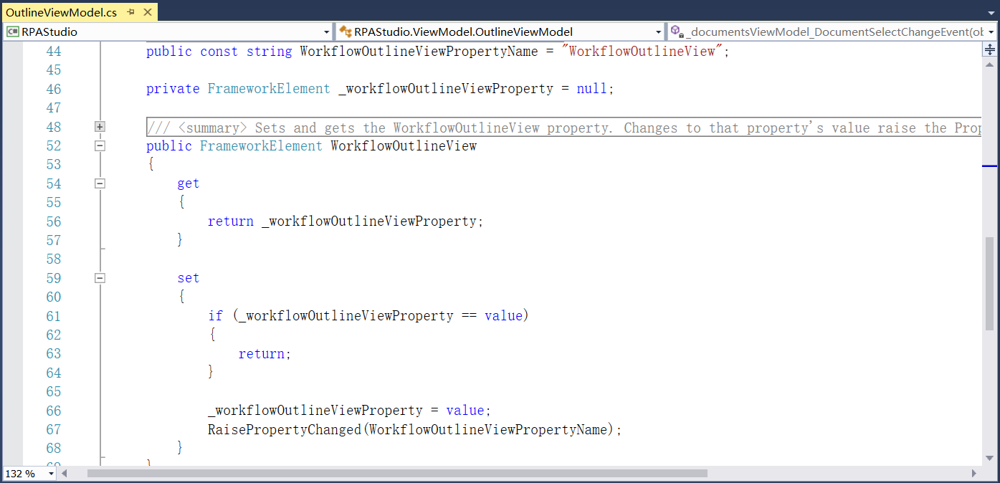
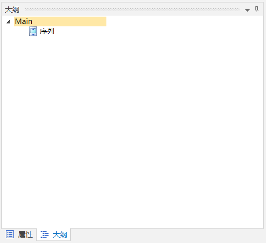

## 13.5.12 大纲视图

1、在RPAStudio.Views中添加大纲视图，如图13.5.12-1所示。

图13.5.12-1 大纲视图

2、在ViewModel文件夹中定义大纲视图的相关实现，如图13.5.12-2所示。

图13.5.12-2 大纲视图实现

3、大纲面板如图13.5.12-3所示。

图13.5.12-3 大纲面板

## links
   * [目录](<preface.md>)
   * 上一节: [属性视图](<13.5.11.md>)
   * 下一节: [输出信息视图](<13.5.13.md>)