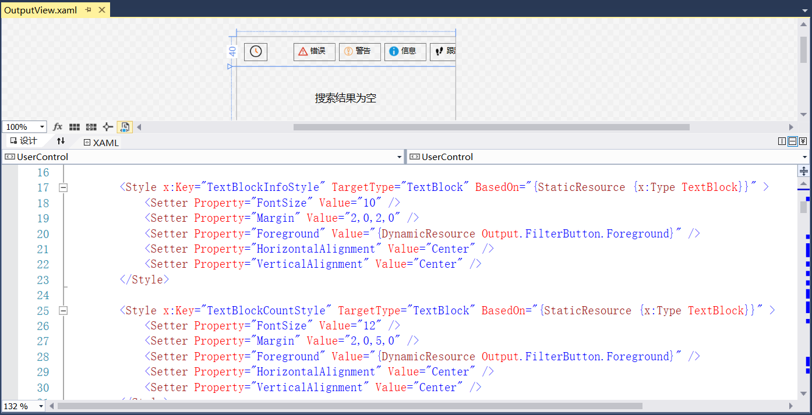

## 13.5.13 输出信息视图

1、在RPAStudio.Views中添加输出信息视图，并且可以显示日志信息的时间，筛选日志类型以及搜索等，如图13.5.13-1所示。

图13.5.13-1 输出信息视图

2、在RPA.Shared.UI中添加ListBox行为类，如图13.5.13-2所示。

图13.5.13-2 ListBox行为类

3、添加Windows窗口扩展类，主要对图标进行显示和隐藏的控制，如图13.5.13-3所示。

图13.5.13-3 Windows窗口扩展类

4、在RPAStudio.Views中添加输出信息的详情视图，如图13.5.13-4所示。

图13.5.13-4 详情视图

5、在ViewModel文件夹中添加详细信息的具体实现以及可以一键复制信息的事件，如图13.5.13-5所示。

图13.5.13-5 输出控制台的详细信息

6、添加输出的信息是否显示时间戳、是否需要过滤出警告日志、信息日志等，如图13.5.13-6所示。

图13.5.13-6 显示时间戳等

7、在ViewModel文件夹中添加输出信息的具体实现，如图13.5.13-7所示。

图13.5.13-7 输出信息窗口

8、在RPAStudio.ViewModel.MainViewModel中添加日志输出，如图13.5.13-8所示。

图13.5.13-8 日志输出

9、输出窗口如图13.5.13-9所示。

图13.5.13-9 输出窗口

## links
   * [目录](<preface.md>)
   * 上一节: [大纲视图](<13.5.12.md>)
   * 下一节: [调试视图](<13.5.14.md>)