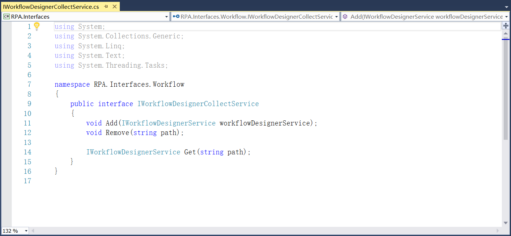

## 13.5.14 调试视图

1、在RPAStudio.Views中添加调试窗口的设计，如图13.5.14-1所示。

图13.5.14-1 调试窗口

2、在RPA.Interfaces项目中新建Workflow文件夹，添加调试服务接口，定义调试速度和操作类型等，如图13.5.14-2所示。

图13.5.14-2 调试速度等

3、接着添加代理接口，如图13.5.14-3所示。

图13.5.14-3 代理接口

4、在RPA.Services.AppDomains中添加AppDomainContainerService跨域服务，如图13.5.14-4所示。

图13.5.14-4 跨域服务

5、在RPA.Interfaces.Workflow中定义工作流所相关的服务接口，如图13.5.14-5所示。以及添加断点显示、加载及清除等，如图13.5.14-6所示。

图13.5.14-5 工作流相关接口

图13.5.14-6 加载断点等

6、添加System.Activities.Presentation和System.AddIn.Contract的引用，添加流程设计视图中保存、复制和初始化等，如图13.5.14-7所示。

图13.5.14-7 流程初始化等

7、接下来添加上述接口的具体服务实现，在RPA.Services.Workflow文件夹中添加工作流相关服务，如图13.5.14-8所示。

图13.5.14-8 工作流相关服务实现

8、在项目中添加Newtonsoft.Json 13.0.1版本的NuGet包，并在RPA.Shared.Utils下的Common中添加构造相对路径的方法，如图13.5.14-9所示。

图13.5.14-9 构造相对路径

9、在RPA.Shared项目中安装ReflectionMagic 4.1.0版本的NuGet包，新建文件夹Debugger，添加RPADebugger类，定义调试状态下所使用到的一些方法，如图13.5.14-10所示。

图13.5.14-10 RPADebugger类

10、在RPA.Services.Workflow下添加WorkflowBreakpointsService类，添加保存和加载项目配置、切换活动断点等实现，如图13.5.14-11所示。

图13.5.14-11 断点服务类实现

11、在RPA.Shared项目中添加Workflow文件夹，添加ModelItemExtensions类，定义 ModelItem函数的扩展，如图13.5.14-12所示。

图13.5.14-12 ModelItem函数扩展

12、在此文件夹中继续添加属性值改变，如图13.5.14-13所示。

图13.5.14-13 属性改变

13、继续添加DesignerWrapper类，设置所使用的键值对等，如图13.5.14-14所示。

图13.5.14-14 设置键值对

14、在RPA.Interfaces.Share中添加SharedVars，如图13.5.14-15所示。

图13.5.14-15 SharedVars

15、在RPA.Services.Workflow中添加工作流设计的服务，如图13.5.14-16所示。

图13.5.14-16 WorkflowDesignerService

16、在ViewModel中添加调试窗口的命令事件，如图13.5.14-17所示。

图13.5.14-17 调试窗口事件

17、在MainViewModel中设置隐藏可能的调试标志显示，如图13.5.14-18所示。

图13.5.14-18 隐藏可能的调试标志显示

18、调试面板如图13.5.14-19所示。

图13.5.14-19 调试面板

19、菜单栏中调试视图如图13.5.14-20所示。

图13.5.14-20 菜单栏调试视图

18、在流程文件中进行调试的步骤如下：

（1）在需要调试的地方，点击该组件，并点击菜单栏中的断点，即为此组件添加断点。

（2）然后点击菜单栏中的调试按钮，流程进入调试阶段。

（3）可通过逐语句或逐过程进行调试或者中断、停止等。

（4）调试完成后可点击菜单栏中断点按钮下的列表进行清除所有断点，或者点击带有断点的组件，再次点击断点按钮，该组件的断点也可清除。

图13.5.14-21 流程调试

## links
   * [目录](<preface.md>)
   * 上一节: [输出信息视图](<13.5.13.md>)
   * 下一节: [导出Nupkg包](<13.6.1.md>)