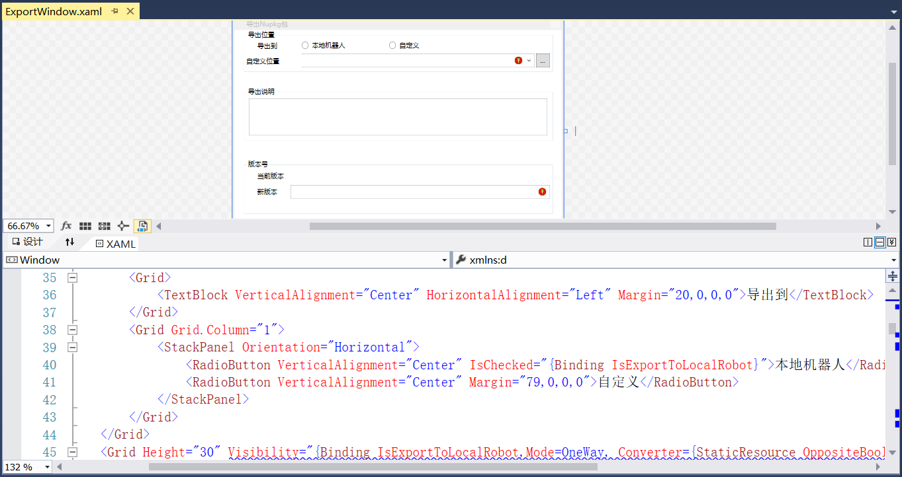
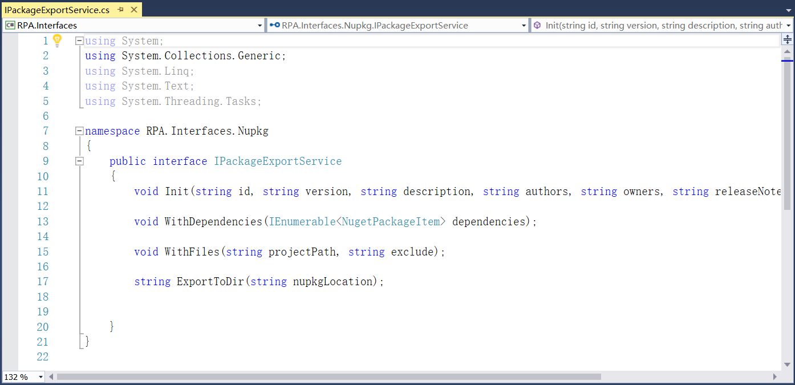
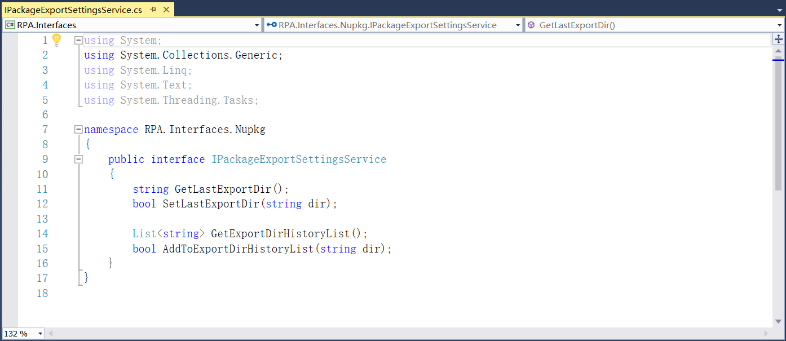
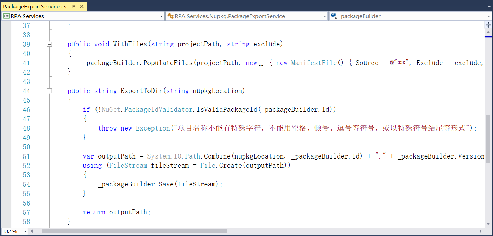
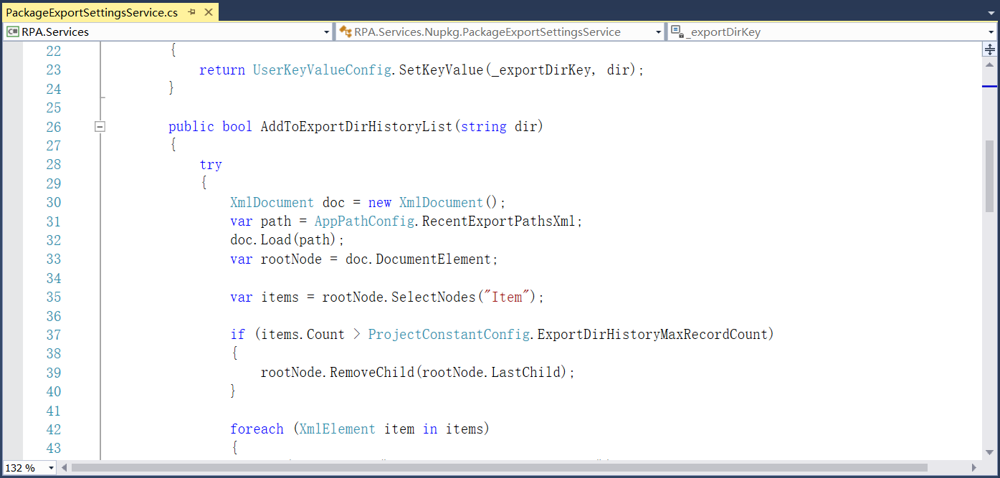
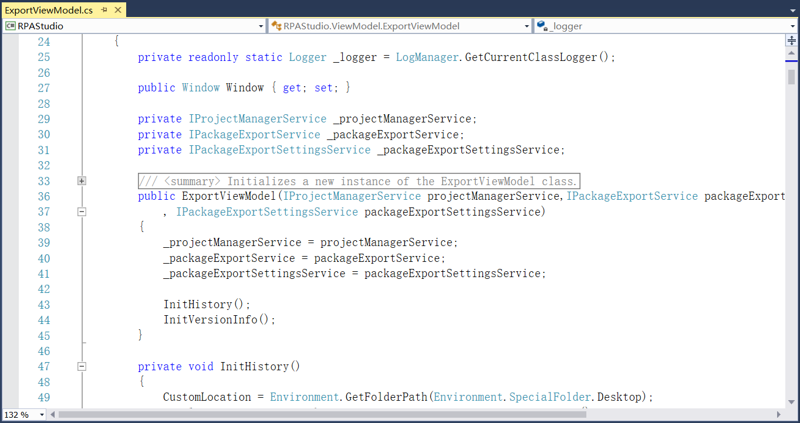
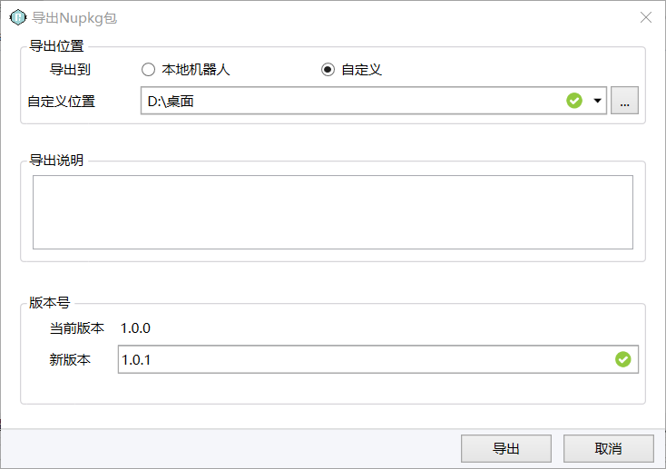

## 13.6.1 导出Nupkg包

1、RPAStudio.Views中添加ExportWindow为导出Nupkg包的视图，如图13.6.1-1所示。

图13.6.1-1 导出Nupkg包

2、在RPA.Interfaces.Nupkg中定义Nupkg包的id、描述信息、版本号等信息的接口，如图13.6.1-2所示。

图13.6.1-2 定义Nupkg包描述信息的接口

3、继续定义包相关设置的接口，如图13.6.1-3所示。

图13.6.1-3 导出Nupkg包设置

4、接下来对上述接口相关服务实现，导出包时名称不允许有特殊字符等，如图13.6.1-4所示。

图13.6.1-4 检验包名称等

5、添加记录最近导出包的路径等，如图13.6.1-5所示。

图13.6.1-5 最近导出包路径

6、在ViewModel文件夹中添加对应的ExportViewModel，来实现导出功能，如图13.6.1-6所示。

图13.6.1-6 导出功能实现

7、导出窗口如图13.6.1-7所示。

图13.6.1-7 导出窗口

## links
   * [目录](<preface.md>)
   * 上一节: [调试视图](<13.5.14.md>)
   * 下一节: [工作流运行](<13.6.2.md>)