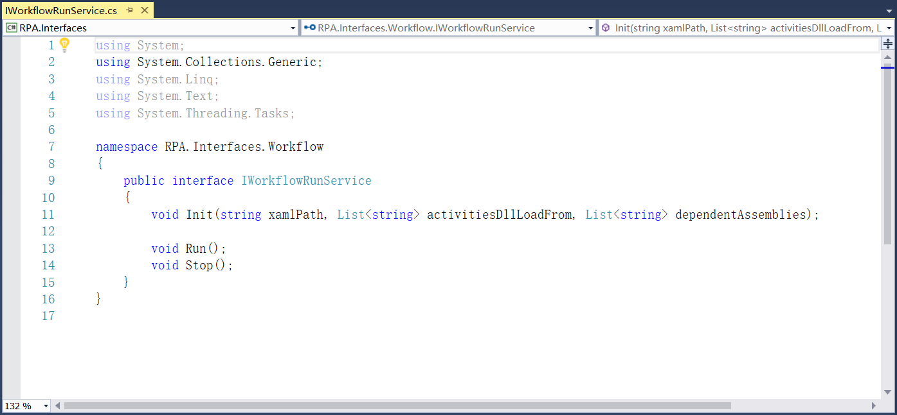
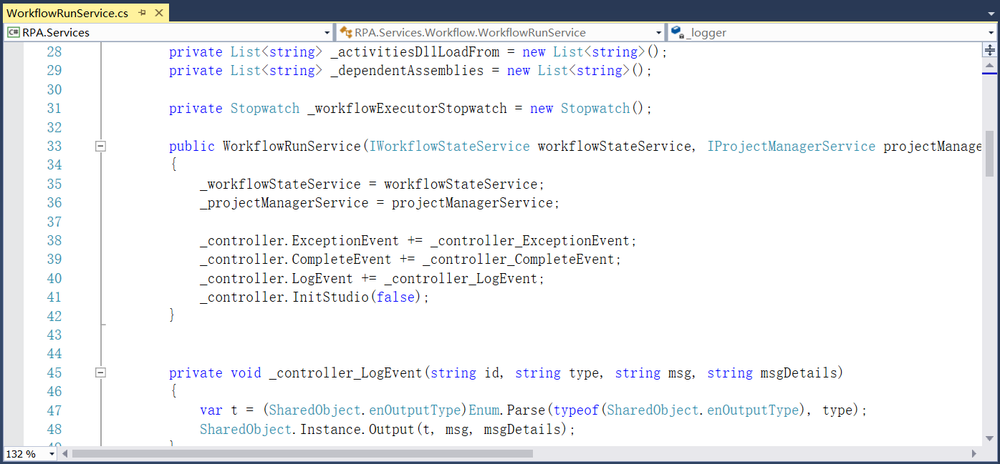
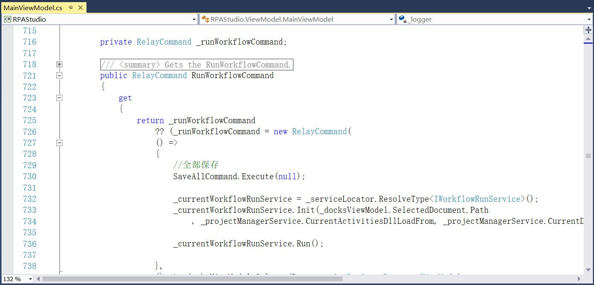

## 13.6.2 工作流运行

1、在RPA.Interfaces.Workflow中添加工作流运行的接口，如图13.6.2-1所示。

图13.6.2-1 工作流运行接口

2、在RPA.Services.Workflow中添加工作流运行的服务实现，并记录工作流运行时的日志信息，如图13.6.2-2所示。

图13.6.2-2 工作流运行

3、并且在MainViewModel中添加工作流运行的事件，如图13.6.2-3所示。

图13.6.2-3 添加工作流运行事件

## links
   * [目录](<preface.md>)
   * 上一节: [导出Nupkg包](<13.6.1.md>)
   * 下一节: [工作流项目的命令行调用](<14.1.md>)