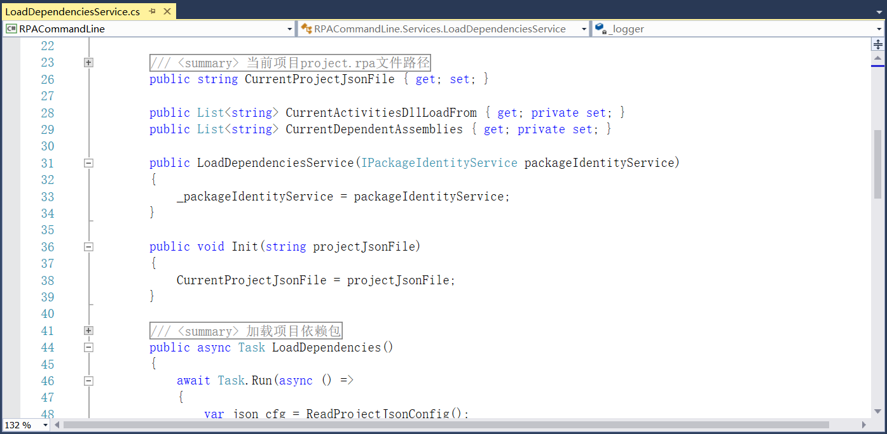

## 14.1 工作流项目的命令行调用

1、在RPACommandLine项目中安装CommandLineParser 2.8.0版本的NuGet包，在RPACommandLine.Args中定义调用时的参数选项，包括文件路径、参数以及日志等，如图14.1-1所示。

图14.1-1 设置调用参数

2、在项目中添加接口文件夹Interfaces，定义参数选项等接口，如图14.1-2所示。

图14.1-2 定义接口

3、继续定义项目文件的名称、版本号等，如图14.1-3所示。

图14.1-3 定义项目名称、版本号等

4、添加加载依赖项的服务接口，如图14.1-4所示。

图14.1-4 加载依赖服务

5、定义运行和停止以及输出日志等方法，如图14.1-5所示。

图14.1-5 运行停止及输出日志等

6、接下来就是具体实现上述定义的接口，如图14.1-6、14.1-7、14.1-8和14.1-9所示。

图14.1-6 参数调用

图14.1-7 项目运行等

图14.1-8 加载依赖包

图14.1-9 代理类

7、添加服务注册，如图14.1-10和图14.1-11所示。

图14.1-10 服务注册

图14.1-11 服务注册

## links
   * [目录](<preface.md>)
   * 上一节: [工作流运行](<13.6.2.md>)
   * 下一节: [RPAExecutor执行器的进程分离](<14.2.md>)