## 14.2 RPAExecutor执行器的进程分离

1、在RPA.Shared.Executor中定义项目名称、项目版本以及需要加载的程序集等，如图14.2-1所示。

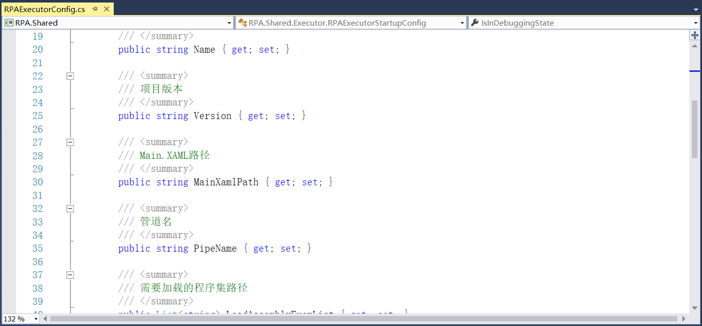

图14.2-1 运行时配置

2、可利用RPAExecutor对流程项目进行调试，如图14.2-2所示。

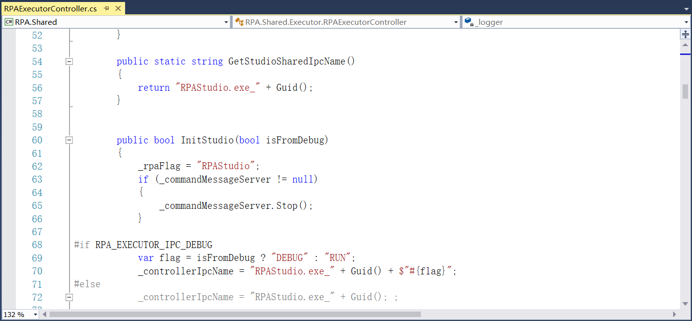

图14.2-2 RPAExecutor

3、添加RPAExecutor代理，如图14.2-3所示。

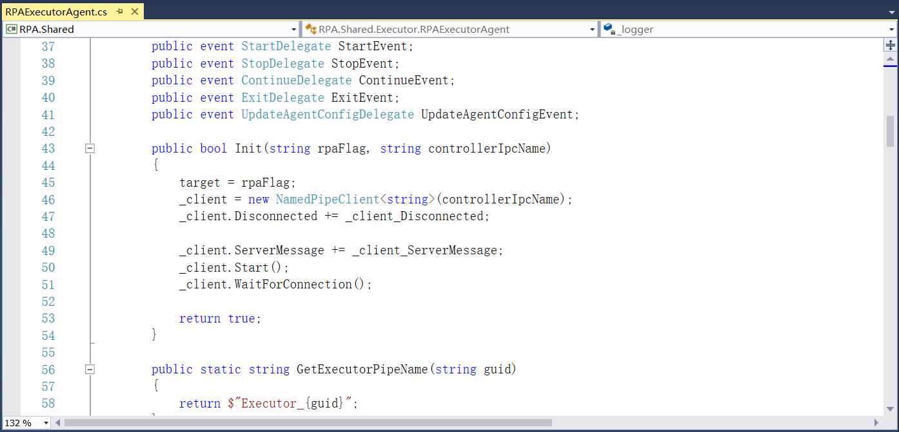

图14.2-3 RPAExecutor代理

4、属性在Json中定义，且不能为空值，如图14.2-4所示。

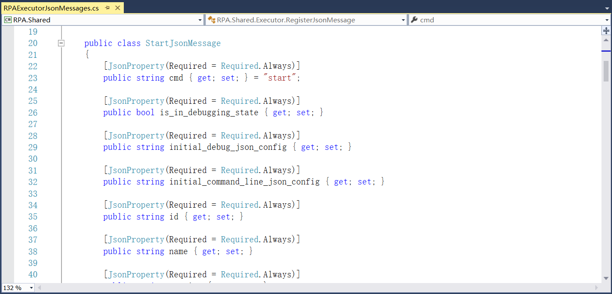

图14.2-4 定义属性

5、在RPAExecutor中定义App.xaml文件，如图14.2-5所示。

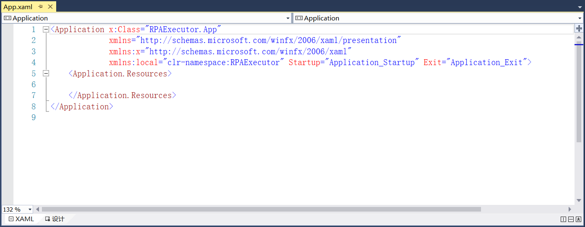

图14.2-5 App.xaml文件

6、在RPA.Interfaces.Workflow中创建活动的抽象基类，如图14.2-6所示。

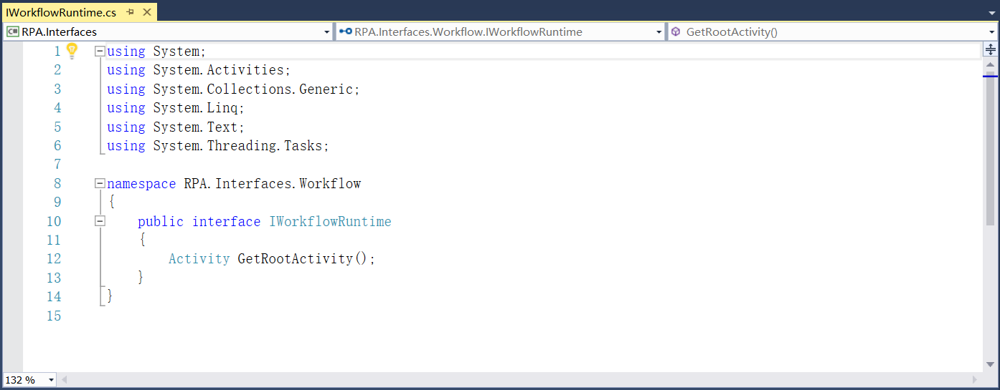

图14.2-6 创建活动的抽象基类

7、在RPA.Services.Workflow中实现相关服务工作流运行时类，如图14.2-7所示。

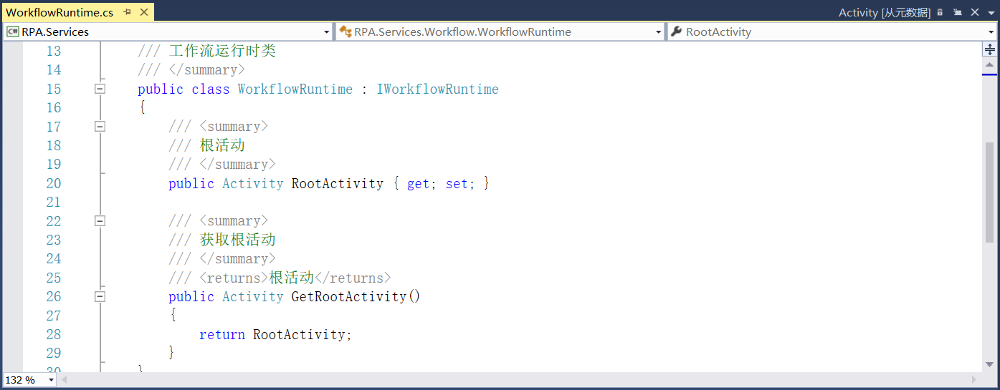

图14.2-7 工作流运行时类

8、并在RPA.Interfaces.Share中添加输出文本并换行，如图14.2-8所示。

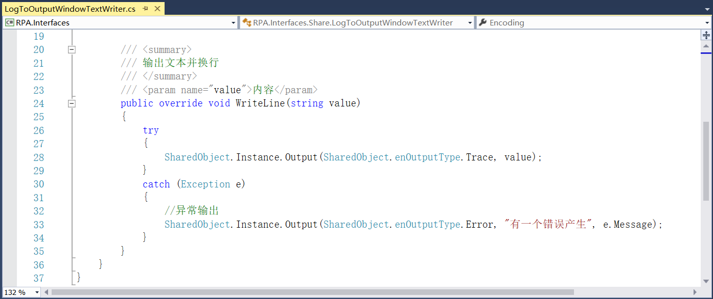

图14.2-8 输出文本并换行

9、在RPAExecutor.Executor中添加执行器运行、停止以及输出信息等属性，如图14.2-9所示。

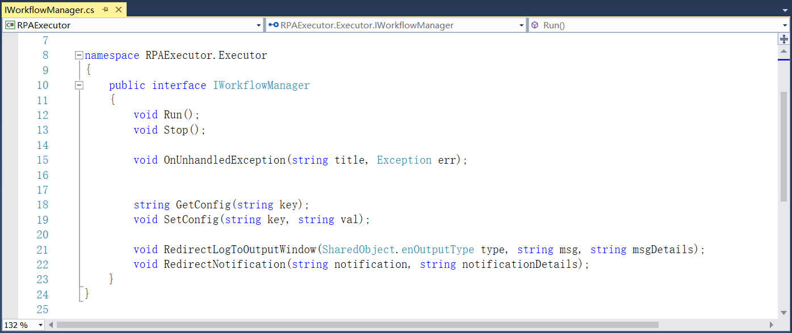

图14.2-9 定义运行等属性

10、在WorkflowRunManager中实现项目的运行和停止等，如图14.2-10所示。

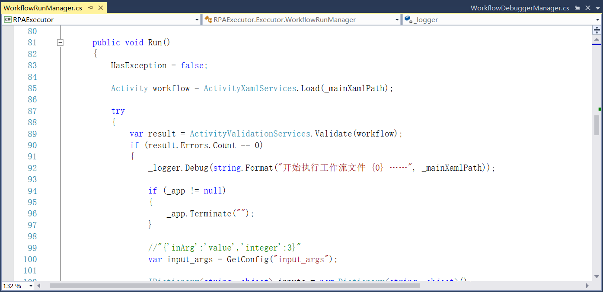

图14.2-10 运行、停止等

11、在VisualTrackingParticipant中添加调试的事件以及记录中断时的位置等，如图14.2-11所示。

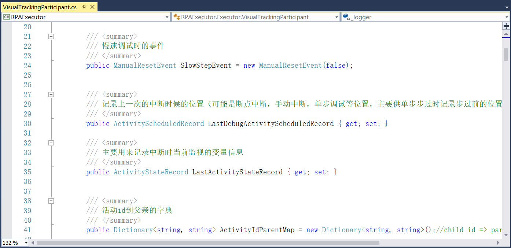

图14.2-11 调试事件等

12、在WorkflowDebuggerManager中定义跟踪器，添加停止工作流运行以及异常处理等，如图14.2-12所示。

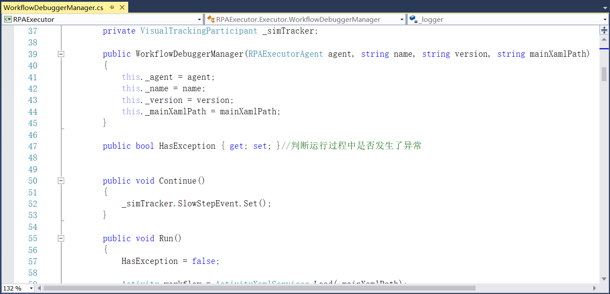

图14.2-12 跟踪器

13、并在ReflectionObject添加获取属性及类型等，如图14.2-13所示。

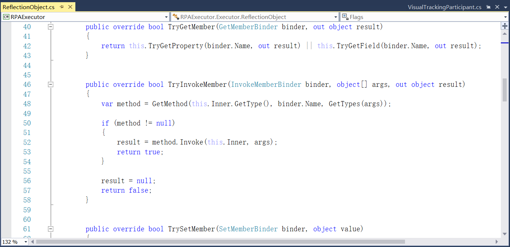

图14.2-13 ReflectionObject类

## links
   * [目录](<preface.md>)
   * 上一节: [工作流项目的命令行调用](<14.1.md>)
   * 下一节: [RPARobot的进程分离](<14.3.md>)