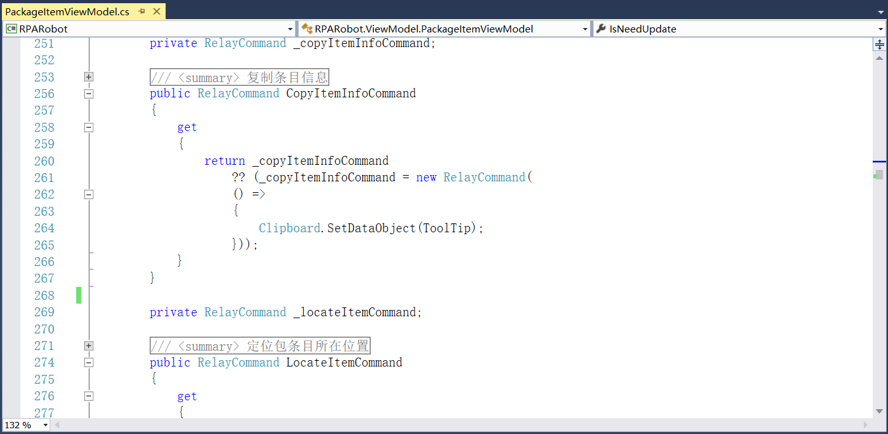
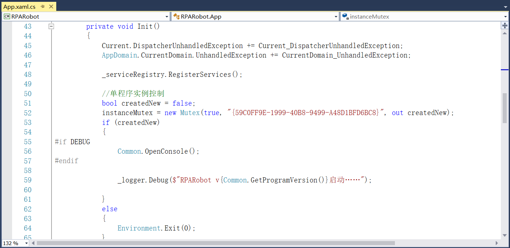

## 14.3 RPARobot的进程分离

1、修改App.xaml文件如图14.3-1所示。

图14.3-1 App.xaml文件

2、在Interfaces文件夹中添加接口，定义指定名称及版本号的包运行，如图14.3-2所示。

图14.3-2 包运行

3、定义包路径、日志路径等相关配置信息，如图14.3-3所示。

图14.3-3 定义路径等配置信息

4、添加加载依赖项的接口，如图14.3-4所示。

图14.3-4 加载依赖项接口

5、添加开始运行和停止运行的接口等，如图14.3-5所示。

图14.3-5 运行接口

6、定义好接口以后，在Services文件夹中来实现定义的接口服务，如图14.3-6、图14.3-7、图14.3-8和图14.3-9所示。

图14.3-6 运行指定包

图14.3-7 目录初始化等

图14.3-8 加载项目依赖项等

图14.3-9 设置代理类

7、在ServiceRegistry文件夹中添加服务注册，如图14.3-10所示。

图14.3-10 服务注册

8、新建Views文件夹，添加RPARobot主窗体的界面设计，包括刷新按钮、浏览日志以及流程列表等，如图14.3-11所示。

图14.3-11 RPARobot主窗体

9、RPARobot启动后添加程序收到托盘，可以打开主面板、浏览日志、退出等，如图14.3-12所示。

图14.3-12 收到托盘中

10、添加RPARobot的关于界面，包括产品名称以及版本号，如图14.3-13所示。

图14.3-13 关于界面

11、在ViewModelLocator中进行数据绑定，如图14.3-14所示。

图14.3-14 数据绑定

12、在ViewModel文件夹中添加关于界面的命令事件，如图14.3-15所示。

图14.3-15 关于界面

13、在MainViewModel中添加流程运行及结束事件等，如图14.3-16所示。

图14.3-16 流程运行结束等

14、在PackageItemViewModel中定义包的版本列表、名称及版本号等，如图14.3-17所示。

图14.3-17 包名称、版本号等

15、在StartupViewModel中添加托盘，可以操作显示主窗体、退出等事件，如图14.3-18所示。

图14.3-18 显示主窗体等

16、并在Resources文件夹中添加定位包、移除包等属性，如图14.3-19所示。

图14.3-19 定位包

17、同时在PackageItemViewModel中添加上述命令事件，如图14.3-20所示。

图14.3-20 定位包事件

18、在RPARobotServiceRegistry中添加服务注册，如图14.3-21所示。

图14.3-21 服务注册

19、在App.xaml.cs中添加控制程序单实例运行，如图14.3-22所示。

图14.3-22 单程序实例控制

## links
   * [目录](<preface.md>)
   * 上一节: [RPAExecutor执行器的进程分离](<14.2.md>)
   * 下一节: [双击自动添加组件](<14.4.md>)