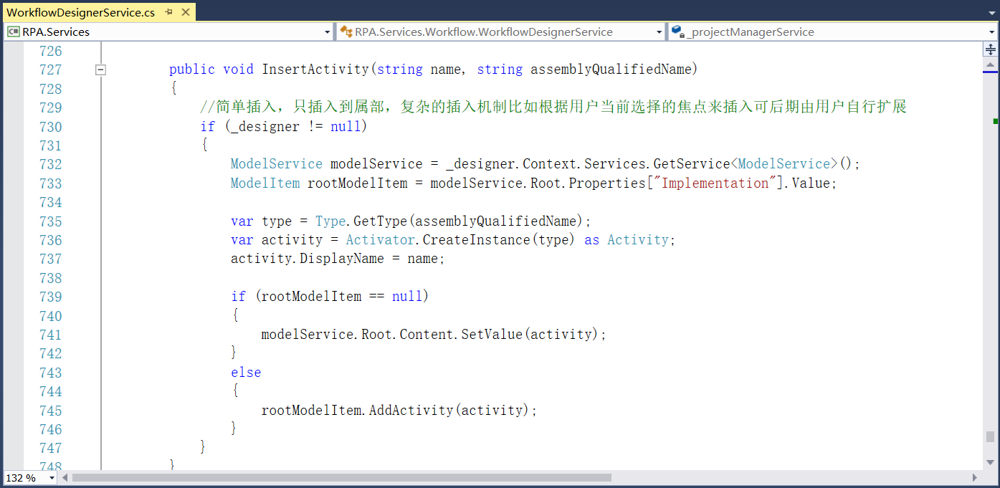
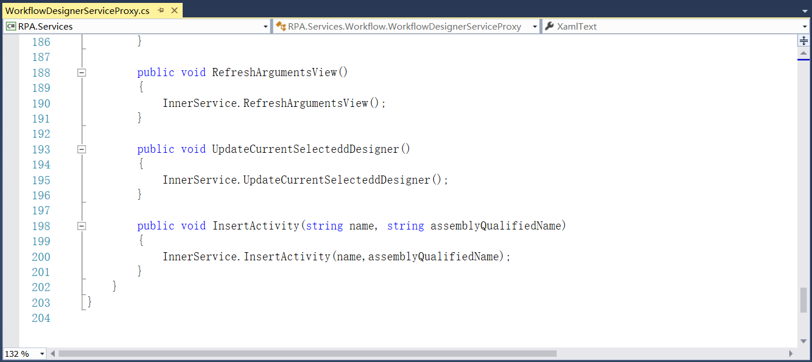
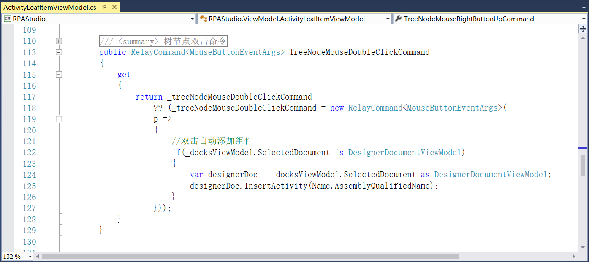
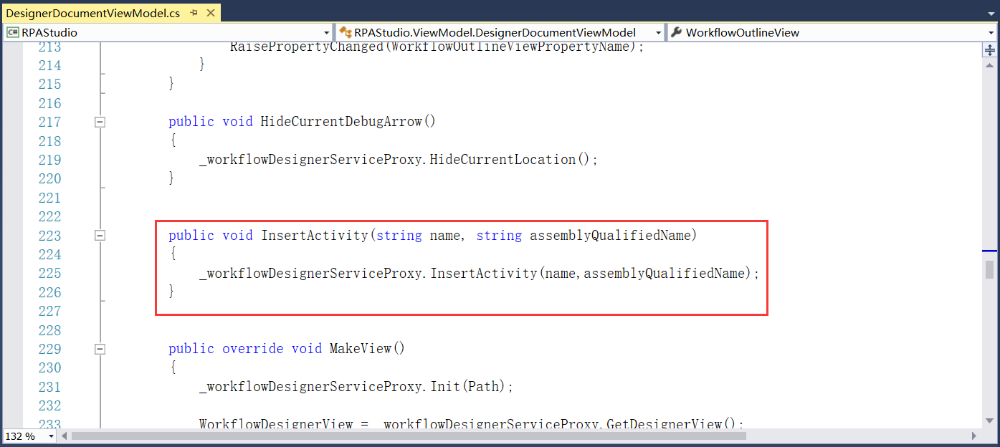

## 14.4 双击自动添加组件

1、在RPA.Services.Workflow.WorkflowDesignerService中添加将活动组件插入到现有设计视图的尾部，如图14.4-1所示。

图14.4-1 活动组件插入

2、并在WorkflowDesignerServiceProxy中添加插入活动组件方法，如图14.4-2所示。

图14.4-2 插入活动组件

3、RPAStudio.ViewModel.ActivityLeafItemViewModel中添加双击命令，如图14.4-3所示。

图14.4-3 双击命令

4、在IWorkflowDesignerServiceProxy接口中定义插入活动组件方法，并在DesignerDocumentViewModel中实现，同时处理组件的显示名称等，如图14.4-4所示。

图14.4-4 添加活动组件

## links
   * [目录](<preface.md>)
   * 上一节: [RPARobot的进程分离](<14.3.md>)
   * 下一节: [代码提示](<14.5.md>)