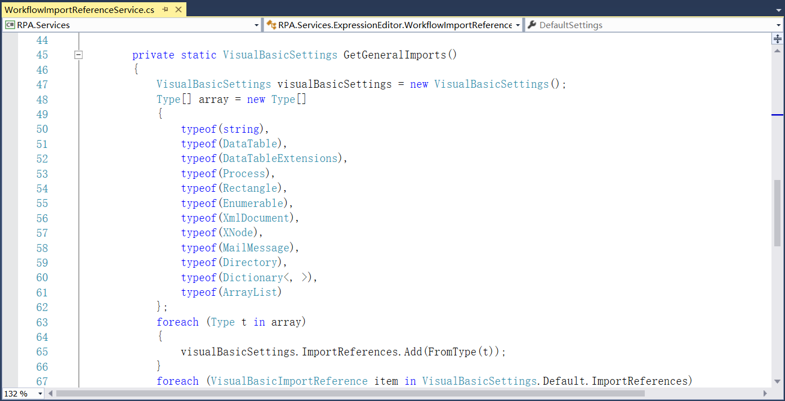

## 14.5 代码提示

1、在RPA.Interfaces.ExpressionEditor中添加程序集、扩展语言等接口，如图14.5-1所示。

图14.5-1 定义扩展语言等

2、在IWorkflowImportReferenceService中添加设置来编译其所包含表达式的源文本，如图14.5-2所示。

图14.5-2 设置源文本

3、在RPA.Services.ExpressionEditor中实现具体的语法服务，使用VB语法，如图14.5-3所示。

图14.5-3 语法服务

4、在WorkflowImportReferenceService中添加相关导入设置，使用这些设置来编译它们所包含表达式的源文本等，如图14.5-4所示。

图14.5-4 编译所包含表达式的源文本等

5、添加处理类型扩展名的方法，如图14.5-5所示。

图14.5-5 类型扩展名

6、添加变量相关设置，如图14.5-6所示。

图14.5-6 变量相关设置

7、定义加载程序集以及是否默认加载，如图14.5-7所示。

图14.5-7 加载程序集等

8、定义出现异常时的方法，如图14.5-8所示。

图14.5-8 异常提示

9、添加编辑器配置，如图14.5-9所示。

图14.5-9 编辑器配置

10、定义提示时的匹配选项等，如图14.5-10所示。

图14.5-10 匹配选项等

11、添加集合扩展类，定义移除集合中最后一项以及第一项内容等方法，如图14.5-11所示。

图14.5-11 集合扩展

12、添加程序集扩展，定义是否可浏览、可获取属性等，如图14.5-12所示。以及获取程序集名称等，如图14.5-13所示。

图14.5-12 程序集扩展

图14.5-13 获取程序集名称

13、添加表达式编辑器等，如图14.5-14和图14.5-15所示。

图14.5-14 编辑器

图14.5-15 表达式编辑器

## links
   * [目录](<preface.md>)
   * 上一节: [双击自动添加组件](<14.4.md>)
   * 下一节: [使用代码如何调试组件](<14.6.md>)