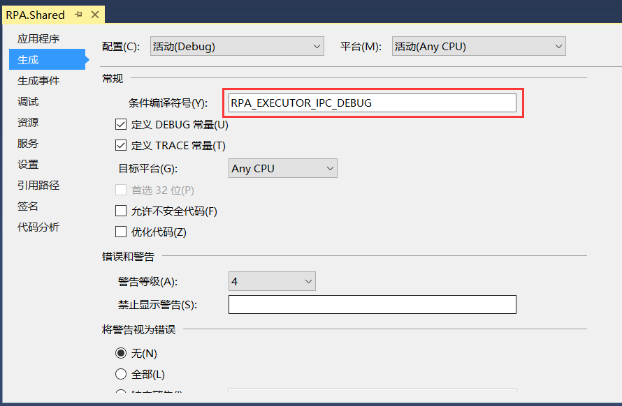
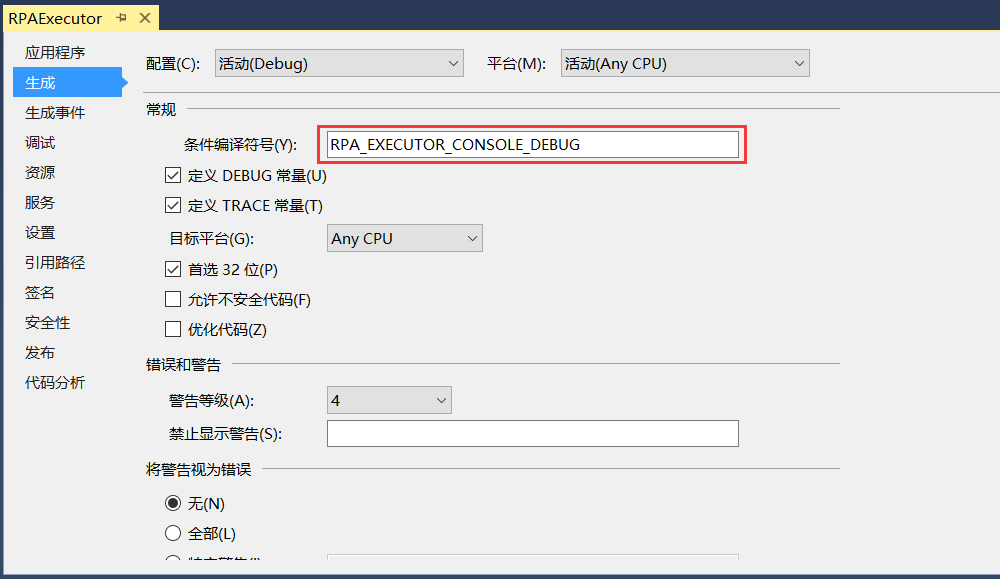
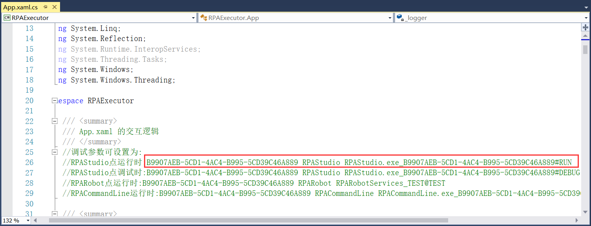
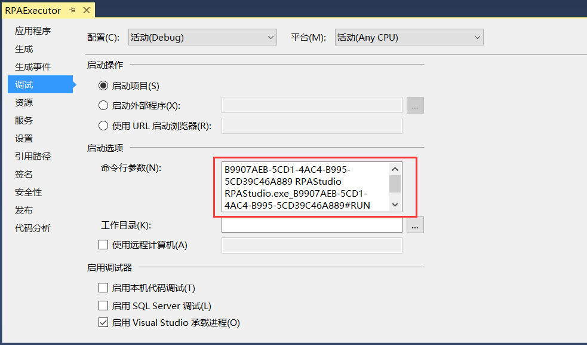
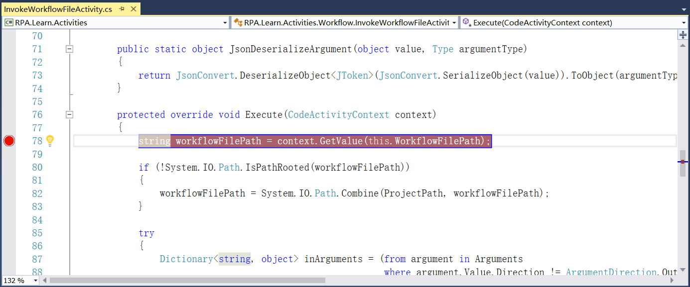
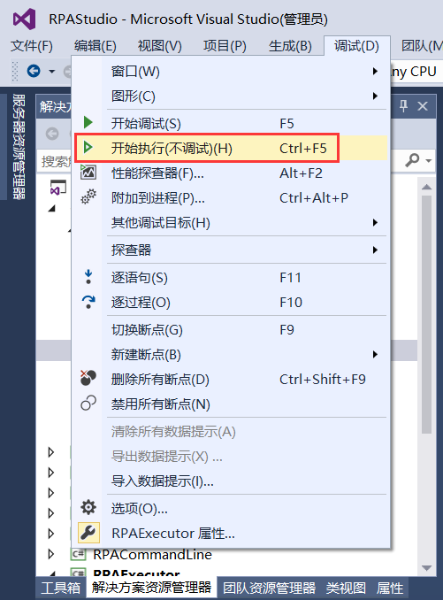
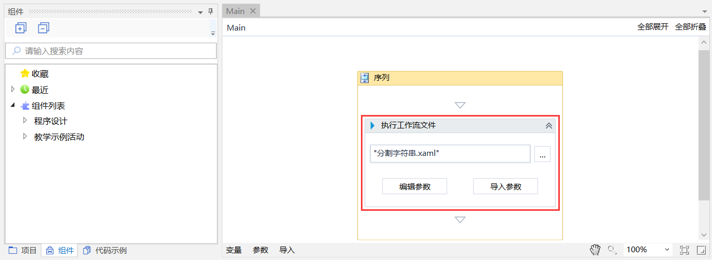
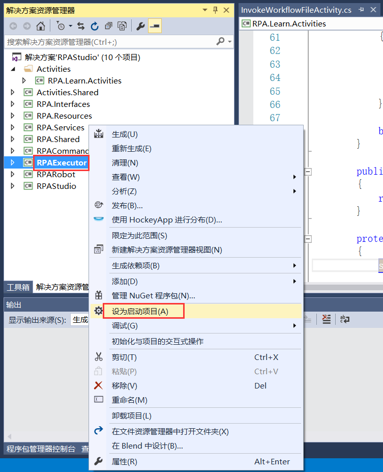
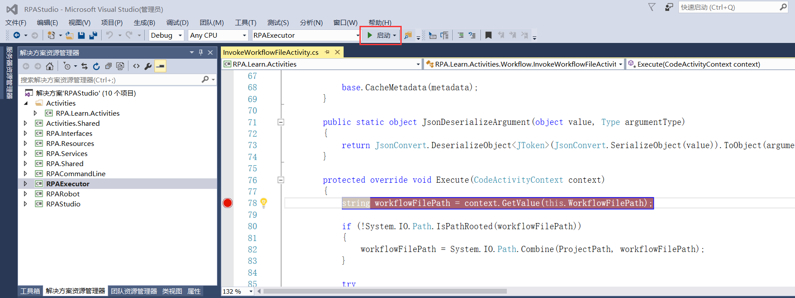
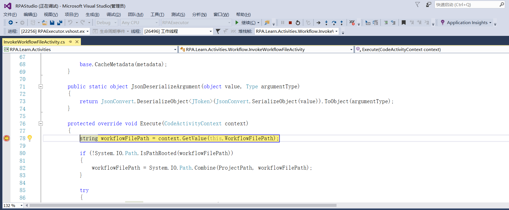

## 14.6 使用代码如何调试组件

1、使用代码调试组件的步骤如下：首先设置共享库RPA.Shared条件编译符号为RPA_EXECUTOR_IPC_DEBUG，如图14.6-1所示。

图14.6-1 RPA.Shared的条件编译符号

2、执行器RPAExecutor的条件编译符号为RPA_EXECUTOR_CONSOLE_DEBUG，如图14.6-2所示。该宏的目的是让执行器运行时显示控制台黑窗口，便于观察调试日志。

图14.6-2 RPAExecutor的条件编译符号

3、执行器的调试参数设置，将RPAExecutor中App.xaml.cs文件中的调试参数复制到调试的命令行参数中并保存项目，调试参数如图14.6-3所示，复制到命令行参数如图14.6-4所示。

图14.6-3 调试参数

图14.6-4 命令行参数设置

4、待调试的活动组件下断点，找到能执行的位置，添加断点，如图14.6-5所示。要

图14.6-5 添加断点

5、然后重新生成解决方案，并将RPAStudio设为启动项目，点击调试下的“开始执行(不调试)”，如图14.6-6所示。

图14.6-6 开始执行（不调试）

6、要确保待调试的组件可以被调试到，如图14.6-7所示调试的组件为执行工作流文件组件，然后点击设计器中的运行或按快捷键F5运行。

不必等执行完，强制结束流程也行。这时候会在设计器中记录下运行的流程文件路径，这样后面调试执行器的时候能直接运行该流程。

注意不要关闭设计器，否则后面的执行器将无法取到信息。

图14.6-7 调试组件

7、调试执行器，以便执行器运行组件的时候触发断点，在项目中设置执行器为启动项目，如图14.6-8所示。

图14.6-8 设RPAExecutor为启动项目

8、让执行器以调试方式运行，点击启动，如图14.6-9所示。

图14.6-9 点击启动

9、成功命中断点，组件调试成功，如图14.6-10所示。

图14.6-10 成功命中断点

10、接着按F10或F11可继续进行逐过程或逐语句调试。

## links
   * [目录](<preface.md>)
   * 上一节: [代码提示](<14.5.md>)
   * 下一节: [打包目录结构](<15.1.md>)