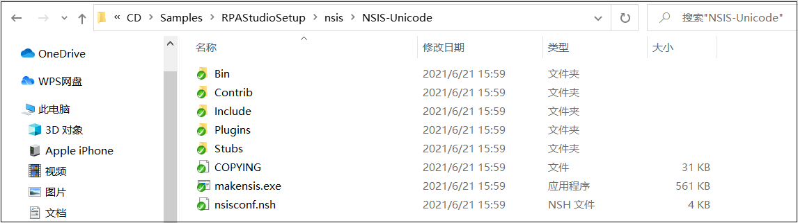
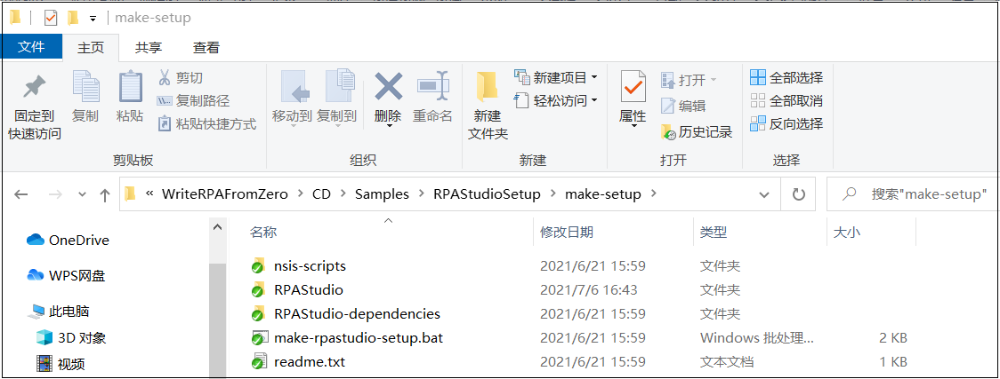

## 15.1 打包目录结构

1、在项目进行打包之前可对程序代码。此项目采用开源的NSIS进行打包，为了避免有些英文系统安装后有乱码问题，使用Unicode字节进行打包，当然也可以使用其他进行打包。将使用到的NSIS相关拷贝到NSIS-Unicode文件夹中，如图15.1-1所示。NSIS相关可以在官网进行查阅下载。

图15.1-1 NSIS目录

2、接着就是新建安装包目录制作make-setup，在其中新建文件夹RPAStudio----用来放置打包的项目文件。nsis-scripts文件夹----放置NSIS脚本，RPAStudio-dependencies文件夹----放置项目使用到的.NET离线包和语言包、以及项目中所使用到的nupkg包以及Python库。最后放置打包脚本的批处理，目录结构如图15.1-2所示。

图15.1-2 打包目录结构

## links
   * [目录](<preface.md>)
   * 上一节: [使用代码如何调试组件](<14.6.md>)
   * 下一节: [打包脚本编写](<15.2.md>)