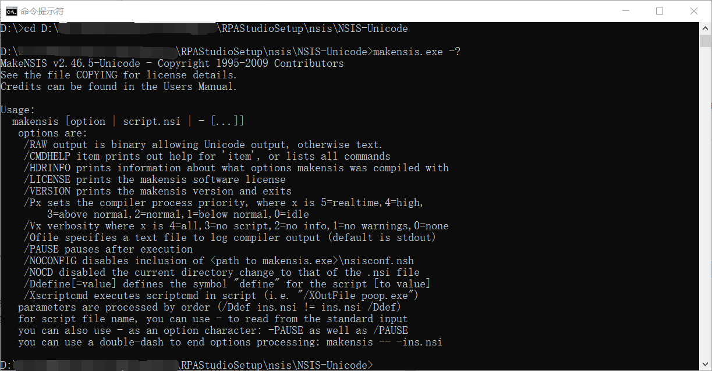

## 15.2 打包脚本编写

1、安装包制作的脚本如图15.2-1所示。

图15.2-1 安装包脚本

2、为了防止安装目录与此bat文件不在同一目录下，脚本中先将目录进行切换。接着对产品名称、版本号以及安装包的名称进行赋值，在打包过程中都将文件拷贝至缓存目录_rpastudio_。为了防止在打包过程中出现异常进行关闭，但缓存目录又有文件，所以先对缓存目录_rpastudio_进行rmdir删除。

接下来使用makensis.exe进行宏定义，其中makensis.exe调用命令可输入makensis.exe -？进行查看帮助，如图15.2-2所示。打包成功后会自动生成安装程序，并且按任意键可对缓存目录_rpastudio_进行删除。

图15.2-2 makensis.exe调用命令

3、根据宏定义调用nsis-scripts文件夹下的script.nsi脚本，如图15.2-3所示。脚本中首先定义安装程序初始常量，并且提升安装程序权限为admin。接着对MUI的现代界面定义，包括版本号、产品名称、公司名等。

图15.2-3 提升权限等

4、脚本中定义安装目录选择界面、过程界面、完成界面以及卸载界面等，如图15.2-4所示。

图15.2-4 添加安装界面等

5、获取.Net Framework的版本支持，因该项目使用的是.Net 4.6.1版本，通过读取注册表，如果版本过低添加自动安装，版本高就忽略自动安装，如图15.2-5所示。

图15.2-5 获取.Net Framework的版本

6、检测安装环境，自动安装.Net Framework脚本如图15.2-6所示。

图15.2-6 自动安装.Net Framework

7、其中程序卸载部分如图15.2-7所示。

图15.2-7 程序卸载

## links
   * [目录](<preface.md>)
   * 上一节: [打包目录结构](<15.1.md>)
   * 下一节: [自动打包](<15.3.md>)