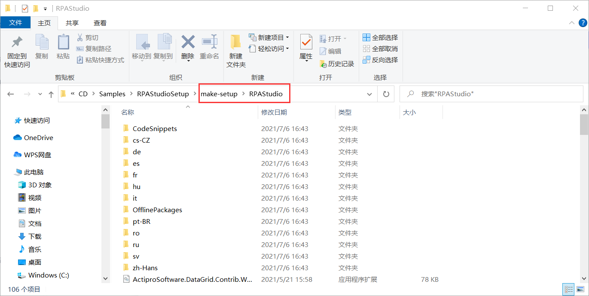
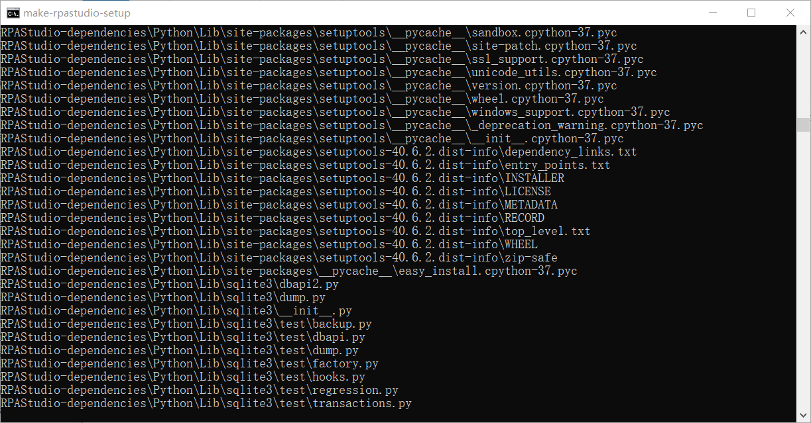
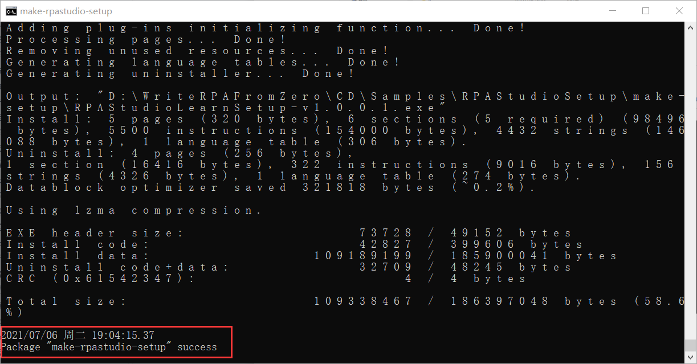
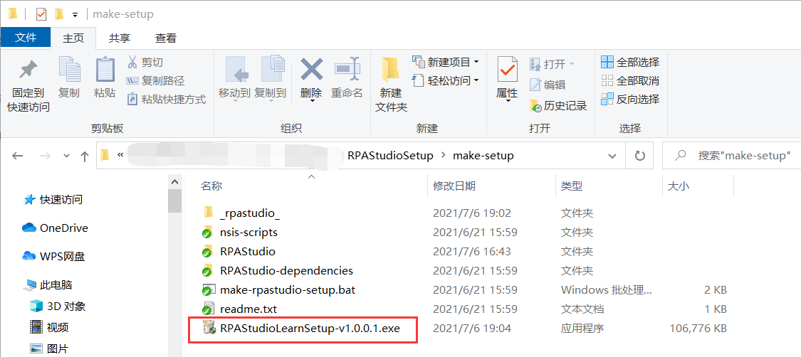

## 15.3 自动打包

1、打包程序使用Release（相对Debug下对代码进行了优化）下项目，然后重新进行编译，将项目下的Release文件夹中的所有文件拷贝至打包目录下的make-setup\RPAStudio文件夹中，如图15.3-1所示。

图15.3-1 将Release下所有文件拷贝至RPAStudio中

2、如有其他nupkg包或需要打进安装包的文件在RPAStudio-dependencies文件夹中进行添加或修改等，并且在make-rpastudio-setup.bat批处理文件进行对应的修改即可，如需修改名称或版本号等也在make-rpastudio-setup.bat中修改。然后双击make-rpastudio-setup.bat批处理文件，如图15.3-2所示正在打包中。

图15.3-2 打包中

3、当出现日期时间以及success字样时代表打包成功，如图15.3-3所示。

图15.3-3 打包成功

4、并在打包目录中生成了安装程序，如图15.3-4所示，此时缓存目录_rpastudio_还存在，但在打包界面按任意键即可删除。

图15.3-4 安装包

## links
   * [目录](<preface.md>)
   * 上一节: [打包脚本编写](<15.2.md>)
   * 下一节: [安装程序](<15.4.md>)