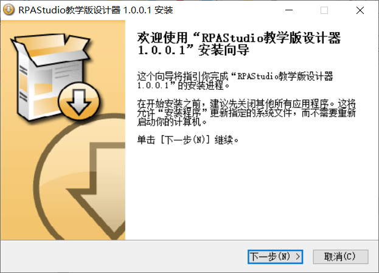
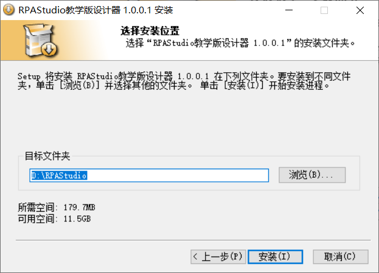

## 15.4 安装程序

1、此时双击安装包即可进行安装使用等，如图15.4-1所示。

图15.4-1 安装向导

2、点击【下一步】，选择安装位置，如图15.4-2所示。

图15.4-2 选择安装位置

3、点击【安装】以后，程序开始安装，如图15.4-3所示，安装完成以后，即可使用。

图15.4-3 程序安装

## links
   * [目录](<preface.md>)
   * 上一节: [自动打包](<15.3.md>)